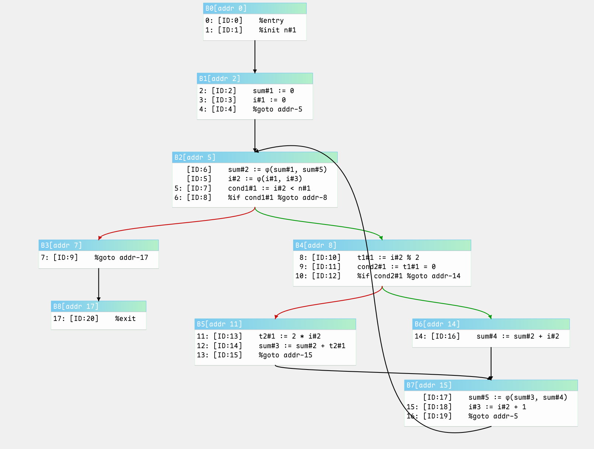

# 静态单赋值形式 (Static Single Assignment Form)

在优化编译器中，数据结构的选择直接影响到实际程序优化的能力和效率。一个糟糕的数据结构选择会阻碍优化，或者将编译速度拖慢到使得高级优化功能变得不可取的程度。静态单赋值形式（SSA）是一种相对较新的中间表示形式，它能有效地将程序中操作的值与存储它们的位置分离开来，从而使多种优化能够实现更有效的版本。

转换到 SSA 形式的过程首先确定在哪些**汇合点**插入 $\phi$ 函数，然后插入**平凡 $\phi$ 函数**（即形式为 $\phi(x, x, ..., x)$ 的 $\phi$ 函数），其参数位置的数量等于该汇合点的控制流前驱中能到达该点的某个变量定义的数量，最后对变量的定义和使用进行重命名（通常通过添加下标）以建立静态单赋值属性。一旦我们完成了需要转换到 SSA 形式才能完成的任务，就需要消除这些 $\phi$ 函数，因为它们只是一个概念性工具，在计算上并不高效 —— 也就是说，当我们在执行过程时到达一个带有 $\phi$ 函数的汇合点时，我们无法确定是通过哪个分支到达该点的，因此也就无法确定应该使用哪个值。

## SSA 定义与计算

### 支配者 (Dominator)

我们说节点 $d$ **支配 (dominates)** 节点 $i$，记作 $d \text{ dom } i$，如果从程序入口到 $i$ 的每一条可能的执行路径都包含 $d$。显然，支配关系是自反的（每个节点支配自身）、传递的（如果 $a \text{ dom } b$ 且 $b \text{ dom } c$，则 $a \text{ dom } c$）和反对称的（如果 $a \text{ dom } b$ 且 $b \text{ dom } a$，则 $b = a$）。我们进一步定义一个称为**直接支配 (immediate dominance)** 的子关系（记作 idom），使得对于 $a \neq b$，当且仅当 $a \text{ dom } b$ 且不存在节点 $c$（$c \neq a$ 且 $c \neq b$）使得 $a \text{ dom } c$ 且 $c \text{ dom } b$ 时，$a \text{ idom } b$。我们记 $ \text{idom}(b)$ 表示 $b$ 的**直接支配者 (immediate dominator)**。显然，一个节点的直接支配者是唯一的。直接支配关系构成流图节点的一棵树，其根节点是入口节点，树的边代表直接支配关系，树的路径显示了所有的支配关系。此外，我们说 $d$ **严格支配 (strictly dominates)** $i$，记作 $d \text{ sdom } i$，如果 $d$ 支配 $i$ 且 $d \neq i$。

### $\phi$ 函数的放置位置 (Where to Place $\phi$-Functions)

乍一看，仔细放置 $\phi$ 函数似乎需要为每个变量枚举赋值语句对。检查是否存在两个对变量 $V$ 的赋值能够到达一个公共点似乎本质上是非线性的。然而，实际上，查看控制流图中每个节点的**支配边界 (dominance frontier)** 就足够了。我们将技术细节留到后面的部分，这里概述一下方法。

假设一个变量 $V$ 在原始程序中只有一个赋值语句，那么任何对 $V$ 的使用要么是程序入口处的 $V_0$，要么是最近一次执行对 $V$ 的赋值后产生的 $V_1$。设 $X$ 是给 $V$ 赋值的**基本块 (basic block)**，那么当控制流沿着边 $X \rightarrow Y$ 流向基本块 $Y$ 时，$X$ 将决定 $V$ 的值。当沿着 $X \rightarrow Y$ 进入 $Y$ 时，$Y$ 中的代码将看到 $V_1$ 且不受 $V_0$ 的影响。如果 $Y \neq X$，但所有到达 $Y$ 的路径仍然必须经过 $X$（在这种情况下，称 $X$ **严格支配 (strictly dominates)** $Y$），那么 $Y$ 中的代码将总是看到 $V_1$。事实上，任何被 $X$ 严格支配的节点，无论离 $X$ 有多远，都将总是看到 $V_1$。**然而，最终控制流可能会到达一个不被 $X$ 严格支配的节点 $Z$。假设 $Z$ 是某条路径上第一个这样的节点，那么 $Z$ 沿着一条入边看到 $V_1$，但沿着另一条入边可能看到 $V_0$。那么称 $Z$ 位于 $X$ 的支配边界中 (in the dominance frontier of X)，并且显然需要为 $V$ 放置一个 $\phi$ 函数。** 一般来说，无论原始程序中有多少个对 $V$ 的赋值，也无论控制流多么复杂，我们都可以通过找到每个给 $V$ 赋值的节点的支配边界，然后找到已经放置了 $\phi$ 函数的每个节点的支配边界，依此类推，来放置 $V$ 的 $\phi$ 函数。

### 支配边界 (Dominance Frontier)

对于一个流图节点 $x$，其支配边界记作 $DF(x)$，是流图中所有满足以下条件的节点 $y$ 的集合：$x$ 支配 $y$ 的一个**直接前驱 (immediate predecessor)**，但 $x$ 不严格支配 $y$。即：
$$
DF(x) = \left\{ y \; | (\exist z \in Pred(y) \; \text{使得}\; x \; dom \; z ) \; \text{且} \; x \; !sdom \; y\right\}
$$

为所有 $x$ 直接计算 $DF(x)$ 的复杂度将是流图节点数量的平方级。一个线性复杂度的算法通过将其分解为计算两个中间部分 $DF_{local}(x)$ 和 $DF_{up}(x, z)$ 来实现：
$$
DF_{local}(x) = \{ y \in Succ(x) \; | \; idom(y) \neq x \} \\
DF_{up}(x, z) = \{ y \in DF(z) \; | \; idom(z) = x \; \& \; idom(y) \neq x \}
$$
然后计算 $DF(x)$ 为：
$$
DF(x) = DF_{local}(x) \bigcup\limits_{z \in N(idom(z) = x)} DF_{up} (x, z)
$$

下面这段Python代码用来计算支配边界：

```python
def dom_front(
     n_bbs: int
     , post_order: List[BasicBlockId]
     , succ: Dict[BasicBlockId, List[BasicBlockId]]
     , idom: Dict[BasicBlockId, BasicBlockId]
     ) -> Dict[int, set]:
     """
     计算支配边界
     :param n_bbs: 基本块的数量
     :param post_order: 控制流图的后续遍历
     :param succ: 基本块的后续节点
     :param idom: 基本块的立即支配节点
     :return: 返回支配边界字典
     """
     df: Dict[int, set] = {i: set() for i in range(n_bbs)}

     for i in post_order:
          # Compute local component
          for y in succ[i]:
               if idom[y] != i:
               df[i] |= {y}
          # Add on up component
          z = idom[i]
          if z != -1:
               for y in df[z]:
               if y != idom[i]:
                    df[i] |= {y}
     return df
```

### 迭代支配边界 (Iterated Dominance Frontier) ($DF^+$)

现在，我们为一个流图节点集合 $S$ 定义其支配边界为：
$$
DF(S) = \bigcup\limits_{x \in S} DF(x)
$$
并定义***迭代支配边界*** $DF^+()$ 为：
$$
DF^+(S) = \lim\limits_{i \rarr \infty} DF^i(S)
$$
其中 $DF^1(S) = DF(S)$ 且 $DF^{i+1}(S) = DF(S \cup DF^i(S))$。**如果 $S$ 是给变量 $x$ 赋值的节点集合加上入口节点，那么 $DF^+(S)$ 正是需要为 $x$ 放置 $\phi$ 函数的节点集合。**

下面这段Python代码用来计算迭代支配边界：

```python
def df_plus(sn: set[int], df: Dict[int, set]) -> set
     """
     iterated dominance frontier DF+()
     :param sn: 基本块Id集合
     :param df: 基本块的支配边界字典
     :return:
     """

     dfp: set = set()

     def df_set(s: set):
          dn = set()
          for x in s:
               dn |= df[x]
          return dn

     change = True
     dfp = df_set(sn)
     while change:
          change = False
          d = df_set(sn | dfp)
          if d != dfp:
               dfp = d
               change = True

     return dfp
```

### 关键属性 (Key Properties)

1. **SSA 构造 (SSA Construction):**
   用于确定哪里需要 $\phi$ 函数。如果一个变量在集合 $S$ 中被定义，则需要在 $DF^+(S)$ 放置 $\phi$ 函数。

2. **汇合点 (Convergence Points):**
   $DF(B)$ 中的节点是控制流路径合并的点，这些点标志着 $B$ 的支配范围的结束。

## 最小化SSA算法实现

```python
class SSAVariable:
    __slots__ = ('name', 'version')

    def __init__(self, var: Union[str, Variable], version: Optional[int]):
        self.name = var.varname if isinstance(var, Variable) else var
        self.version = version if version is not None else -1

    def __str__(self):
        return f"{self.name}#{self.version}"

    @property
    def base_name(self) -> str:
        return self.name


def minimal_ssa(cfg: ControlFlowGraph):
     # 集合，元素为变量名
     variables: set[str] = set()
     # 字典，键为变量名，值为列表，记录所有定义过该变量名的基本块
     def_sites: Dict[str, List] = {v: [] for v in variables}

     # 收集所有定义的变量名
     for inst in cfg.insts.ret_insts():
          """遍历所有的指令，如果是赋值指令，收集定义变量名"""
          if inst.is_assignment():
               # 获取目的操作数的值，将变量转换为字符串，记录
               variables.add(str(inst.get_dest_var().value))

     # 收集所有定义变量的基本块
     for block in cfg.blocks.values():
          for inst in block.insts.ret_insts():
               if inst.is_assignment():
                    variable: Variable = inst.get_dest_var().value
                    def_sites[str(variable)].append(block.id)

     # 插入必要的 phi 函数
     for varname in variables:

          # 先进先出队列
          worklist = deque(def_sites[varname])
          even_on_worklist = set(def_sites[varname])

          # 如果当前变量只被定义过一次，根据 phi 函数的规则，我们就不需要
          # 为该变量插入 phi 函数。
          if len(even_on_worklist) == 1:
               continue

          # 迭代处理工作列表
          while worklist:
               # 获取定义当前变量的块id
               def_block_id = worklist.popleft()

               # 迭代当前块的支配边界
               for y in cfg.df[def_block_id]:

                    # 根据块id获取基本块对象
                    y_block = cfg.blocks[y]

                    # 检查当前基本块是否含有当前变量v的phi函数
                    if not has_phi_for_var(y_block, varname):

                         # 创建phi指令，参数为变量名和当前基本块的前驱数量(作为phi函数的参数个数)
                         new_phi = create_phi_function(varname, num_pred_s=len(cfg.pred[y]))

                         # 找到当前块中第一条常规指令在控制流指令列表中的位置
                         insert_index = cfg.insts.index_for_inst(y_block.first_ordinary_inst)
                         # 将phi指令插入到指定位置
                         cfg.add_new_inst(insert_index, new_phi, y_block)
                         # 将phi指令插入到基本块指令列表的首位置
                         y_block.insts.add_phi_inst(new_phi)

                         # 检查y是否是首次被插入到了工作列表，如果不是首次，加入到工作列表
                         if y not in even_on_worklist:
                            even_on_worklist.add(y)
                            worklist.append(y)

     rename_variables(cfg, def_sites, variables)


def rename_variables(cfg: ControlFlowGraph, def_sites: Dict[str, List], variables: set[str]) -> None:

     # 初始化版本计数器
     counters: Dict[str, int] = {v: 0 for v in def_sites.keys()}

     # 初始化当前版本栈
     stacks = defaultdict(list)

     # 收集在每个基本块退出时变量的版本 { block: { var: version } }
     block_versions: Dict[int, dict] = defaultdict(dict)

     # 临时存储phi的操作数 { block: { var: [operands] }
     phi_operands: Dict[int, dict] = defaultdict(lambda: defaultdict(list))

     # 为每个变量初始化为 0 版本，存放在栈中
     for var in variables:
          stacks[var].append(0)


     """
     确保我们在进行变量重命名之前首先计算好支配树。
     由于我们是按照访问支配树的顺序设置phi函数进行变量重命名，对于循环结构（带有回边）
     变量的版本并不严格递增
     """

     def rename_use_operand(operand: Operand):
          if operand:
               if operand.type == OperandType.VAR:
               if operand.value.varname in stacks:
                    operand.type = OperandType.SSA_VAR
                    operand.value = SSAVariable(operand.value, stacks[operand.value.varname][-1])

               elif operand.type == OperandType.ARGS:
               for arg in operand.value.args:
                    # if arg.type == OperandType.VAR:
                    if isinstance(arg.value, Variable):
                         if arg.value.varname in stacks:
                              arg.type = OperandType.SSA_VAR
                              arg.value = SSAVariable(arg.value, stacks[arg.value.varname][-1])


          else:
               pass

     # depth first search
     def dfs(block_para: BasicBlock):

          nonlocal counters, stacks, block_versions, phi_operands

          """
          1. 处理当前基本块中所有phi指令，并为phi函数的版本分配一个新的版本
          """
          phi_def_list: List[str] = []
          for phi_inst_in_cbb in block_para.insts.ret_phi_insts():
               assert isinstance(phi_inst_in_cbb.result.value, SSAVariable)
               v: SSAVariable = phi_inst_in_cbb.result.value

               v_n = v.base_name

               # 为phi函数的结果分配新的版本
               counters[v_n] += 1
               v.version = counters[v_n]

               # 添加到栈
               stacks[v_n].append(counters[v_n])
               phi_def_list.append(v_n)

          """
          2. 重命名传统指令中的变量名
          """
          for inst_in_cbb in block_para.insts.ret_ordinary_insts():
               """
               遍历当前基本块中所有的传统指令，分别重命名use和def指令
               """
               rename_use_operand(inst_in_cbb.operand1)
               rename_use_operand(inst_in_cbb.operand2)

               if inst_in_cbb.is_assignment():

                    # 获取结果变量，并分配新的版本
                    v: Variable = inst_in_cbb.get_dest_var().value
                    counters[v.varname] += 1

                    # 构造SSA变量
                    new_ver = counters[v.varname]
                    new_var = SSAVariable(v, new_ver)

                    # 设置指令的结果操作数
                    inst_in_cbb.result.type = OperandType.SSA_VAR
                    inst_in_cbb.result.value = new_var

                    # 添加到栈中
                    stacks[v.varname].append(new_ver)

          """
          3. 收集基本块结束时变量的版本
          """
          exit_versions = {}
          for v in variables:
               exit_versions[v] = stacks[v][-1]
          block_versions[block_para.id] = exit_versions

          """
          4. 收集所有后继块中phi函数的操作数
          """
          for succ in cfg.succ[block_para.id]:
               cbb_idx_in_pred = cfg.pred[succ].index(block_para.id)
               succ_bb = cfg.blocks[succ]

               if succ not in phi_operands:
                    phi_operands[succ] = {}

               for phi_inst_in_cbb in succ_bb.insts.ret_phi_insts():
                    result: SSAVariable = phi_inst_in_cbb.result.value
                    varname = result.base_name

               if varname not in phi_operands[succ]:
                    phi_operands[succ][varname] = [-1] * len(cfg.pred[succ])  # default version

               current_ver = stacks[varname][-1] if varname in stacks and stacks[varname] else 0
               # save operands
               phi_operands[succ][varname][cbb_idx_in_pred] = current_ver

          """
          5. 访问支配树
          """
          for child_id in block_para.dominator_tree_children_id:
               dfs(cfg.blocks[child_id])

          """
          6. 回溯时弹出当前作用域版本
          """
          for inst_in_cbb in reversed(block_para.insts.ret_ordinary_insts()):
               if inst_in_cbb.is_assignment():
               if isinstance(inst_in_cbb.result.value, Variable):
                    result: Variable = inst_in_cbb.result.value
                    varname = result.varname
                    stacks[varname].pop()
               elif isinstance(inst_in_cbb.result.value, SSAVariable):
                    result: SSAVariable = inst_in_cbb.result.value
                    stacks[result.base_name].pop()
               else:
                    raise TypeError("Only Variables or SSAVariables are allowed")

          for v in reversed(phi_def_list):
               stacks[v].pop()


     # 指令变量重命名
     dfs(cfg.root)

     # 应用phi的操作数并对原phi指令进行重命名
     for block_id, phi_data in phi_operands.items():

          # calculate pred block index
          pred_index_map: Dict[int, int] = {pred_id: idx for idx, pred_id in enumerate(cfg.pred[block_id])}

          block: BasicBlock = cfg.blocks[block_id]

          for phi in block.insts.ret_phi_insts():
               result_var: SSAVariable = phi.result.value
               base_varname: str = result_var.base_name

               if base_varname not in phi_data:
               continue

               phi_args: Args = phi.operand2.value
               for index, pred_id in enumerate(cfg.pred[block_id]):
               # get index from dict
               pred_index = pred_index_map[pred_id]
               # obtain the version number of the corresponding predecessor.
               version = phi_data[base_varname][pred_index]
               phi_arg_var: SSAVariable = phi_args.args[index].value
               phi_arg_var.version = version
```

## SSA边

SSA 边是编译器数据流分析中的关键概念，它表示变量定义(definition)与使用(use)之间的直接数据依赖关系。在静态单赋值(SSA)形式中，SSA 边提供了精确的数据流信息，是许多编译器优化的基础。

### 定义

SSA 边是连接变量定义点(def)和其使用点(use)的有向边。在 SSA 形式中：

1. **定义点(def)**：变量被赋值的位置
   
   - 普通赋值语句：$x_1 = a + b$
   - Phi 函数：$x_2 = φ(x_1, x_3)$

2. **使用点(use)**：变量被引用的位置
   
   - 操作数：$y = x_1 * 2$
   - Phi 函数的参数：$x_2 = \phi (x_1, x_3)$ 中的 $x_1$ 和 $x_3$

**SSA 边的特点**：

- **精确性**：每个使用点都有明确的定义来源
- **无环性**：SSA 图通常是无环的(除循环携带依赖外)
- **高效性**：支持快速的数据流分析

### SSA 边的类型

**1. 直接边 (Direct Edges)**

- **定义**：在同一个基本块内的定义-使用关系

- **示例**：
  
  ```
  block1:
    x#1 := 10     // 定义
    y#1 := x#1 + 5 // 使用
  ```

- **SSA 边**：`(x#1定义, y#1使用)`

**2. 控制流边 (Control Flow Edges)**

- **定义**：跨越基本块的定义-使用关系

- **示例**：
  
  ```
  block1:
  
    x#1 := 10
    %if cond %goto &block3
  block2:
    y#1 := x#1 + 1  // 使用
  
  block3:
    z#1 := x#1 * 2  // 使用
  ```

- **SSA 边**：`(x#1定义, y#1使用)` 和 `(x#1定义, z#1使用)`

**3. Phi 边 (Phi Edges)**

- **定义**：连接 Phi 函数参数到其来源定义的边

- **示例**：
  
  ```
  block1:
    x#1 := 10
    %goto &block3
  
  block2:
    x#2 := 20
    %goto block3
  
  block3:
    x#3 = φ(x#1, x#2) // Phi函数
    y#1 = x#3 + 5     // 使用
  ```

- **SSA 边**：
  
  - `(x#1定义, x#3的phi操作数)`
  - `(x#2定义, x#3的phi操作数)`
  - `(x#3定义, y#1使用)`

**4. 循环携带边 (Loop-Carried Dependencies)**

- **定义**：跨越循环迭代的依赖关系

- **示例**：
  
  ```
  header:
    i#2 = φ(i#1, i#3) // 循环携带
    ...
  
  body:
    i#3 = i#2 + 1
  ```

- **SSA 边**：`(i_3定义, i_2的phi操作数)` 标记为循环携带

### 计算

**SSA Edge定义**

```python
class SSAEdge:
    """
    def-use chain
    """
    __slots__ = ('source_inst', 'target_inst', 'src_block', 'dest_block', 'var', 'type', 'loop_carried')

    def __init__(self, source_inst: MIRInst, target_inst: MIRInst, src_block, dest_block, var):
        # def
        self.source_inst: MIRInst = source_inst
        # use
        self.target_inst: MIRInst = target_inst

        self.src_block = src_block
        self.dest_block = dest_block

        self.var = var

        # REGULAR / PHI_ARG / LOOP_CARRIED
        self.type = "REGULAR"
        self.loop_carried = False

    @property
    def id(self) -> Tuple[MIRInstId, MIRInstId]:
        return self.source_inst.id, self.target_inst.id

    def mark_loop_carried(self):
        self.type = "LOOP_CARRIED"
        self.loop_carried = True

    def __repr__(self):
        edge_type = self.type if self.type != "REGULAR" else ""
        return f"MIR[ {self.source_inst} ]    ->    MIR[ {self.target_inst} ]    VAR[ {self.var} ]    {edge_type} "


class SSAEdgeBuilder:
    def __init__(self, cfg, edges: List[SSAEdge], def_map):
        self.cfg = cfg
        self.ssa_edge_list: List[SSAEdge] = edges
        self.edges: List[Tuple[MIRInstId, MIRInstId]] = self._collect_ssa_edge()
        self.succ: Dict[MIRInstId, List[MIRInstId]] = self._construct_ssa_succ()
        self.def_map = def_map

    def _construct_ssa_succ(self) -> Dict[MIRInstId, List[MIRInstId]]:
        succ: Dict[MIRInstId, List[MIRInstId]] = defaultdict(list)
        for s,d in self.edges:
            succ[s].append(d)
        return succ

    def _collect_ssa_edge(self) -> List[Tuple[MIRInstId, MIRInstId]]:
        edges: List[Tuple[MIRInstId, MIRInstId]] = []

        for e in self.ssa_edge_list:
            edges.append(e.id)

        return edges
```

**算法实现**

在进行SSA边计算之前，我们需要首先分析程序的循环结构。

```python
class Loop:
    """
    Loop Structure
    """
    def __init__(self, header: BasicBlock):
        self.header: BasicBlock = header
        self.body_blocks: set[BasicBlock] = set()
        self.latches = set()
        self.parent: Optional['Loop'] = None
        self.children = [ ]

    def add_block(self, block: BasicBlock):
        self.body_blocks.add(block)

    def contains_block(self, block):
        return block in self.body_blocks

    def is_inner_relative_to(self, other: 'Loop'):
        """
        Check whether it is more nested than another loop
        :param other:
        :return:
        """

        # if other is an ancestor of this loop, then
        # this loop is nested deeper

        current = self
        while current.parent:
            if current.parent == other:
                return True
            current = current.parent

        return False

    def __repr__(self):
        return f"Loop(header={self.header}, blocks={len(self.body_blocks)})"

```

`LoopAnalyzer`是当前流图的循环结构分析器，它的部分定义如下：

```python
class LoopAnalyzer:
    """
    Loop Analyzer
    """

    def __init__(self, cfg: 'ControlFlowGraph'):
        self.cfg: 'ControlFlowGraph' = cfg
        self.loops = [ ]

    def analyze_loops(self) -> 'LoopAnalyzer':
        """
        analysing loop structure in cfg.
        :return:
        """
        self._find_natural_loops()
        self._compute_loop_nesting()
        return self

    def _find_natural_loops(self):
        """
        find natural loops
        :return:
        """
        pass

    def _compute_loop_nesting(self):
        """Calculate loop nesting relationship"""
        pass

    def get_loop_for_block(self, block: BasicBlock) -> Optional[Loop]:
        """Get innermost loop containing specific block"""

        candidate = None
        for loop in self.loops:
            if loop.contains_block(block):
                # prioritize choosing a deeper loop
                if not candidate or loop.is_inner_relative_to(candidate):
                    candidate = loop
        return candidate
```

在进行循环分析之后，将分析器作为参数传递给 `ssa_edges_comp`函数。

```python
def ssa_edges_comp(cfg, loop_info) -> 'SSAEdgeBuilder':
     """
     计算SSA Edge。（在调用该函数之前必须确保所有变量都被转换为 SSAVariable）
     :param loop_info: LoopAnalyzer实例
     :return: SSAEdgeBuilder
     """

     edges: List[SSAEdge] = []

     # def_sites的键为SSA变量名（携带了版本号）
     def_sites: Dict[str, int] = {}  # var_name -> MIRInst.id

     phi_sources = defaultdict(list)  # phi_inst_id -> original definition list

     def is_loop_carried(phi_block: BasicBlock, def_block: BasicBlock, lo) -> bool:
          """
          检查定义指令到phi指令的边是否是循环携带依赖

          :param phi_block:
          :param def_block:
          :param lo: Loop Info
          :return:
          """

          phi_loop = lo.get_loop_for_block(phi_block)

          if not phi_loop:
               return False

          # check if definition block is in the same loop.
          if phi_loop.contains_block(def_block):
               # check if definition block is in the loop body (not header)
               if def_block != phi_loop.header:
               return True

          return False

     # stage 1.
     # collect all definition.
     for block in cfg.blocks.values():
          for inst in block.insts.ret_ordinary_insts():
               if inst.is_assignment():
               var: SSAVariable = inst.result.value
               def_sites[str(var)] = inst.id

          for phi_inst in block.insts.ret_phi_insts():
               var: SSAVariable = phi_inst.result.value
               def_sites[str(var)] = phi_inst.id
               phi_sources[phi_inst.id] = []

     # stage 2.
     # connect common use.
     for block in cfg.blocks.values():
          # 遍历当前块的所有普通指令
          for inst in block.insts.ret_ordinary_insts():

               # 获取指令的操作数列表
               operand_list = inst.get_operand_list()

               for operand in operand_list:
                    if isinstance(operand.value, SSAVariable) and str(operand.value) in def_sites:
                         src_inst_id = def_sites[str(operand.value)]
                         edges.append(SSAEdge(
                              cfg.insts_dict_by_id[src_inst_id]
                              , inst
                              , cfg.find_defining_block(src_inst_id)
                              , block
                              , str(operand.value)))

     # stage 3.
     # handle phi instructions
     for block in cfg.blocks.values():

          # 遍历基本块所有的phi指令
          for phi in block.insts.ret_phi_insts():

               # 获取所有的前驱基本块ID
               predecessor_id_list = cfg.pred[block.id]

               for i, operand in enumerate(phi.get_operand_list()):

                    # 确保是SSAVariable
                    assert isinstance(operand.value, SSAVariable)

                    # 获取SSA变量名
                    ssa_name = str(operand.value)

                    if ssa_name in def_sites:

                         src_inst_id = def_sites[ssa_name]

                         # 找到定义当前SSA变量的基本块
                         src_block = cfg.find_defining_block(src_inst_id)

                         # 如果基本块存在，并且是当前基本块的前驱
                         if src_block and src_block.id in predecessor_id_list:

                              # 建立SSA边
                              ssa_edge = SSAEdge(
                                   cfg.insts_dict_by_id[src_inst_id]
                                   , phi
                                   , cfg.find_defining_block(src_inst_id)
                                   , block
                                   , ssa_name)

                              # 标志是否是循环携带依赖
                              if is_loop_carried(block, src_block, loop_info):
                                   ssa_edge.mark_loop_carried()

                              edges.append(ssa_edge)

     return SSAEdgeBuilder(cfg, edges, def_sites)
```

## 示例

考虑下面这段C代码

```c
int foo(int n)
{
    int sum = 0;
    for (int i = 0; i < n; i++)
    {
        if (i % 2 == 0)
            sum += i;
        else
            sum += 2 * i;
    }

    return sum;
}
```

转换上面的C代码到我们自定义的MIR

```text
    %entry
    %init n

    sum := 0
    i := 0
    %goto &L1

L1:
    cond1 := i < n
    %if cond1 %goto &L2
    %goto &L_exit

L2:
    t1 := i % 2
    cond2 := t1 = 0
    %if cond2 %goto &L_even
    t2 := 2 * i
    sum := sum + t2
    %goto &L_update

L_even:
    sum := sum + i

L_update:
    i := i + 1
    %goto &L1

L_exit:
    %exit
```

控制流图的形式如下


在运行我们的算法之后，我们得到的控制流图为



## References

1. RON CYTRON, JEANNE FERRANTE, BARRY K. ROSEN, and MARK N. WEGMAN  IBM Research Division  and  F. KENNETH ZADECK  Brown University. Efficiently computing static single assignment form and the control dependence graph. ACM Trans. Program. Lang. Syst. p451-490. 10/1991. https://dl.acm.org/doi/10.1145/115372.115320
2. Muchnick and Steven S. Advanced compiler design and implementation.