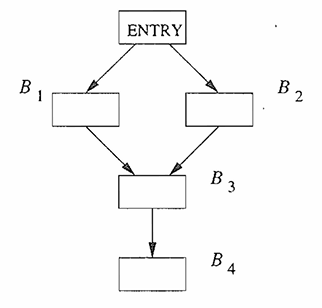

# 数据流分析基础

数据流分析指的是一组用来获取有关数据如何沿着程序执行路径流动的相关信息的技术。

程序的执行可以看作是对程序状态的一系列转换。程序状态由程序中的所有变量的值组成，同时包括运行时刻栈的栈顶之下各个栈帧的相关值。一个中间代码语句的每次执行都会把一个输入状态转换成一个新的输出状态。**这个输入状态和处于该语句之前的程序点相关联，而输出状态和该语句之后的程序点相关联**。

当我们分析一个程序的行为时，我们必须考虑程序执行时可能采取的各种通过程序的流图的程序点序列（“路径”）。然后我们从各个程序点上可能的程序状态中抽取出需要的信息，用以解决特定数据流分析问题。在更加复杂的分析中，我们必须考虑调用和返回执行时会形成在不同过程的流图之间跳转的路径。

流图给出的可能执行路径的信息如下：

- 在一个基本块内部，一个语句之后的程序点和它的下一个语句之前的程序点相同。

- 如果一个从基本块 $B_1$ 到 基本块 $B_2$ 的边，那么 $B_2$ 的第一个语句之前的程序点可能紧跟在 $B_1$ 的最后一个语句后的程序点之后。

我们可以把从点 $p_1$ 到点 $p_2$ 的一个执行路径定义为满足下列条件的点的序列 $p_1, p_2, ... , p_n$：对于每个 $i = 1, 2, ... , n - 1$ ：

1) 要么 $p_1$ 是紧靠在一个语句前面的点，且 $p_{i+1}$ 是紧跟在该语句后面的点。

2) 要么 $p_i$ 是某个基本块的结尾，且 $p_{i+1}$ 是该基本块的一个后继基本块的开头。

一般来说，一个程序可能有无穷多条可能的执行路径（特别是对于循环结构），执行路径的长度并没有上界。程序分析把可能出现在某个程序点上的所有程序状态总结为有穷的特性集合。不同的分析技术可以选择抽象掉不同的信息，并且一般来说，没有哪个分析会给出状态的完全表示。

## 数据流分析模式

在所有的数据流分析应用中，我们都会把每个程序点和一个 *数据流值 (data-flow value)* 关联起来。这个值是在该点可能观察到的所有程序状态的集合的抽象表示。所有可能的数据流值的集合称为这个数据流应用的域。比如，[到达定值](../reaching_definitions/reaching_definitions.md) 的数据流值的域是程序的定值集合的所有子集的集合。某个数据流值是一个定值的集合，而我们希望把程序中的每个点和可能到达该点的定值的精确集合关联起来。对于抽象方式的选择依赖与分析的目标。我们只跟踪相关的信息。

我们把每个语句 $s$ 之前和之后的数据流分别记为 $IN[s]$ 和 $OUT[s]$。*数据流问题(data-flow problem)* 就是要对一组约束求解。这组约束对所有的语句 $s$ 限定了 $IN[s]$ 和 $OUT[s]$ 之间的关系。约束分为两种，基于语句语义（传递函数）的约束和基于控制流的约束。

### 传递函数

在一个语句之前和之后的数据流值受该语句的语义的约束。比如，假设我们的数据流分析涉及确定各个程序点上各变量的常量值。如果变量 $a$ 在执行语句 $b \leftarrow a$ 之前的值为 $v$，那么在该语句之后 $a$ 和 $b$ 的值都是 $v$。一个赋值语句之前和之后的数据流值的关系被成为*传递函数(transfer function)*。

信息可能沿着执行路径向前传播，或者沿着执行路径逆向流动。在一个前向数据流问题中，一个语句 $s$ 的传递函数（通常被记为 $f_s$）以语句前的数据流值作为输入，并产生语句之后的新数据流值。也就是
$$
OUT[s] = f_s(IN[s])
$$
 反过来，在一个逆向数据流问题中，语句 $s$ 的传递函数 $f_s$ 把第一个语句之后的数据流值转变成为语句之前的新数据流值。也就是
$$
IN[s] = f_s(OUT[s])
$$
### 控制流约束

基本块中的控制流很简单。如果一个基本块 $B$ 由语句 $s_1, s_2, ..., s_n$ 顺序组成，那么 $s_i$ 输出的控制流值和输入 $s_{i+1}$ 的控制流值相同。也就是
$$
IN[s_{i+1}] = OUT[s_i] \quad i = 1, 2, ..., n - 1
$$
对于基本块之间的控制流，一个基本块的首语句的定值的集合就是到达它的各个前驱基本块的最后一个语句之后的定值集合的并集。

### 基本块上的数据流模式

从技术上来讲，数据流模式涉及程序中每个点上的数据流值。控制流从基本块的开始流动到结尾，中间没有中断或者分支。这样我们就可以用进入和离开基本块的数据流值的方式重新描述这个模式。对于每个基本块 $B$ ，我们把紧靠其前和紧随其后的数据流值分别记为 $IN[B]$ 和 $OUT[B]$。关于 $IN[B]$ 和 $OUT[B]$ 的约束可以根据关于 $B$ 中的各个语句 $s$ 的 $IN[s]$ 和 $OUT[s]$ 的约束得到。

假设基本块由语句 $s_1, s_2, ..., s_n$ 顺序组成。如果 $s_1$ 是基本块 $B$ 的第一个语句，那么 $IN[B] = IN[s]$。 类似地，如果 $s_n$ 是基本块 $B$ 的最后一个语句，那么 $OUT[B] = OUT[s_n]$。基本块 $B$ 传递函数记为 $f_B$ ，它可以通过将该基本块中各语句的传递函数组合起来获得该传递函数。也就是说，设 $f_{s_{i}}$ 是语句 $s_i$ 的传递函数，那么 $f_B = f_{s_n} \circ ... \circ f_{s_2} \circ f_{s_1}$ 。该基本块的开头和结尾处的数据流值的关系是
$$
OUT[B] = f_B(IN[B])
$$
因此，前向数据流问题的方程就可以表示为
$$
IN[B] = \bigcup_{P是B的一个前端}OUT[P]
$$
逆向数据流问题的方程是类似的，但是 $IN$ 和 $OUT$ 值的角色被调换了。也就是说
$$
IN[B] = f_B(OUT[B]) \\
OUT[B] = \bigcup_{S是B的一个后继}IN[S]
$$
 和线性算术方程不同，数据流方程通常没有唯一解。我们的目标是寻找一个最”精确的“满足这两组约束（即控制流和传递的约束）的解。换言之，我们需要一个解，它能够支持有效的代码改进，但是又不会导致不安全的转换。这些不安全的转换改变了程序计算的内容。

### 传递方程

传递方程描述了基本块内部的信息转换过程，即 **输入状态如何转换为输出状态**。

假设一个基本块 $B$，它的语句为 $s_1, s_2, ... , s_n, n \in \mathbb{N}$ 。那么 $B$ 的传递函数可以表示为 $f_B = f_{s_n} \circ ... \circ f_{s_2} \circ f_{s_1}$ 。我们定义传递方程为
$$
OUT[B] = f_B (IN[B])
$$
其中 $IN[B]$ 为基本块 $B$ 入口处的数据流值，$OUT[B]$ 为基本块 $B$ 出口处的数据流值。

传递函数需要根据数据流分析问题而设计。有几种常用的传递函数模型：

1.   生成—销毁模型

     最常见的形式，适用于位向量表示的数据流问题。
     $$
     f_B(IN) = (IN - KILL_B) \cup GEN_B
     $$

2.   符号函数模型

     适用于复杂分析
     $$
     f_B(IN) = g(s_1(g(s_2(...g(s_n(IN))))))
     $$
     其中 $s_1, s_2, ... , s_n, n \in \mathbb{N}$ 是块中的语句，$g$ 是每条语句的传递函数。

3.   单调函数模型
     $$
     f_B(IN) = F_B(IN)
     $$
     其中 $F_B$ 是单调函数，满足：
     $$
     \text{如果 } X \sube Y \text{ , 则 } F_B(X) \sube F_B(Y)
     $$

### 控制流方程

控制流方程描述了信息如何通过控制流边在基本块之间传播，即 **基本块入口状态如何由前驱/后缀决定** 。控制流分析可以分为**前向分析**
$$
IN[B] = \bigwedge_{P \in pred(B)} OUT[P]
$$
和 **后向分析**
$$
OUT[B] = \bigwedge_{S \in succ(B)} IN[S]
$$
其中 $pred(B)$ 和 $succ(B)$ 分别表示 $B$ 的前驱基本块集合和后继基本块集合，$\wedge$ 表示交汇操作。在任何数据流模式中，我们用交汇运算来汇总各条路径会合点上不同路径所作的贡献。

### 初始值与安全值

在数据流分析框架中，"初始值"和"安全值"是两个关键概念，它们共同确保了分析的保守性和正确性。初始值即为在分析起点（前向分析的入口块或后向分析的出口块）设置的值。它表示程序执行开始时的已知状态，通常时最精确的状态。安全值被定义为在非起点位置设置的保守值，确保分析不会遗漏任何可能的路径。它表示“最坏情况”的假设，并确保分析结果是保守的（不会漏报），通常是半格中的 $\bot$ （最安全但最不精确的值）。随着分析算法的运行，各个程序点的值从安全逐渐向精确解收敛。

### May分析和Must分析

数据流分析问题通常分为may分析和must分析两大类，这种分类决定了问题的求解策略、初始值和安全值的设置。

| 特性 | May分析 | Must分析 |
|------|--------|---------|
| **目标** | 识别可能发生的情况 | 识别必然发生的情况 |
| **近似方向** | 过度近似(over-approximation) | 不足近似(under-approximation) |
| **安全性** | 包含所有可能情况 | 只包含必然发生情况 |
| **精度** | 可能包含假阳性 | 可能包含假阴性 |
| **适用场景** | 存在性问题 | 保证性问题 |
| **初始值** | 入口/出口点：最精确值(top) | 入口/出口点：最精确值(top) |
| **安全值** | 其他点：最保守值(bottom) | 其他点：最保守值(bottom) |
| **合并操作** | 并集(∪)或类似 | 交集(∩)或类似 |

---

> 数据流分析中的保守主义
>
> 实际数据流分析值是通过程序的所有可能执行路径来定义的。所有的数据流模式计算得到的都是对实际数据流值的估算。我们必须保证所有的估算误差都在”安全“的方向上。如果一个策略性决定不允许我们改变程序计算出的内容，它就被认为是”安全的“（或者说”保守的“）。遗憾的是，安全的策略导致我们错失一些能够保持程序含义的代码改进的机会。但实际上对所有优化技术而言，没有哪个安全的策略可以保证不错失任何机会。使用不安全策略就是以改变程序含义的代价来加快代码速度。一般来说，这是不可接受的。
>
> 因此在设计一个数据流模式的时候，我们必须知道这些信息将如何被使用，并保证我们做出的任何估算都是在“保守”或者说“安全”的方向上。每个模式和应用都要单独考虑。比如，如果我们把到达定值信息用于常量折叠，那么把一个实际上不可到达的定值当作可到达就是安全的（我们可能在 $x$ 实际是一个常量且可以被折叠的情况下认为 $x$ 不是一个常量），但是把一个实际可到达的定值当作不可到达就是不安全的（我们可能把 $x$ 替换为一个常量，但是实际上程序有时会赋予 $x$ 一个不同与该常量的值）。

## 数据流分析框架

### 半格

在每一种情况中，数据流分析都是通过对一种称为 [**格(Lattice)**](../../basics/lattice/lattice_theory.md)  的代数结构的元素进行运算来完成的。格的元素代表变量、表达式，或一个过程所有可能执行的其他程序设计结构的抽象性质——这种性质与输入数据值无关，通常也与过程流经的控制流路径无关。多数数据流分析都不关心程序执行条件的真假，即不关心 `if` 是取 `then` 分支还是 `else` 分支，也不关心循环的执行次数。我们将过程中每一种可能的控制流和计算结构与一个所谓的流函数关联起来，这个流函数将每个结构的作用抽象成对应的格元素的作用。 

出于理论严谨性和实际需求的平衡，通常我们在数据流分析中使用 **半格(Semilattice)** 而非完整的 **格(Lattice)** 。

>   "在计算机科学中，我们使用半格不是因为它们完美，而是因为它们足够好且实际可行。"
>
>   —— 引自《数据流分析基础》(Foundations of Data Flow Analysis)

在数据流分析中，只需要保证元素可以 “向上”合并（汇集信息）或 “向下”合并（分发信息），而不一定需要同时具备两种操作。这导致了半格的概念。

定义：一个半格是一个集合 $L$ 和一个二元操作 $\wedge$ 并且对于所有 $x, y, z \in L$，我们有：
$$
\begin{align*}
& x \wedge x = x & \text{等幂性} \\ 
& x \wedge y = y \wedge x & \text{可交换} \\
& x \wedge ( y \wedge z ) = (x \wedge y ) \wedge z & \text{结合律} 
\end{align*}
$$
半格有一个顶元素，表示为 $\top$ ，使得对于 $L$ 中迭代所有 $x$， $\top \wedge x = x$。半格可能还有一个底元素，表示为 $\bot$ ，使得对于 $V$ 总的所有 $x$ ，$\bot \wedge x = \bot$。

我们为半格 $(L, \wedge)$ 定义偏序 $\preceq$ ：对于 $L$ 中的所有 $x$ 和 $y$ ，我们定义
$$
x \preceq y \quad \text{当且仅当} \quad x \wedge y = x
$$
因为交汇运算 $\wedge$ 是等幂的、可交换的且满足结合律，上面定义的偏序 $\preceq$ 就是自反的、反对称的和传递的。

-   自反性：对于所有的 $x$，$x \preceq x$。因为交汇运算时等幂的，因此 $x \wedge x = x$。
-   反对称性：如果 $x \preceq y$ 且 $y \preceq x$，那么 $x = y$。在证明中，$x \preceq y$ 意味着 $x \wedge y = x$，而 $y \preceq x$ 意味着 $y \wedge x = y$。根据 $\wedge$ 的可交换性， $x = (x \wedge y) = (y \wedge x) = y$。
-   传递性：如果 $x \preceq y$ 且 $y \preceq z$，那么 $x \preceq z$。证明如下：$x \preceq y$ 且 $y \preceq z$ 意味着 $x \wedge y = x$ 且 $y \wedge z = y$。根据交汇运算的结合律可得到 $(x \wedge z) = ((x \wedge y) \wedge z) = (x \wedge (y \wedge z)) = (x \wedge y) = x$。所以有 $x \preceq z$，证明完毕。

>   在其他文献中你可能看到 并半格(Join Semi-Lattice) 或 交半格(Meet Semi-Lattice) 这两个术语。假设一个偏序集 $(S, \preceq)$ ，按照格的运算操作将半格分为两种：
>
>   -   并半格(Join Semi-Lattice)：如果对于 $S$ 中的任意两个元素 $a$ 和 $b$ ，都存在一个最小上界 $a \vee b \in S$。
>   -   交半格(Meet Semi-Lattice)：如果对于 $S$ 中的任意两个元素 $a$ 和 $b$ ，都存在一个最大下界 $a \wedge b \in S$。
>
>   注：$\wedge$(Meet) 或 $\vee$(Join) 只是格的两种操作，它们只是运算的抽象符号，并不限定某一个或某一种操作方式。它们的实际操作含义需要根据格的数据对象而赋予。

需要注意的是，半格只要求一种操作（Join 或 Meet）对于任意两个元素存在。半格高度必须是有界的，半格中任意链（一个全序子集）的最大长度减一成为半格的高度。这个高度决定了迭代数据流分析算法在最坏情况下的迭代次数上限。

**最大下界**

假设 $(L, \wedge)$ 是一个半格。域元素 $x$ 和 $y$ 的最大下界(greatest lower bound, glb) 是一个满足下列条件的元素 $g$ ：

1.   $g \preceq x$
2.   $g \preceq y$ ，并且
3.   如果 $z$ 是使得 $z \preceq x$ 且 $z \preceq y$ 成立的元素，那么 $z \preceq g$。

我们的结论是，$x$ 和 $y$ 的交汇运算值就是它们的唯一最大下界。令 $g = x \wedge y$，可以观察到下列性质：

- 因为 $(x \wedge y) \wedge x = x \wedge y$，所以 $g \leq x$ 。证明：$g \wedge x = ((x \wedge y) \wedge x) = (x \wedge ( y \wedge x)) = (x \wedge (x \wedge y)) = ((x \wedge x) \wedge y) = (x \wedge y ) = g$。
- $g \leq y$ 的证明同上。
- 假设 $z$ 是任意的满足 $z \leq x$ 和 $z \leq y$ 的元素。已知 $z \leq g$，因此除非 $z$ 就是 $g$，否则它不是 $x$ 和 $y$ 的一个最大下界。证明如下：$(z \wedge g) = (z \wedge (x \wedge y)) = ((z \wedge x) \wedge y)$。因为 $z \preceq x$，我们知道 $(z \wedge x = z)$，因此 $(z \wedge g) = (z \wedge y)$。因为 $z \preceq y$，我们知道 $z \wedge y = z$，因此 $z \wedge g = z$。我们已经证明了 $z \preceq g$，并且得出结论 $g = x \wedge y$ 是 $x$ 和 $y$ 的唯一最大下界。

**乘积格**

我们按照下面的方式构造乘积格。假设 $\{ A, \wedge_{A} \}$ 和 $\{ B, \wedge_B \}$ 是两个（半）格。这两个格的乘积格定义如下：

1.   乘积格的域是 $A \times B$。

2.   乘积格的交汇运算 $\wedge$ 定义如下：如果 $(a, b)$ 和 $(a', b')$ 是乘积格域中的元素，那么
     $$
     (a, b) \wedge (a', b') = (a \wedge_A a', b \wedge_B b')
     $$
     
     乘积格的偏序可以很简单地用 $A$ 的偏序 $\preceq_A$ 和 $B$ 的偏序 $\preceq_B$ 来表示：
     $$
     (a, b) \preceq (a', b') \text{ 当且仅当 } (a \wedge_A a', b \wedge_B b')
     $$

格的乘积是一个满足结合律的运算，因此上面两条规则可以被扩展到任意多个格。也就是说，如果我们有格 $(A_i, \wedge_i)(i = i, 2, ... , k)$ ，那么这 $k$ 个格按照这个顺序的乘积的域为 $A_1 \times A_2 \times ... \times A_k$，其交汇运算定义为：
$$
(a_1, a_2, ..., a_k) \wedge (b_1, b_2, ... , b_k) = (a_1 \wedge_1 b_1, a_2 \wedge b_2, ... , a_k \wedge_k b_k)
$$
 而偏序定义为
$$
(a_1, a_2, ..., a_k) \preceq (b_1, b_2, ... , b_k) \text{ 当且仅当对所有的} i, \ a_i \preceq b_i
$$

**格的高度**

偏序集$(V, \preceq)$ 的一个上升链(ascending chain) 是一个满足 $x_1 \preceq x_2 \preceq ... \preceq x_n$ 的序列。一个半格的高度是所有上升链的 $\preceq$ 关系个数的最大值。也就是说，高度比链中的元素个数少一。比如一个有 $n$ 个定值的程序的到达定值半格的高度是 $n$。

如果一个半格具有有穷的高度，就可以比较容易地证明相应的迭代数据流算法的收敛性。显然，一个由有穷值集组成的格具有有穷的高度；一个具有无穷多个值的格也可能具有有穷的高度。在常量传播算法中使用的格就是一个这样的例子。

### 传递函数

一个数据流框架中的传递函数族 $F: V \rightarrow V$ 具有下列性质：

1.   $F$ 有一个单元函数 $I$，使得对于 $V$ 中的所有 $x$，$I(x) = x$。
2.   $F$ 对函数组合运算封闭。也就是说，对于 $F$ 中的任意函数 $f$ 和 $g$，定义为 $h(x) = g(f(x))$ 的函数 $h$ 也在 $F$ 中。

### 单调框架

对于一个框架，如果框架中的所有传递函数都是单调的，那么我们就说这个框架是单调的。$F$ 中的传递函数 $f$ 是单调函数的条件是对于域 $V$ 中的任意两个元素，如果第一个元素大于第二个元素，那么 $f$ 作用于第一个元素的结果也大于它作用于第二个元素所得到的结果。

一个数据流分析框架 $(D, F, V, \wedge)$ 是单调的，如果
$$
\text{公式1：对于所有的 } V \text{ 中的 } x \text{ 和 } y \text{ 以及 } F \text{ 中的 } f，x \preceq y \; \implies \; f(x) \preceq f(y)
$$
单调性可以被等价地定义为 
$$
\text{公式2：对于所有的 } V \text{ 中的 } x \text{ 和 } y \text{ 以及 } F \text{ 中的 } f，f(x \wedge y) \; \preceq \; f(x) \wedge f(y)
$$
**证明：**

首先假设 $(\forall x, y \in L) \; [x \preceq y \; \implies \; f(x) \preceq f(y)]$ 成立，需证明 $(\forall x, y \in L) \; [f(x \wedge y) \leq f(x) \wedge f(y)]$。由于 $( x \wedge y )$ 是 $x$ 和 $y$ 的最大下界，满足：
$$
x \wedge y \preceq x \quad \text{和} \quad x \wedge y \preceq y
$$
根据假设 $(\forall x, y \in L) \; [x \preceq y \; \implies \; f(x) \preceq f(y)]$，可得：
$$
f(x \wedge y) \preceq f(x) \quad \text{和} \quad f(x \wedge y) \preceq f(y).
$$
由于 $f(x) \wedge f(y)$ 是 $f(x)$ 和 $f(y)$ 的最大下界，因此有
$$
f(x \wedge y) \preceq f(x) \wedge f(y).
$$
即 $(\forall x, y \in L) \; [f(x \wedge y) \preceq f(x) \wedge f(y)]$ 成立。

反之，假设 $(\forall x, y \in L) \; [f(x \wedge y) \preceq f(x) \wedge f(y)]$ 成立，需证明 $(\forall x, y \in L) \; [x \preceq y \; \implies \; f(x) \preceq f(y)]$。 
设 $x \preceq y$，则根据定义有 $x \wedge y = x$。由假设可得： 
$$
f(x) = f(x \wedge y) \preceq f(x) \wedge f(y).
$$
由于 $f(x) \wedge f(y)$ 是 $f(x)$ 和 $f(y)$ 的最大下界，满足 $f(x) \wedge f(y) \preceq f(y)$。因此：  
$$
f(x) \preceq f(x) \wedge f(y) \preceq f(y)
$$
即 $f(x) \preceq f(y)$，故 $(\forall x, y \in L) \; [x \preceq y \; \implies \; f(x) \preceq f(y)]$ 成立。

**可分配的框架**

数据流分析框架经常会遵守一个比 公式2 更强的条件，我们把这个条件称为 *可分配框架* (distributivity condition)，即对于 $V$ 中的所有 $x$ 和 $y$ 以及 $F$ 中的所有 $f$，有
$$
f(x \wedge y) = f(x) \; \wedge \; f(y)
$$
当然，如果 $a = b$，那么根据幂等性有 $a \wedge b = a$，因此 $a \preceq b$。这样，可分配性蕴含了单调性，但是反过来并不成立。

### 数据流的解

**不动点理论**

一个不动点是指一个映射 $F$ 作用于数据流值向量，使得 $F(X) = X$。在数据流分析中，我们定义函数 $F$ 为整个方程组的函数，即：
$$
F(X)_B = f_B( \bigwedge_{P \in PRED(B)} X_P)
$$
其中 $X$ 是一个向量，每个分量对应于一个基本块的数据流值（入口和出口值）。

**最大不动点与标准最小不动点**

最小不动点是指所有不动点中最小的一个（按格的偏序比较）。在正向分析中，如果我们从初始值⊥（格的最小元）开始迭代，那么迭代过程会从最不精确的值（即最安全但最保守的值）开始，并随着迭代逐步增加信息（即数据流值按偏序增大），直到收敛到最小不动点。因为迭代过程中，每次应用传递函数和交汇操作都会使值增大（或保持不变）。由于格满足升链条件（ascending chain condition）或高度有限，迭代最终会停止。最小不动点对应于从最小元（⊥）开始迭代得到的不动点。

最大不动点是指所有不动点中最大的一个。在正向分析中，如果我们从初始值⊤（格的最大元）开始迭代，那么迭代过程会从最精确的值（即包含所有可能的值）开始，并随着迭代逐步移除不满足条件的信息（即数据流值按偏序减小），直到收敛到最大不动点。每次应用传递函数和交汇操作都会使值减小（或保持不变）。最大不动点对应于从最大元（⊤）开始迭代得到的不动点。

当传递函数不满足分配律，而只是单调时，最小不动点和最大不动点可能不同。例如，常量传播分析（Constant Propagation）的格不是幂集格，而是基于变量到常量的映射，其传递函数是单调但不满足分配律，因此可能存在多个不动点。此时，我们通常选择最小不动点（从⊥开始）作为解，因为它是最安全的。

**理想解**

不失一般性，我们假设现在感兴趣的数据流框架是一个前向的数据流问题。考虑一个基本块 $B$ 的入口点。求理想解的第一步是要找到从程序入口到达 $B$ 的开头的所有可能的执行路径。只有当程序的某次执行能够准确地沿着某条路径进行，这条路径才被称为“可能的”。理想的求解方法将计算每个可能路径尾端的数据流值，并对这些数据流值应用 $\wedge$(交汇) 运算得到它们的最大下界。那么，程序的任何执行都不可能在程序点上产生一个更小的数据流值（单调性）。另外，这个界限还是紧致：根据流图中到达 $B$ 的所有可能路径计算得到的数据流值的集合的最大下界不可能变得更大。

对于一个流图中的每个基本块 $B$，令 $f_B$ 是 $B$ 的传递函数。考虑任意从初始结点 $ENTRY$ 到某个基本块 $B_k$ 中的路径
$$
P = ENTRY \rightarrow B_1 \rightarrow B_2  \rightarrow ...  \rightarrow B_{k-1}  \rightarrow B_k
$$
 程序的路径可能包含环，因此一个基本块可能在路径 $P$ 中多次出现。定义 $P$ 的传递函数 $f_P$ 为 $f_{B_1}, f_{B_2}, ..., f_{B_{k-1}}$ 的函数组合的结果。请注意 $f_B$ 没有参与组合运算，这表明这条路径只是到达 $B_k$ 的开头，而不是其结尾。执行这条路径而创建的数据流值就是 $f_P(v_{ENTRY})$ ，其中 $v_{ENTRY}$ 是代表初始结点 $ENTRY$ 的常值传递函数的结果。因此，基本块 $B$ 的理想结果是 
$$
IDEAL[B] = \bigwedge_{P是从ENTRY到B的一个可能路径} f_P(v_{ENTRY})
$$
这个理想结果是我们最希望的结果（故称作“理想”解），也就是能为我们提供最大程度且安全的优化的结果，即我们可以根据这个解来为程序做到最大程序并且维持程序原语义并且安全的优化。按照问题中数据流框架的格理论偏序关系 $\preceq$ ，我们有下面结论：

-   任何比 **IDEAL** 更大的答案都是错误的。
-   任何小于或者等于这个理想值的值都是保守的，安全的。

>   对于任何基本块，只要忽略程序可能执行的某些路径就可能得到该基本块的大于 IDEAL 的解。但是如果我们基于这样的较大的解来改进代码，就不能保证这些被忽略的路径中一定不会有某些执行效果使得我们的代码改进不正确。反过来，任何小于IDEAL的解都可以被看作是包含了某些不必需要的路径，它们可能是流图中不存在的路径，也可能流图中存在此路径但程序却不会按照这条路径执行。这些较小的解将只允许进行对程序的所有可能执行都正确的转换，但是它们会禁止 IDEAL值原本允许的某些转换。

**MOP 解**

寻找所有可能的执行路径是一个不可判定问题，因此，我们必须使用近似的方法。在数据流抽象中，假设流图中的每条路径都可能被执行。因此，我们可以用如下方法定义 $B$ 的基于路径交汇运算的解(MOP解)
$$
MOP[B] = \bigwedge_{P是从ENTRY到B的一个流图路径} f_P(v_{ENTRY})
$$
MOP解考虑的路径是所有可能被执行的路径的超集（如果流图中包含环，那么在 $MOP$解中需要考虑的路径数量仍然是无界的），并对所有的路径的执行结果进行交汇操作。因此，MOP解中交汇运算的输入不仅包括所有可执行路径的数据流值，还包括了一些和不可能执行路径相关的数据流值。把理想解和一些其他的值进行交汇运算不可能创造出一个大于(偏序关系上的比较) 理想值的解。因此，对所有的 $B$，我们有 $MOP[B] \preceq IDEAL[B]$。

### 迭代算法

对于控制流图 $G = (N, E)$，其中 $N$ 是节点（基本块）集合，$E$ 是边集合，我们已经知道数据流方程可表示为：

前向分析
$$
\begin{align*}
\text{IN}[B] &= \bigwedge_{P \in \text{pred}(B)} \text{OUT}[P] \\
\text{OUT}[B] &= f_B(\text{IN}[B])
\end{align*}
$$
后向分析
$$
\begin{align*}
\text{OUT}[B] &= \bigwedge_{S \in \text{succ}(B)} \text{IN}[S] \\
\text{IN}[B] &= f_B(\text{OUT}[B])
\end{align*}
$$
**通用迭代算法**

**输入**：

- 控制流图 $G = (N, E)$
- 入口节点 $n_0$（前向分析）或出口节点 $n_{exit}$（后向分析）
- 半格 $(L, \otimes)$，其中 $\otimes$ 是合并操作
- 传递函数族 $\{f_B : L \to L \mid B \in N\}$
- 初始值 $init \in L$
- 安全值 $safe \in L$

**输出**：
- 每个节点的 IN 和 OUT 状态

**步骤**：
1. **初始化**：
   $$
   \begin{aligned}
   \forall B \in N : & \\
   \quad \text{IN}[B] & \leftarrow safe \\
   \quad \text{OUT}[B] & \leftarrow safe \\
   \end{aligned}
   $$
   
   设置起始点状态：
   $$
   \begin{align*}
   \text{if forward}: & \quad \text{OUT}[n_0] \leftarrow init \\
   \text{if backward}: & \quad \text{IN}[n_{exit}] \leftarrow init \\
   \end{align*}
   $$

2. **创建工作列表**：
   $$
   \text{Worklist} \leftarrow N \setminus \{n_0\} \quad (\text{前向分析}) \\
   \text{or} \\
   \text{Worklist} \leftarrow N \setminus \{n_{exit}\} \quad (\text{后向分析})
   $$

3. **迭代直到收敛**：
   $$
   \begin{align*}
   \text{while } & \text{Worklist} \neq \emptyset \text{ do}: \\
   & \quad \text{从 Worklist 中取出节点 } B \\
   & \quad \text{计算新输入状态:} \\
   & \quad \quad \text{if forward:} \\
   & \quad \quad \quad \text{IN}_{new}[B] \leftarrow \bigwedge_{P \in \text{pred}(B)} \text{OUT}[P] \\
   & \quad \quad \text{else:} \\
   & \quad \quad \quad \text{OUT}_{new}[B] \leftarrow \bigwedge_{S \in \text{succ}(B)} \text{IN}[S] \\
   \\
   & \quad \text{应用传递函数:} \\
   & \quad \quad \text{if forward:} \\
   & \quad \quad \quad \text{OUT}_{new}[B] \leftarrow f_B(\text{IN}_{new}[B]) \\
   & \quad \quad \text{else:} \\
   & \quad \quad \quad \text{IN}_{new}[B] \leftarrow f_B(\text{OUT}_{new}[B]) \\
   \\
   & \quad \text{检查状态变化:} \\
   & \quad \quad \text{if } \text{OUT}_{new}[B] \neq \text{OUT}[B] \ (\text{前向}) \\
   & \quad \quad \quad \text{or} \ \text{IN}_{new}[B] \neq \text{IN}[B] \ (\text{后向}) \text{ then}: \\
   & \quad \quad \quad \text{更新状态:} \\
   & \quad \quad \quad \quad \text{IN}[B] \leftarrow \text{IN}_{new}[B] \quad (\text{前向}) \\
   & \quad \quad \quad \quad \text{OUT}[B] \leftarrow \text{OUT}_{new}[B] \quad (\text{后向}) \\
   & \quad \quad \quad \text{将受影响节点加入 Worklist:} \\
   & \quad \quad \quad \quad \text{if forward: } \text{Worklist} \leftarrow \text{Worklist} \cup \text{succ}(B) \\
   & \quad \quad \quad \quad \text{if backward: } \text{Worklist} \leftarrow \text{Worklist} \cup \text{pred}(B) \\
   \end{align*}
   $$

4. **返回结果**：
   $$
   \text{return } (\text{IN}, \text{OUT})
   $$

我们知道迭代算法的解是不动点的解。迭代算法产生的解于MOP解的区别主要是以下两点：

1.   迭代算法访问各个基本块，其访问顺序并不一定是执行的顺序。

2.   在每个路径的交汇点，算法对当前已经得到的数据流值应用交汇运算。其中一部分被使用的值可能是在初始化过程中人为加入的，并不表示从程序开始的执行结果。

考虑下面这个简单的控制流图

  

假设我们对 $IN[B_4]$​ 的值感兴趣。根据 $MOP$​ 的定义：
$$
MOP[B_4] = ((f_{B_3} \circ f_{B_1}) \; \wedge \; (f_{B_3} \circ f_{B_2}))(v_{ENTRY})
$$
在迭代算法中，如果我们按照 $B_1, B_2, B_3, B_4$ 的顺序访问结点，那么
$$
IN[B_4] = f_{B_3}( f_{B_1}(v_{ENTRY}) \; \wedge \; f_{B_2}(v_{ENTRY}))
$$
只有当数据流框架是可分配时得到的解才是相同的。如果一个数据流框架单调但是不可分配，根据单调框架的公式2，我们仍然有$IN[B_4] \preceq MOV[B_4]$。
$$
\text{公式2：对于所有的 } V \text{ 中的 } x \text{ 和 } y \text{ 以及 } F \text{ 中的 } f，f(x \wedge y) \; \preceq \; f(x) \wedge f(y)
$$
如果对于所有的基本块 $B$ 都有 $IN[B] \preceq IDEAL[B]$，那么这个解就是安全的（保守的）。

## 参考文献

1. Kam, J.B. and Jeffrey D. Ullman. Monotone Data Flow Analysis Frameworks, Tech. Rept. No. 169, Dept, of Elec. Engg., Princeton Univ., Princeton, NJ, 1975.
2. Kildall, Gary A. A Unified Approach to Global Program Optimization, in [POPL73], pp. 194-206.
3. Muchnick and Steven S. Advanced compiler design and implementation.
4. Aho, Alfred V. Compilers: principles, techniques, & tools.

