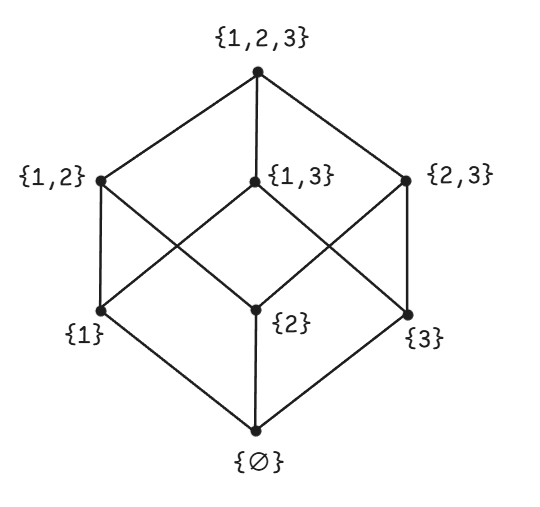
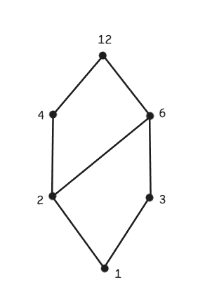
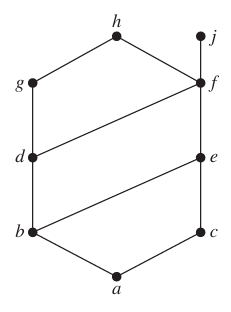

# Lattice

## 基础

### 偏序(Partial Order)

在数学中（特别是集合论和序理论），偏序关系（partial order relation）是一种二元关系，它满足自反性、反对称性和传递性三个基本性质。以下是其精确定义：

设 $S$ 是一个非空集合（集合中的元素可以是任意对象）。一个二元关系 $R$ 定义在 $S$ 上（即 $R \subseteq S \times S$），称为偏序关系，当且仅当它满足**自反性(Reflexivity)，反对称性(Antisymmetry)和传递性(Transitivity)**。一个集合 $S$ 与定义在集合上的偏序关系 $R$ 被称作**偏序集(partially ordered set, 或 poset)**，表示为 $(S, R)$，$S$的成员被成为偏序集的元素。

习惯上，在任意偏序集$(S, R)$，符号 $a \preceq b$被用来表示$(a, b) \in R$。偏序关系也通常用符号$\leq$表示，当$(a, b) \in \leq$时，记作$a \leq b$。

如果一个偏序集合$(S, \preceq)$上的元素 $a$ 和 $b$满足$a \preceq b$或$b \preceq a$，我们称它们是**可比较的(comparable)**。如果既不满足$a \preceq b$ 也不满足 $b \preceq a$，则$a$ 和 $b$ 是**不可比较(incomparable)**。

如果存在偏序集$(S, \preceq )$，并且$S$中的每个元素都是可比较的，则 $S$ 是**全序集(totally ordered set)或线型序集(linearly ordered set)**，$\preceq$ 是**全序(total order)**或**线性序(linear order)**。一个全序集有时也被称作 **链(chain)**。

如果偏序集$(S, \preceq)$ 的 $\preceq$ 是全序并且$S$的每个非空子集都至少含有一个元素，则 $(S, \preceq)$是**良序集(well-ordered set)**。

### 字典序(Lexicographic Order)

Lexicographic Order（字典序）是一种基于**已有顺序**为**序列**（如字符串、元组、列表或笛卡尔积）定义**全序关系**的方法。其名称来源于字典中单词的排列规则：先比较首字母，若相同则比较第二个字母，依此类推。

设两个序列 $A = (a_1, a_2, \dots, a_m)$ 和 $B = (b_1, b_2, \dots, b_n)$，且序列元素所属的集合 $S$ 上已定义**全序关系** $\leq$（如字母顺序、数值大小）。字典序 $\leq_{\text{lex}}$ 定义为：
$$
A \leq_{\text{lex}} B \iff 
\begin{cases} 
\exists \, k \leq \min(m, n) : \\
\quad \forall i < k, \, a_i = b_i \, \land \, a_k \leq b_k, \quad \text{（前 \(k-1\) 个元素相等，第 \(k\) 个元素决定顺序）} \\
\text{或} \\
m \leq n \, \land \, \forall i \leq m, \, a_i = b_i. \quad \text{（\(A\) 是 \(B\) 的前缀）}
\end{cases}
$$

1. **全序性**（Total Order）：
   
   - 若底层元素集 $S$ 是全序集，则字典序也是全序（任意两个序列可比）。
   - 例如：字母集 $S = \{a, b, c, \dots, z\}$ 按字母表顺序是全序，因此单词序列按字典序全序排列。

2. **递归比较**：
   
   - 从第一个元素开始逐位比较，直到找到差异或一个序列结束。
   - 示例：比较 `(2, 3, 5)` 和 `(2, 3, 4, 9)`：
     - 前两位相同 $(2=2, 3=3)$ → 比较第三位：$5 > 4$ → 故 `(2, 3, 5) > (2, 3, 4, 9)`。

3. **前缀规则**：
   
   - 若一序列是另一序列的前缀，则前缀更小。
   - 示例：`"cat" < "catalog"`（因 `"cat"` 是 `"catalog"` 的前缀）。

**严格字典序（Strict Lexicographic Order）**
定义严格版本 $<_{\text{lex}}$：
$$
A <_{\text{lex}} B \iff A \leq_{\text{lex}} B \land A \neq B.
$$

- 示例：`"apple" < "apply"`（前四位相同 `appl`，第五位 `e` < `y`）。

**底层为偏序的情况**
若元素集 $S$ 仅有**偏序**（非全序），则字典序仅为**偏序**：

- 示例：设 $S = \{x, y\}$ 且 $x$ 与 $y$ 不可比（即既非 $x \leq y$ 也非 $y \leq x$），则：
  - 序列$(x, y)$和$(y, x)$在字典序下**不可比**（因首元素不可比）。

### 哈斯图 (Hasse Diagrams)

Hasse 图是用于可视化**有限偏序集**（Partially Ordered Set, Poset）的简约图示方法，它通过省略冗余边（可由传递性和自反性推导出的关系），仅保留**覆盖关系**（covering relations），从而清晰展现偏序结构。

---

**核心思想与定义**

1. **覆盖关系（Covering Relation）**： 
   在偏序集 $(P, \leq)$ 中，元素 $b$ **覆盖**元素 $a$（记作 $a \lessdot b$），当且仅当：
   
   - $a < b$（即 $a \leq b$ 且 $a \neq b$），
   - **不存在**中间元素 $z$ 满足 $a < z < b$。 
     *例如：在整除序中，$2$ 覆盖 $1$（因无整数 $z$ 满足 $1 < z < 2$），但 $4$ 不直接覆盖 $1$（因存在 $2$ 满足 $1 < 2 < 4$）。*

2. **Hasse 图的构建原则**：
   
   - **顶点**：每个元素表示为平面上的点。
   - **边**：仅当 $b$ 覆盖 $a$ 时，从 $a$ 到 $b$ 画一条**无向线段**（约定俗成：若 $a < b$，则 $b$ 画在 $a$ 上方）。
   - **省略**：
     - 自反性：不画 $a \leq a$ 的自环。
     - 传递性：若 $a \lessdot b$ 且 $b \lessdot c$，则不直接画 $a$ 到 $c$ 的边（由路径隐含）。

---

**绘制步骤**

1. **分层排列**：  
   
   - 将**极小元**（minimal elements，无更小元素）置于底层。
   - 若 $b$ 覆盖 $a$，则 $b$ 放置在 $a$ 正上方（或斜上方）。
   - 同一水平层的元素**不可比**（incomparable）。

2. **恢复完整偏序**：  
   
   - $a \leq b$ 当且仅当存在一条**从 $a$ 到 $b$ 的向上路径**（路径可能经过多条边）。

---

**关键性质**

- **简约性**：边数 $\leq |P| - 1$（远少于完整偏序图的 $O(|P|^2)$ 条边）。
- **无环**：不含回路（因偏序是反对称的）。
- **方向隐含**：所有边隐含**向上**方向（无需箭头）。

**经典示例**

例1：集合 $S = \{1,2,3\}$ 的幂集（子集包含序 $\subseteq$）

- **元素**：$\emptyset, \{1\}, \{2\}, \{3\}, \{1,2\}, \{1,3\}, \{2,3\}, \{1,2,3\}$  
- **覆盖关系**：
  - $\emptyset \lessdot \{1\}, \emptyset \lessdot \{2\}, \emptyset \lessdot \{3\}$
  - $\{1\} \lessdot \{1,2\}, \{1\} \lessdot \{1,3\}$
  - $\{2\} \lessdot \{1,2\}, \{2\} \lessdot \{2,3\}$
  - $\{3\} \lessdot \{1,3\}, \{3\} \lessdot \{2,3\}$
  - $\{1,2\} \lessdot \{1,2,3\}, \{1,3\} \lessdot \{1,2,3\}, \{2,3\} \lessdot \{1,2,3\}$
- **Hasse 图**：  



例2：整除序（$D_{12} = \{1,2,3,4,6,12\}$，关系为整除）

- **覆盖关系**：
  - $1 \lessdot 2, 1 \lessdot 3$
  - $2 \lessdot 4, 2 \lessdot 6$
  - $3 \lessdot 6$
  - $4 \lessdot 12, 6 \lessdot 12$
- **Hasse 图**：  



### 最大元素和最小元素(Maximal and Minimal Elements)

在偏序集$(S, \preceq)$中，如果不存在一个元素 $b$ 满足 $a \prec b$，则 $a$ 是**最大的(Maximal)**。同样的，如果不存在元素 $b$ 满足 $b \prec a$，则 $a$ 是**最小的(Minimal)**。

对于偏序集$(S, \preceq)$，对于所有$b \in S$，总满足 $b \preceq a$，则 $a$ 是偏序集中的**最大元素(Greatest element)**。如果最大元素存在，那么它是唯一的。同样，对于所有$b \in S$，总满足 $a \preceq b$，则 $a$ 是偏序集中的**最小元素(Least element)**。

在偏序集$(P, \preceq)$中，设$S \sube P$ 是任意子集：

---

**1. 上界 (Upper Bound)**

**定义**：元素 $u \in P$称为 $S$ 的**上界**，当且仅当：
$$
\forall s \in S, \, s \preceq u
$$

- **性质**：
  - 上界可能不存在（如 \(S\) 无界）
  - 上界不一定唯一（可能有多个）
  - 上界不一定属于 \(S\)（通常 $u \notin S$）

---

**2. 下界 (Lower Bound)**

**定义**：元素 $l \in P$ 称为 $S$ 的**下界**，当且仅当：
$$
\forall s \in S, \, l \preceq s
$$

- **性质**：
  - 下界可能不存在
  - 下界不一定唯一
  - 下界不一定属于 $S$

**示例**：



子集$\{a,b,c\}$的上界是 $e,f,j$ 和 $h$。它的下界只有 $a$。子集 $\{j,h\}$ 没有上界，它的下界是 $a, b, c, d, e$ 和 $f$ 。$a, c, d, f$ 的上界是 $f, h$ 和 $j$，它的下界是 $a$。

---

**3. 最小上界 (Least Upper Bound, LUB) / 上确界 (Supremum)**

**定义**：元素 $\sup S \in P$ 称为 $S$ 的**最小上界**，当且仅当：
$$
\begin{aligned}
&(1) \ \sup S \text{ 是 } S \text{ 的上界} \\
&(2) \ \forall u \in P, \, \text{若 } u \text{ 是 } S \text{ 的上界，则 } \sup S \preceq u
\end{aligned}
$$

- **性质**：
  - 若存在则唯一（由反对称性保证）
  - 记作 $\sup S$ 或 $\bigvee S$
  - 不一定属于 $S$

**示例**：  

- $S = (0, 1) \subseteq \mathbb{R}$: $\sup S = 1$ $(1 \notin S)$  
- $S = \{ x \in \mathbb{Q} \mid x^2 < 2 \} \subseteq \mathbb{R}：$$\sup S = \sqrt{2}（$无理数）  
- **不存在例**：在 $\mathbb{Q} $中，$S = \{ x \in \mathbb{Q} \mid x^2 < 2 \} $无最小上界（因 $\sqrt{2} \notin \mathbb{Q}）$

---

**4. 最大下界 (Greatest Lower Bound, GLB) / 下确界 (Infimum)**

**定义**：元素 $\inf S \in P $称为 $S $的**最大下界**，当且仅当：
$$
\begin{aligned}
&(1) \ \inf S \text{ 是 } S \text{ 的下界} \\
&(2) \ \forall l \in P, \, \text{若 } l \text{ 是 } S \text{ 的下界，则 } l \preceq \inf S
\end{aligned}
$$

- **性质**：
  - 若存在则唯一
  - 记作 $\inf S $或 $\bigwedge S$
  - 不一定属于 $S$

**示例**：  

- $S = (0, 1) \subseteq \mathbb{R}$: $\inf S = 0$ $(0 \notin S)$  
- $S = \{ \frac{1}{n} \mid n \in \mathbb{N} \} \subseteq \mathbb{R}$: $\inf S = 0（$$0 \notin S)$  

---

 **存在性定理**

1. **实数完备性公理**： 
   在 $(\mathbb{R}, \leq) $中，任意**有上界的非空子集**必有最小上界（$\sup S $存在）。

2. **格 (Lattice)**： 
   若偏序集 $(P, \leq) $中，任意两个元素 $\{a, b\} $都有最小上界 $\sup\{a,b\} $和最大下界 $\inf\{a,b\}，$则称为**格**。  
   
   - **示例**：  
     - 幂集 $(\mathcal{P}(X), \subseteq)：$$\sup\{A,B\} = A \cup B，$$\inf\{A,B\} = A \cap B $ 
     - 正整数集 $(\mathbb{Z}^+, \mid)（$整除序）：$\sup\{a,b\} = \text{lcm}(a,b)，$$\inf\{a,b\} = \gcd(a,b)$

### 拓扑排序(Topological Sorting)

拓扑排序是对**有向无环图（DAG）** 的顶点进行线性排序的算法，使得对于图中的每条有向边 $u \to v$，在排序中 $u$ 都出现在 $v$ 之前。它反映了顶点间的**依赖关系**，常用于任务调度、编译顺序等场景。

---

**核心概念**

1. **有向无环图（DAG）**：
   
   - 有向边：表示顶点间的偏序关系（如任务依赖）
   - 无环：图中不存在循环依赖（否则拓扑排序不可能）

2. **偏序与全序**：
   
   - 拓扑排序将**偏序关系**扩展为**全序关系**
   - 同一层级的顶点（无直接依赖）可任意排序

---

**算法原理**

拓扑排序的核心是**逐步移除入度为0的顶点**（无前置依赖的顶点），直到所有顶点被处理。

**数学定义**

设 DAG $G = (V, E)$：

- $V$：顶点集，$|V| = n$ 
- $E$：有向边集，$|E| = m$ 
- $\text{deg}^-(v)$：顶点 $v$ 的**入度**（指向 $v$ 的边数）

拓扑排序输出序列 $\sigma = [v_1, v_2, \dots, v_n]$ 满足：
$$
\forall (u, v) \in E, \quad \sigma^{-1}(u) < \sigma^{-1}(v)
$$
其中 $\sigma^{-1}(v)$ 表示 $v$ 在序列中的索引。

---

**算法实现（Kahn 算法）**

伪代码

```plaintext
function TopologicalSort(Graph G):
    1. 初始化:
        - 入度数组 indegree[1..n] ← 0
        - 队列 Q ← 空队列
        - 结果列表 L ← 空列表

    2. 计算入度:
        for each 边 (u, v) ∈ E:
            indegree[v] ← indegree[v] + 1

    3. 初始化队列:
        for each 顶点 v ∈ V:
            if indegree[v] == 0:
                Q.enqueue(v)

    4. 处理队列:
        while Q 非空:
            u ← Q.dequeue()
            L.append(u)  // 将 u 加入结果

            for each 邻接顶点 v of u:  // 遍历 u → v 的边
                indegree[v] ← indegree[v] - 1
                if indegree[v] == 0:
                    Q.enqueue(v)

    5. 检查环:
        if |L| < n:
            return "图中有环，拓扑排序不存在"
        else:
            return L
```

**数学符号描述**
$$
\begin{aligned}
&\text{输入: } G = (V, E) \\
&\text{输出: } \sigma = [v_1, v_2, \dots, v_n] \text{ 或错误} \\
\\
&\text{初始化:} \\
&\quad \forall v \in V, \text{deg}^-(v) \leftarrow \sum_{(u,v) \in E} 1 \\
&\quad Q \leftarrow \{ v \in V \mid \text{deg}^-(v) = 0 \} \\
&\quad L \leftarrow [] \\
\\
&\text{过程:} \\
&\quad \textbf{while } Q \neq \emptyset: \\
&\quad \quad u \leftarrow \text{dequeue}(Q) \\
&\quad \quad L.\text{append}(u) \\
&\quad \quad \textbf{for each } v \text{ such that } (u, v) \in E: \\
&\quad \quad \quad \text{deg}^-(v) \leftarrow \text{deg}^-(v) - 1 \\
&\quad \quad \quad \textbf{if } \text{deg}^-(v) = 0: \\
&\quad \quad \quad \quad \text{enqueue}(Q, v) \\
\\
&\quad \textbf{if } |L| < |V|: \\
&\quad \quad \textbf{return } \text{"Cycle Detected"} \\
&\quad \textbf{else:} \\
&\quad \quad \textbf{return } L
\end{aligned}
$$
**算法特性**

1. **时间复杂度**：$O(|V| + |E|)$ 
   
   - 计算入度：$O(|E|)$ 
   - 每个顶点入队/出队一次：$O(|V|)$ 
   - 每条边处理一次：$O(|E|)$ 

2. **空间复杂度**：$O(|V|)$ 
   
   - 存储入度数组和队列

3. **正确性保证**：
   
   - 无环图：总能找到拓扑排序
   - 有环图：队列提前空，检测到环

**示例演示**

```
A → B → D
  ↘   ↗
    C
```

顶点入度：  

- $\text{deg}^-(A) = 0$
- $\text{deg}^-(B) = 1$
- $\text{deg}^-(C) = 1$
- $\text{deg}^-(D) = 2$

执行过程：

1. 初始列队 $Q = \{ A \}$
2. 处理 $A$:
   1. $L= [ A ]$
   2. 更新 $B$ 入度 →0，$C$入度→0
   3. $Q = \{B, C\}$ （顺序任意）
3. 处理 $B$:  
   1. $L = [A, B]$
   2. 更新 $D$ 入度→1
4. 处理 $C$:
   1. $L = [A, B, C]$
   2. 更新 $D$ 入度→0
   3. $Q = \{D\}$
5. 处理 $D$:
   1. $L = [A, B, C, D]$

合法拓扑序：$[A, B, C, D]$ 或 $[A, C, B, D]$。

## 格(Lattice)

格是一种具有**特殊代数结构**的偏序集，其中任意两个元素都有唯一的最小上界（join）和最大下界（meet）。

#### 核心定义

设 $(L, \leq)$ 是一个偏序集。若对任意两个元素 $a, b \in L$：

1. **最小上界（join）** 存在：$\sup\{a, b\}$ 存在，记作 $a \vee b$
2. **最大下界（meet）** 存在：$\inf\{a, b\}$ 存在，记作 $a \wedge b$

则称 $(L, \leq)$ 为一个**格**（Lattice）。

#### 等价代数定义

格也可定义为配备两个二元运算 $\vee$（并）和 $\wedge$（交）的集合 $L$，满足：

1. **交换律**： 
   $a \vee b = b \vee a$ 
   $a \wedge b = b \wedge a$
2. **结合律**： 
   $(a \vee b) \vee c = a \vee (b \vee c)$ 
   $(a \wedge b) \wedge c = a \wedge (b \wedge c$)
3. **吸收律**： 
   $a \vee (a \wedge b) = a$ 
   $a \wedge (a \vee b) = a$

偏序关系可通过运算恢复： 
$$
a \leq b \iff a \vee b = b \iff a \wedge b = a
$$
**关键特性**

1. **有限子集的边界存在性**： 
   在格中，任意**有限非空子集**都有最小上界和最大下界。

$$
\sup\{a_1, \dots, a_n\} = a_1 \vee \cdots \vee a_n, \quad \inf\{a_1, \dots, a_n\} = a_1 \wedge \cdots \wedge a_n
$$

2. **格同态（Lattice Homomorphism）**：
   
   映射 $f: L_1 \to L_2$ 满足：
   
   $$
   f(a \vee b) = f(a) \vee f(b), \quad f(a \wedge b) = f(a) \wedge f(b)
   $$

3. **子格（Sublattice）**：
   
   子集 $S \subseteq L$ 对 $\vee$ 和 $\wedge$ 运算封闭。

#### 格的分类

1. 有界格（Bounded Lattice）
   
   若存在元素 $\top$（最大元）和 $\bot$（最小元）满足：
   
   $$
   \forall a \in L, \quad a \leq \top, \quad \bot \leq a
   $$
   
   - 此时 $\bot \vee a = a$，$\top \wedge a = a$
   - **示例**：幂集格 $(\mathcal{P}(X), \subseteq)$ 中，$\top = X$，$\bot = \emptyset$

2. 分配格（Distributive Lattice）
   
   满足分配律：
   
   $$
   a \vee (b \wedge c) = (a \vee b) \wedge (a \vee c), \quad a \wedge (b \vee c) = (a \wedge b) \vee (a \wedge c)
   $$
   
   - **非分配格示例**：钻石格 $M_3$ 或五角格 $N_5$（下图）
     
     ```
         ⊤
        /|\
       a b c   --> 违反分配律：a ∧ (b ∨ c) = a ∧ ⊤ = a  
        \|/       但 (a ∧ b) ∨ (a ∧ c) = ⊥ ∨ ⊥ = ⊥
         ⊥
     ```

3. 模格（Modular Lattice）
   
   满足模律：
   
   $$
   \text{若 } a \leq b, \text{ 则 } a \vee (c \wedge b) = (a \vee c) \wedge b
   $$
   
   - 分配格一定是模格，反之不成立

4. 完备格（Complete Lattice）
   
   任意子集（包括无限子集）都有最小上界和最大下界。
   
   - **Knaster-Tarski 定理**：完备格上的单调函数有最小不动点

#### 示例

**1. 子空间格**

对于向量空间$V$的所有子空间构成的偏序集 $(\text{Sub}(V), \sube)$，任意两个子空间 $W_1$和$W_2$：

- **交(Meet)**：
  
  $$
  W_1 \wedge W_2 = W_1 \cap W_2
  $$
  
  验证：
  
  1. 子空间封闭性：
     
     - 对任意 $u, v \in W_1 \cap W_2$ 和标量 $\alpha, \beta$：
       
       $$
       \alpha u + \beta v \in W_1 \quad \text{且} \quad \alpha u + \beta v \in W_2 \implies \alpha u + \beta v \in W_1 \cap W_2
       $$
     
     - 所以 $W_1 \cap W_2$ 是子空间
  
  2. 最大下界(GLB)：
     
     - 下界性：$W_1 \cap W_2 \sube W_1$ 且 $W_1 \cap W_2 \sube W_2$
     - 最大性：对任意子空间 $U$ 满足 $U \sube W_1$ 和 $U \sube W_2$，有 $U \sube W_1 \cap W_2$ 

- **和 (Join):** 
  
  $$
  W_1 \vee W_2 = W_1 + W_2 = \{ w_1 + w_2 | w_1 \in W_1, w_2 \in W_2 \}
  $$
  
  验证：
  
  1. 子空间封闭性：
     
     - 对任意 $u = u_1 + u_2$，$v = v_1 + v_2 \in W_1 + W_2$ 和标量 $\alpha, \beta$：
       
       $$
       \alpha u + \beta v = \underbrace{(\alpha u_1 + \beta v_1)}_{\in W_1} + \underbrace{(\alpha u_2 + \beta v_2)}_{\in W_2} \in W_1 + W_2
       $$
     
     - 所以 $W_1 + W_2$ 是子空间
  
  2. 最小上界(LUB)：
     
     - 上界性：$W_1 \sube W_1 + W_2$ (因 $w_1 = w_1 + 0$)，同理 $W_2 \sube W_1 + W_2$
     - 最小性：对任意子空间 $U$ 满足 $W_1 \sube U$ 和 $W_2 \sube U$，有 $w_1 + W_2 \in U$，故 $W_1 + W_2 \sube U$。

格的性质分析：

1. 有界格：
   
   - 最小元 $\bot = \{ 0 \}$ （零子空间）
   - 最大元 $\top = V$ （全空间）

2. 模格性(Modular Lattice)：
   
   子空间格满足**模律**：
   
   $$
   \text{若 } A \sube C \text{, 则 } A \vee (B \wedge C) = (A \vee B) \wedge C
   $$
   
   - 反例说明非分配性：
     
     取 $V = \mathbb{R}^2$，设：
     
     - $A = \text{span} \{(1, 0) \}$
     
     - $B = \text{span} \{(0, 1) \}$
     
     - $C = \text{span} \{(1, 1) \}$
       
       $$
       A \vee (B \wedge C) = A \vee \{ 0 \} = A, \quad (A \vee B) \wedge C = \mathbb{R}^2 \wedge C = C \neq A
       $$
       
       违反分配律，故为非分配格

## 常量传播的格

常量格的元素包括：

- 常数 (具体值，如5， 11.32, true, "hello, world"等)
- TOP（$\top$, 表示未知，不可决定。可能是常量）
- BOTTOM（$\bot$，也称为NAC（Not a Constant），表示不是一个常量）

偏序关系：对于任意常数 $c$，有 $c \sube \top$ 且 $\bot \sube c$ 。从偏序关系上来看，$\bot$ 比任何常数都更精确。但在常量传播中，通常我们定义偏序为：$c \sube \top$，并且$\bot\text{(NAC)} \sube \top$，但是常数和NAC之间没有直接的偏序关系。




