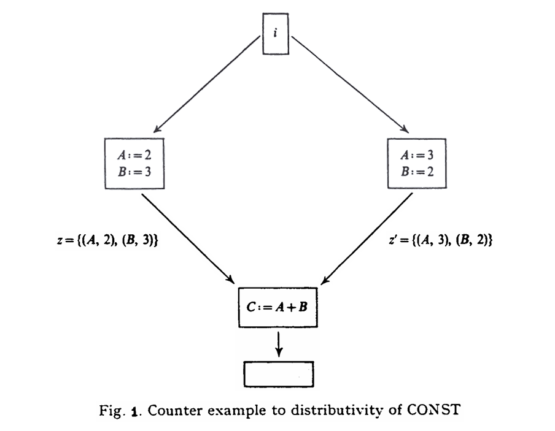
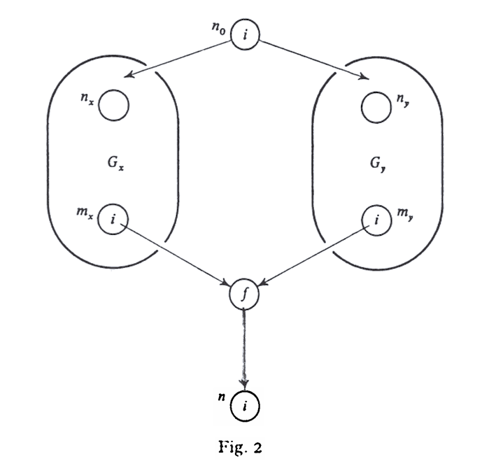
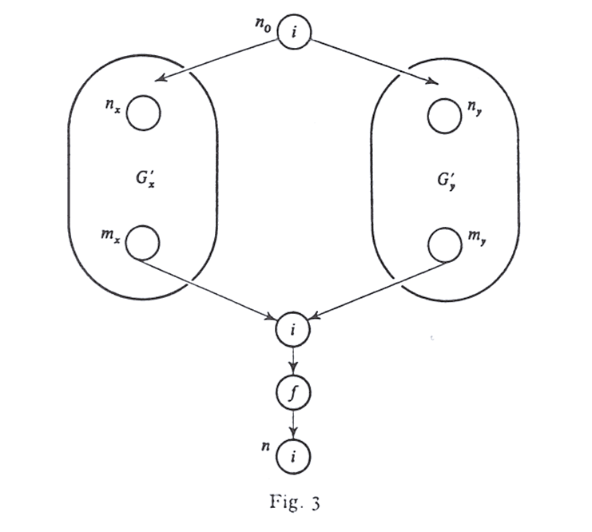

# Monotone Data Flow Analysis Frameworks

Performing compile time optimization requires solving a class of problems, called Global data flow analysis problems (abbreviated as gdfap's), involving determination of information which is distributed throughout the program.

Monotone data flow analysis frameworks are used to analyze the flow of information through a program. They are based on the idea of propagating data flow information through the control flow graph (CFG) of the program. The analysis is called "monotone" because the information gathered at each point in the program is monotonically increasing(or decreasing) as the analysis progresses.

## Lattice Theoretic

**Definition**: A flow graph is a triple $ G = (N, E, n_0) $, where: 

1. $N$ is a finite set of nodes.
2. $E$ is a subset of $ N \times N $ called the edges. The edge $(x, y)$ enters node y and leaves node $x$. We say that $x$ is a predecessor of $y$, and $y$ a successor of $x$.
3. $n_0$ in $N$ is the initial node. There is a path from $n_0$ to every node.

**Definition**:  A semilattice is a set $L$ with a binary meet operation $\wedge$ such that for all $ a, b, c \in L $:
$$
\begin{align*}
& a \wedge a = a & \text{idempotent} \\ 
& a \wedge b = b \wedge a & \text{commutative} \\
& a \wedge ( b \wedge c ) = (a \wedge b ) \wedge c & \text{accociative} 
\end{align*}
$$
**Definition**: Given a semilattice $L$ and elements, $a, b \in L$, we say that
$$
\begin{flalign}
& a \geq b \qquad \iff \; a \wedge b = b \\
& a \ge b \qquad \iff \; a \wedge b = b \; and \; a \neq b
\end{flalign}
$$
also $ a \leq b $ means $ b \geq a$ and $ a < b $ means $ b > a $. We extend the notation of the meet operation to arbitrary finite sets by saying
$$
\bigwedge\limits_{1 \leq i \leq n} x_i = x_1 \wedge x_2 \wedge ... \wedge x_n
$$
**Definition**: A semilattice $L$ is said to have a bottom element $\bot$, if for all $ x \in L, \bot \wedge x = \bot$. $L$ is said to have a top element $\top$, if $\top \wedge x = x$ for all $x \in L$. We assume from here on that every semilattice has a bottom element, but not necessarily a top element.

**Definition**: Given a semilattice $L$, a sequence of elements $x_1, x_2, ..., x_n $ in $L$ forms a chain if $ x_i > x_{i-1}$ for $ 1 \leq i < n $. $L$ is said to be bounded if for each $x \in L$ there is a constant $b_x$ such that each chain beginning with $x$ has length at most $b_x$.

If $L$ is bounded, then we can take meets over countably infinite sets if we define $ \bigwedge\limits_{x\in S}x$, where $ S = \{ x_1, x_2, ...\} $, to be $\lim_{n \to\infty} \bigwedge\limits_{1 \leq i \leq n} x_i $ . The fact that $L$ is bounded assures us there is an integer $m$ such that $\bigwedge\limits_{x\in S} x = \bigwedge\limits_{1 \leq i \leq m} x_i$.

**Partial Orders and Greatest Lower Bounds**

As we shall see, the meet operator of a semilattice define a partial order on the values of the domain. A relation $\leq$ is a $partial\;order$ on a set $V$ if $\forall x, y, z \in V$:

1. $x \leq x$ (the partial order is $reflexive$).
2. If $x \leq y$ and $y \leq x $, then $x = y$ (the partial order is $antisymmetice$).
3. If $x \leq y$ and $y \leq z$, then $x \leq z$ (the partial order is $transitive$).

The pair $(V, \leq)$ is called a $poset$, or $partially\;ordered\;set$. It is also convenient to have a $ < $ relation for a post, defined as
$$
x < y \quad \iff (x \leq y)\;\text{and}\;(x \neq y).
$$
Suppose $(V, \wedge)$ is a semilattice. A $greatest \; lower \; bound$ (or $glb$) of domain elements $x$ and $y$ is an element $g$ such that

1. $g \leq x$,
2. $g \leq y$, and 
3. If $z$ is any element such that $z \leq x \; \text{and} \; z \leq y, \; \text{then} \; z \leq g$.

It turns out that the meet of $x$ and $y$ is their only greatest lower bound. To see why, let $g = x \wedge y$. Observe that:

- $g \leq x$ because $(x \wedge y) \wedge x = x \wedge y$.
- $g \leq y$ by a similar argument.
- Suppose $z$ is any element such that $z \leq x$ and $z \leq y$. We claim $z \leq g$, and therefore, $z$ cannot be a glb of x and y unless it is also $g$. In proof: $(z \wedge g) = (z \wedge (x \wedge y)) = ((z \wedge x) \wedge y)$. Since $z \leq x$, we know $(z \wedge x) = z$, so $(z \wedge g) = ( z \wedge y)$. Since $z \leq y$, we know $z \wedge y = z $, and therefore $ z \wedge g = z $. We have proven $ z \leq g$ and conclude $ g = x \wedge y$ is the only glb of $x$ and $y$. 

## Monotone Data Flow Analysis Frameworks

**Definition**: Given a bounded semilattice $L$, a set of functions $F$ on $L$ is said to be a $monotone \; function \; space \; associated \; with \; L$ if the following conditions are satisfied:

- [M1] Each $f\in F$ satisfies the $monotoncity$ condition,
  $$
  (\forall x, y \in L)(\forall f \in F)\;[f(x \wedge y) \leq f(x) \wedge f(y)]
  $$

- [M2] There exists an identify function $i$ in $F$, such that
  $$
  (\forall x \in L)\; [i(x) = x].
  $$

- [M3] $F$ is closed under composition, i.e. $f, g \in F \Rightarrow f \circ g\in F$, where
  $$
  (\forall x, y \in L) \; [f \circ g (x) = f(g(x))]
  $$

- [M4] $L$ is equal to the closure of $\{ 0 \}$ under the meet operation and application of functions in $F$.

$Observation \; 1$. Given a semilattice $L$, let $f$ be a function on $L$, then
$$
(\forall x, y \in L) \; [f(x \wedge y) \leq f(x) \wedge f(y)] \iff (\forall x, y \in L) \; [x\leq y \; implies \; f(x) \leq f(y)]
$$
$proof$. We shall assume $(\forall x, y \in L) \; [x\leq y \; implies \; f(x) \leq f(y)]$ and show that $(\forall x, y \in L) \; [f(x \wedge y) \leq f(x) \wedge f(y)]$ holds. Since $x \wedge y$ is the greatest lower bound of $x$ and $y$, we know that
$$
x \wedge y \leq x \quad and \quad x \wedge y \leq y 
$$
Thus, by $(\forall x, y \in L) \; [x\leq y \; implies \; f(x) \leq f(y)]$,
$$
f(x \wedge y) \leq f(x) \quad and \quad f(x \wedge y) \leq f(y).
$$
Since $f(x) \wedge f(y)$ is the greatest lower bound of $f(x)$ and $f(y)$, we have $(\forall x, y \in L) \; [f(x \wedge y) \leq f(x) \wedge f(y)]$.

Conversely, let us assume $(\forall x, y \in L) \; [f(x \wedge y) \leq f(x) \wedge f(y)]$ to prove $(\forall x, y \in L) \; [x\leq y \; implies \; f(x) \leq f(y)]$. We suppose $x \leq y$ and use $(\forall x, y \in L) \; [f(x \wedge y) \leq f(x) \wedge f(y)]$ to conclude $f(x) \leq f(y)$. Since $x \leq y$ is assumed, $x \wedge y = x$ , by definition. We know that
$$
f(x) \leq f(x) \wedge f(y).
$$
Since $f(x) \wedge f(y)$ is the $glb$ of $f(x)$ and $f(y)$, we know $f(x) \wedge f(y) \leq f(y)$. Thus
$$
f(x) \leq f(x) \wedge f(y) \leq f(y)
$$
implies $(\forall x, y \in L) \; [x\leq y \; implies \; f(x) \leq f(y)]$.

□

$Observation\;2$. For any bounded semilattice $L$ and any countable set $S \subseteq L$, if for all $x \in S$ we have $ x \geq y$, then $\bigwedge\limits_{x\in S} x\geq y$.

$proof$. Consider the meet of all elements in $S$:
$$
m = \bigwedge\limits_{x \in S} x
$$
The meet $m$ is the greatest lower bound of all elements in $S$. By definition, $m \leq x$ for all $x \in S$. If $x \geq y$ for all $x \in S$, then every element in $S$ is an upper bound for $y$. $m$, being the greatest lower bound of all $x \in S$, must also be a lower bound for $y$. Therefore, $y \in m$. Hence, $m = \bigwedge\limits_{x \in S} x \geq y$. 

□

**Definition**: A Monotone data flow analysis framework is a triple $D = (L, \wedge, F)$, where

1. $L$ is a bounded semilattice with meet $\wedge$.
2. $F$ is a monotone function space associated with $L$.

A particular instance of a monotone data flow analysis framework is a pair $I = (G, M)$, where

1. $G = (N, E, n_0)$ is a flow graph.
2. $M: N \rightarrow F$ is a function which maps each node in $N$ to a function in $F$.

Some monotone data flow analysis frameworks satisfy the condition:
$$
(\forall x, y \in L)(\forall f \in F)\;[f(x \wedge y) = f(x) \wedge f(y)]\qquad\text{(distributivity)}
$$
That is, each $f$ in $F$ is a homomorphism on $L$. There are many interesting  gdfap's which are monotone data flow analysis frameworks but which do not satisfy the distributivity property. The following are some examples.

Constant Propagation can be formalized as a monotone data flow analysis framework $CONST = (L, \wedge, F)$. Here $L \subset 2^{V \times R}$, where **$V = \{ A_1, A_2, ...\}$ is an infinite set of variables** and **$R$ is the set of all real numbers.**

- $L$ is the set of functions from finite subsets of $V$ to $R$.
- $\theta \in L$ is the function which is undefined for all $A_i \in V$.

- The meet operation on $L$ is set intersection.

Intuitively, $z\in L$ stands for the information about variables which we may assume at certain points  of the program flow graph. $(A, r) \in z$ implies the variable A has value $r$.

We define a notation for functions in $F$ based on the sequence of assignments whose effect they are to model.

1. There are functions denoted $\langle A := B \,\theta\, C \rangle$ and $\langle A := r \rangle$ in $F$, for each $A$, $B$ and $C$ in $V$, $r \in R$ and $\theta \in \{ +, -, *, / \}$.

Let $z \in L$. Then

- $\langle A := B \,\theta\, C \rangle(z) = z'$, where $z'(X) = z(X)$ for all $X \in V - \{A\}$;  $z'(A)$ is undefined unless $z(B) = b$ and $z(C) = c$ for some $b$ and $c$ in R, in which case $z'(A) = b\,\theta\,c$.

  > Assume that $z$ represents the semilattice before that the program execution flow enters function $\langle A := B \,\theta\, C \rangle$,  and $z'$ the semilattice of  the program execution flow after executing  $\langle A := B \,\theta\, C \rangle$.  Since $\langle A := B \,\theta\, C \rangle$ is an assignment statement, so no matter what the variable $A$ changes, we always know all other variables will not be affected because the only variable affected is $A$. Hence we can obtain $z'(X) = z(X)$ for all $X \in V - \{A\}$. However, we still can determine the value of $A$ if $z(B) = b$ and $z(C) = c$ for some $b$ and $c$ in R, in which case $z'(A) = b\,\theta\,c$.

- $\langle A := r \rangle(z)=z'$ where $z'(X) = z(X)$ for all $X \in V - \{A\}$ and $z'(A) = r$.

2. $i \in F$, where $i(z) = z$ for all $z\in L$.
3. if $f, g \in F$ then $f \circ g \in F$.

**Lemma 1**. Let $L$ be a semilattice and $f_1, f_2, ..., f_n$ be functions on $L$. If it is true that $(\forall x,  y \in L) (\forall 1 \leq i \leq n)\; [f_i(x \wedge y) \leq f_i(x) \wedge f_i(y)]$, then $f_1 \circ f_2 \circ ... \circ f_n (x \wedge y) \leq f_1 \circ f_2 \circ ... \circ f_n (x) \wedge f_1 \circ f_2 \circ ... \circ f_n(y)$.

$proof$. $f_n(x \wedge y) \leq f_n(x) \wedge f_n(y)$ (by assumption). Suppose $f_1 \circ f_2 \circ ... \circ f_n (x \wedge y) \leq f_1 \circ f_2 \circ ... \circ f_n (x) \wedge f_1 \circ f_2 \circ ... \circ f_n(y)$, then $f_{i-1}(f_i\circ...\circ f_n(x \wedge y)) \leq f_{i-1}(f_i\circ...\circ f_n(x)) \wedge f_{i-1}(f_i\circ...\circ f_n(y))$ (by Observation 1). $f_{i-1}(f_i\circ...\circ f_n(x)) \wedge f_{i-1}(f_i\circ...\circ f_n(y)) \leq f_{i-1}  \circ ... \circ f_n (x) \wedge f_{i-1} \circ ... \circ f_n(y)$ (by assumption). So by simple backward induction on $i$, the lemma follows.

□

**Theorem 1**. $CONST = (L, \wedge, F)$ is a monotone data flow analysis framework. Furthermore there exists $z, z' \in L$ and $f \in F$ such that $f(z \wedge z') \leq f(z) \wedge f(z')$ .

$proof$. The fact that $L$ is a bounded semilattice with a $\bot$ element is obvious. Furthermore, for any element $z \in L, z = f_1 \circ f_2 \circ ... \circ f_n(\bot)$ for some integer $n$, where $f_i$ is of the form $\langle A_i = r \rangle$. So to show that $F$ is a monotone function space associated with $L$, it suffices by Lemma 1, to show that for all $z, z' \in L$ and all functions in $F$ of the form $\langle A := B \;\theta \;C \rangle$ or $\langle A = r \rangle$,
$$
\langle A := B \,\theta\, C \rangle(z \wedge z') \leq \langle A := B \,\theta\, C \rangle(z) \wedge \langle A := B \,\theta\, C \rangle(z')
$$
and
$$
\langle A := r \rangle(z \wedge z' ) \leq \langle A := r \rangle(z) \wedge \langle A := r \rangle(z').
$$
Observe that since $\wedge$ is intersection on $L$, the $\leq$ relation is set inclusion.

1. Suppose we are given $z, z' \in L$ and $\langle A := B \; \theta \; C \rangle \in F$. Let $y = \langle A := B \; \theta \; C \rangle(z \wedge z')$. Then for all $X \in V - \{ A \}$, if $(X, r) \in y$ then $(X, r) \in z$ and $(X, r) \in z'$. Hence $(X, r) \in \langle A := B \; \theta \; C \rangle(z)$ and $(X, r) \in \langle A := B \; \theta \; C \rangle(z')$.

   If $A$ is undefined in $y$, then we are done. Suppose however, that $(A, r) \in y$. Then $\{ (B, r_1), (C, r_2)\}$ is a subset of $z$ and is also a subset of $z'$, for some $r_1$ and $r_2$ such that $r = r_1\;\theta\;r_2$. This implies that $(A, r) \in \langle A := B\;\theta\;C\rangle(z)$ and $(A, r) \in \langle A := B\;\theta\;C\rangle(z')$

2. Suppose we are given $z, z' \in L$ and $\langle A := r\rangle \in F$. It is straightforward to show that $\langle A := r \rangle (z \wedge z') = \langle A := r \rangle (z) \wedge \langle A := r \rangle (z')$. Hence the first part of the lemma follows.

   For a counterexample showing that $CONST$ is not distributive, consider the flow chart of Figure 1. There we see that $\langle C := A + B \rangle(z \wedge z') = \emptyset $, while $\langle C := A + B \rangle(z) \wedge \langle C := A + B \rangle(z') = \{ (C, 5) \} $.

   
□

We shall also mention that Theorem 1 can be generalized to any framework whose lattice elements associate "values" with variables, whose meet operation is intersection, and whose functions reflect the application of "operation" on those values and assignment of values to variable. The framework will be monotone in all cases, but will be distributive only if the interpretation of the operator is "free", that is, the effect of applying $k\text{-}ary$ operator $\theta$ to two different $k\text{-}tuples$ of values is never that same.

> The phrase **"whose functions reflect the application of 'operation' on those values and assignment of values to variable"** refers to how the **transfer functions** in the data flow analysis framework operate on the lattice elements. Specifically, it describes the behavior of these functions in terms of:
>
> 1. **Applying operations** to the values associated with variables (e.g., performing arithmetic or logical operations).
> 2. **Assigning new values** to variables based on the results of those operations.
>
> This means that the transfer functions $( f \in F)$ simulate the effect of program statements on the values of variables. For example:
> - If a program statement is `x = y + z`, the corresponding transfer function:
>   - **Applies the operation** $+$ to the values of $y$ and $z$.
>   - **Assigns the result** to $x$.
>
> In the lattice, this might look this:
>
> - If $y$ is mapped to 3 and $z$ is mapped to 5, the transfer function updates $x$ to 8.

## Approaches to Solving Monotone Data Flow Analysis Problems

It appears generally true that what one searches for in a data flow problem is what we shall call the $meet\;over\;all\;paths (MOP)$ solution. That is, let $PATH(n)$ denote the set of paths from the initial node to node $n$ in some flow graph. The we really want $\bigwedge\limits_{p \in PATH(n)}f_p(\bot)$ for each $n$. It is this function, the $MOP$ solution that, in any practical data flow problem we can think of, expression the desired information.

The paths considered in the $MOP$ solution are a superset of all the paths that are possibly executed. Thus, the $MOP$ solution meets together not only the data-flow values of all the executable paths, but also additional values associated with the paths that cannot possibly by executed.

Notice that in the $MOP$ solution, the number of paths considered is still unbounded if the flow graph contains cycles. Thus, the $MOP$ definition does not lend itself to a direct algorithm. The iterative algorithm certainly does not first find all the paths leading to a basic block before applying the meet operator. Rather,

1. The iterative algorithm visits basic blocks, not necessarily in the order of execution.
2. At each confluence point, the algorithm applies the meet operator to the data-flow values obtained so far. Some of these values used were introduced artificially in the initialization process, not representing the result of any execution from the beginning of the program.

**Algorithm 1** (Essentially Kildall's Algorithm applied to a monotone framework)

&emsp; $Input$. A particular instance $I = (G, M)$ of $D = (L, \wedge, F)$, where $G = (N,E, n_0)$ is a flow graph.

&emsp; $Initialization$.
$$
(\forall n \in N) \qquad \qquad 
A[n] \begin{cases}
		\bot \qquad \text{if}\; n = n_0 \\
		\top \qquad \text{otherwise}
	\end{cases}
$$
&emsp; $Iteration \; Step$. Visit nodes other that $n_0$ in order $n_1, n_2, ... $ (with repetitions, and not fixed in advance). We $visit$ node n by setting
$$
A[n] = \bigwedge\limits_{p \in PRED(n)} f_p(A[p])
$$
where $PRED(n) = \{ p\,|\,(p, n) \in E\}$. The sequence $n_1, n_2, ...$ has to satisfy the following condition:

&emsp; If there exists a node $n \in N - {n_0}$ such that $A[n] \neq \bigwedge\limits_{p \in PRED(n)} f_p(A[p])$ after we have visited node $n_s$ in the sequence, then there exists integer $t > s$ such that $n_t = n$. Also, if after visiting node $n_s$, $A[n] = \bigwedge\limits_{p \in PRED(n)} f_p(A[p])$ for all $n \neq n_0$, then the sequence will eventually end.

>   For no loop CFG, the iterative algorithm only iterates once.

&emsp; $Convention$. Given instance $I = (G, M)$ of framework $D = (L, \wedge, F)$, if we apply Algorithm 1 to $I$ with the sequence $n_1, n_2, ...$, we say that the $j$-th step of Algorithm 1 has been applied after we have visited node $n_1, n_2, ..., n_j$. Let $n$ be a node in $G$. We let $A^{(m)}[n]$ denote the value of $A[n]$ right after step $m$ of Algorithm 1 has been applied.

&emsp; $Convention$. Given a particular instance $I = (G, M)$ of $D = (L, \wedge, F)$, we let $f_n$ denote $M(n)$, the function in $F$ which is associated with node $n$. Let $P = n_1, n_2,..., n_m, n_{m+1}$ be a path in $G$. Then we may use $f_P(.)$ for $f_{n_m}(f_{n_{m-1}}(...f_{n_1}(.)))$. Note that $f_{n_{m+1}}$ is not in the composition.

&emsp; **Lemma 2**. Given an instance $I = (G, M)$ of a monotone data flow analysis framework $D = (L, \wedge, F)$, if we apply Algorithm 1 to $I$, the algorithm will eventually halt.

&emsp; $Proof$. It is a simple proof by induction on $m$, the number of steps applied in Algorithm 1, that $A^{(m+1)}[n] \leq A^{(m)}[n]$ (by monotone property, $f(x \wedge y) \leq f(x) \wedge f(y)$), for all nodes in $G$. According to the condition on the sequence of nodes being visited, after we have applied the $k$-th step of Algorithm 1, either there exists an integer $j$ such that $A^{(k + j + 1)}[n] \leq A^{(k+j)}[n]$ for some node $n$ in G, or the sequence will halt. The facts that $L$ is bounded and that $G$ has only finitely many nodes guarantee that the sequence ends and the algorithm will eventually halt.

□

&emsp; **Theorem 2**. Given an instance  $I = (G, M)$ of framework $D = (L, \wedge, F)$, after we have applied Algorithm 1 to $I$, we have $(\forall n \in N)\left[ A[n] \leq \bigwedge\limits_{P \in PATH(n)} f_P(\bot) \right]$, where $PATH(n) = \left\{ P \; | \; P \; \text{is a path in} \; G \; \text{from} \; n_0 \; \text{to} \; n \right\}$.

&emsp; $Proof$. We want to prove by induction on $l$ that $(\forall n \in N)\left( A[n] \leq \bigwedge\limits_{P \in PATH_l(n)} f_p(\bot) \right)$, where $PATH_l(n) = \{ P \; | \; P \; \text{is a path of length } l \text{ from } n_0 \text{ to } n \}$.

&emsp; $Basic$. $(l = \bot)$ $n_0$ is the only node that has a path from $n_0$ of zero length. Since $A[n_0]$ is assigned $\bot$ initially and not changed afterward, the basic holds.

&emsp; $Inducitons \; step$. $(l > 0)$ If $n = n_0$, we are done. Suppose $n \neq n_0$. We have $A[n] = \bigwedge\limits_{p \in PRED(n)} f_p(A[p])$ , and $(\forall p \in PRED(n)) \; \left( A[p] \leq \bigwedge\limits_{Q \in PATH_{l-1}(p)} f_Q(\bot) \right)$, by hypothesis. Thus $A[n] \leq \bigwedge\limits_{P \in PRED(n)} f_p \left( \bigwedge\limits_{Q \in PATH_{l-1}(p)} f_Q(\bot) \right)$ by monotonicity and Observation 1. By monotonicity again, we have $A[n] \leq \bigwedge\limits_{ p \in PRED(n)\; Q \in PATH_{l-1}(p) } f_p(f_Q(\bot)) = \bigwedge\limits_{P \in PATH_l f_P(\bot)}$. By Observation 2, we have for all $n \in N$
$$
A[n] \leq \bigwedge\limits_{P \in PATH(n)} f_P(\bot).
$$

□

&emsp; **Theorem 3**. Given an instance $I = (G, M)$ of a monotone framework $D = (L, \wedge, F)$, after we have applied Algorithm 1, the solution $A[n]$'s we get is the maximum fixed point solution of the set of simultaneous equations
$$
\begin{align*}
 X[n_0] &= \bot \\
 (\forall n \in X - { n_0 })(X[n] &= \bigwedge\limits_{p \in PRED(n)} f_p(X[p])
\end{align*}
$$
&emsp; $Proof$. It is obvious that, after Algorithm1 halts, the $A[n]$'s satisfy the above equations. Now suppose we are given any solution $B[n]$'s to the equation. We want to prove by induction on $m$, the number of steps applied in Algorithm 1, that after the $m$-th step $B[n] \leq A^{m}[n]$ for all $n \in N$.

&emsp; $Basic$. $(m = 0)$ Obvious.

&emsp; $Inductions \; step$. $(m = 0)$ At the $m$-th step, we have

&emsp; **Corollary**. Given an instance $I = (G, M)$ of a framework $D = (L, \wedge, F)$, as input to Algorithm 1, the $A[n]$'s we get after Algorithm 1 halts is unique independent of the sequence in which nodes are visited, provided the sequence satisfies the condition stated in the algorithm.

&emsp; **Theorem 4**. Given a monotone framework $D = (L, \wedge, F)$, suppose $(\exist x, y\in L)(\exist f \in F)\left[ f(x \wedge y) < f(x) \wedge f(y) \right]$, i.e. $D$ is not distributive. Then there exists an instance $I = (G, M)$ such that after we apply Algorithm 1, there is a node $n$ in $G$ such that 
$$
A[n] < \bigwedge\limits_{ P \in PATH(n)} f_P(\bot).
$$
&emsp; $Proof$. By condition [M4] in the definition of a monotone function space, we can find acyclic graphs $G_x$ and $G_y$, with input nodes $n_x$ and $n_y$, and output nodes $m_x$ and $m_y$, such that after that we apply Algorithm 1 to $G_x$ and $G_y$, we get $A[m_x] = x$ and $A[m_y] = y$. A straightforward induction on the number of meet operations and function applications necessary to construct a lattice element from $\bot$ proves the existence of $G_x$ and $G_y$.

&emsp; Consider the graph $G$ of the above figure. It is easy to check that if we apply Algorithm 1 we have $A[n] = f(x \wedge y)$. By Theorem 2, in $G$ we have $x \leq \bigwedge\limits_{ P \in PATH(n_x)} f_P(\bot)$ and $y \leq \bigwedge\limits_{ P \in PATH(n_y)} f_P(\bot)$. Thus $\bigwedge\limits_{P \in PATH(n)} f_P(\bot) \geq f(x) \wedge f(y)$ by monotonicity. But we are given $f(x) \wedge f(y) > f(x \wedge y)$, so $A[n] < \bigwedge\limits_{P \in PATH(n)} f_P(\bot)$.

□

In summary then, Kildall's algorithm applied to a monotone data flow analysis framework yields a unique solution, independent of the order in which nodes are visited. This solution is the maximum fixed point of the set of equations associated with a flow graph. However, we can only show that the solution is equal to or less than the $MOP$ solution, and when the framework is not distributive there will always be some instance in which the inequality is strict.

**A Variant of Kildall's Algorithm**

This algorithm will obtain the $MOP$ solution in certain situations where Algorithm 1 fails to do so. However, like Algorithm 1, it must fail for some instance of any monotone, non-distributive framework. It is interesting, however, to note that the two algorithms differ in their behavior in the general monotone case, although they are easily shown in produce identical answers for distributive frameworks.

**Algorithm 2**

&emsp;$Input$. As in Algorithm 1

&emsp;$Initialization$
$$
(\forall \in N)
\qquad \qquad \qquad
B[n] 
\begin{cases}
\begin{flalign}
&f_{n_0}(\bot)\qquad & \text{if}\; n = n_0 \\
&\top & \text{otherwise}
\end{flalign}
\end{cases}
$$
&emsp;$Iteration \; step$. Visit nodes other than $n_0$  in order $n_1, n_2, ...$ (not fixed in advance). We $visit$ node $n$ by setting
$$
B[n] := \bigwedge\limits_{p \in PRED(n)} f_n(B[p])
$$
The sequence $n_1, n_2, ...$ has to satisfy the condition: if there is a node $n \in N - \{ n_0 \}$ such that $B[n] \neq \bigwedge\limits_{ p \in PRED(n)} f_n(B[p])$ after we have visited node $n_s$ in the sequence, then there exists integer $ t > s$ such that $n_t = t$. Also if $B[n] = \bigwedge\limits_{p \in PRED(n)} f_n(B[p])$ for all $n \neq n_0$, we will eventually halt the iteration.

&emsp;$Final \; Step$. We set
$$
\begin{align*}
H[n_0] &= \bot \\
(\forall n \in N - \{ n_0\}) H[n] &= \bigwedge\limits_{p \in PRED(n)} B[p].
\end{align*}
$$
**Theorem 5**. Given an instance $I = (G, M)$ of a framework $D = (L, \wedge, F)$ as input to Algorithm 2:

1. Algorithm 2 will eventually halt. The result we get is unique independent of the order in which nodes are visited and $(\forall v \in N)\; H[n] \leq \bigwedge\limits_{P \in PATH(n)} f_P(\bot)$.

2. The resulting $B[n]$'s form the maximum fixed point of the set of equations
   $$
   \begin{align*}
   X[n_0] &= f_{n_0}(\bot) \\
   (\forall n \in N - \{ n_0\}) (X[n] &= \bigwedge\limits_{p \in PRED(n)} f_n(X[p])).
   \end{align*}
   $$

3. If $A[n]$ is the result of applying Algorithm 1 to $I = (G, M)$, then $A[n] \leq H[n]$.

&emsp; $Proof$. The proofs are similar to the proofs of the results in the previous section and we omit them.

□

**Theorem 6**. Given a monotone framework $D = (L, \wedge, F)$, suppose $(\exist x, y \in L)(\exist f \in F)\big[ f(x \wedge y) < f(x) \wedge f(y) \big]$, i.e. $D$ is not distributive. Then:

1. there exists an instance $I = (G, M)$ such that there is a node in $G$ such that
   $$
   H[n] \leq \bigwedge\limits_{P \in PATH(n)} f_P(\bot)
   $$
   after we have applied Algorithm 2 to $I$. 

2. there exists an instance $I' = (G', M')$ such that there is a node $n$ in $G'$ such that 
   $$
   A[n] \leq H[n]
   $$
   after we have applied Algorithm 1 and Algorithm 2 to instance $I$.
   
   

&emsp; $Proof$. We may, as in Theorem 4, invoke condition [M4] to observe that there are graphs $G'_x$ and $G'_y$ such that their output nodes $m_x$ and $m_y$ have $B[m_x] = x$ and $B[m_y] = y$. Then consider the graph of the above figure. It follows from monotonicity that
$$
\bigwedge\limits_{P \in PATH(n)} f_P(\bot) \geq f(x) \wedge f(y) > f(x \wedge y) = H[n].
$$
&emsp; To prove Theorem 6 (2), we refer to Figure 2. Direct calculation will show that $A[n] = f(x \wedge y)$. By part (3) of Theorem 5, $H[m_x] \geq x$ and $H[m_y] \geq y$. Thus $B[m_x] \geq x$ and $B[m_y] \geq y$. It follows that $H[n] \geq f(x) \wedge f(y)$, so $A[n] < H[n]$.

□

## Undecidability of the MOP Problem for Monotone Data Flow Analysis Frameworks

We have seen that some of the obvious algorithms fail to compute the MOP solution for an arbitrary monotone framework. We shall now show that this situation must hold for any algorithm. In particular, we show that there does not exist an algorithm which, for arbitrary instance $I = (G, M)$ of an arbitrary monotone data flow analysis framework $D = (L, \wedge, F)$, will compute $\bigwedge\limits_{P \in PATH(n)}f_P(\bot)$ for all nodes $n$ of $G$.

**Definition**. The $Modified \; Post's \; Correspondence \; Problem \; (MPCP)$ is  the following: Given arbitrary lists $A$ and $B$, of $k$ strings each in $\{ 0, 1 \}^+$, say
$$
A = w_1, w_2, ..., w_k \qquad B = z_1, z_2, ..., z_k
$$
does there exist a sequence of integers $i_1, i_2, \ldots , i_r$ such that
$$
w_1 w_{i_1} w_{i_2} \ldots w_{i_r} = z_1 z_{i_1} z_{i_2} \ldots z_{i_r}
$$
It is well known that MPCP is undecidable.

**Example instance of MPCP**. Consider the following two lists:

$A = \{ w_1, w_2, w_3, w_4 \}$ and $B = \{z_1, z_2, z_3, z_4\}$ 
$$
\begin{align*}
&w_1 = 010 \qquad &z_1 = 010 \\
&w_2 = 0 \qquad &z_2 = 100 \\
&w_3 = 01 \qquad &z_3 = 00 \\
&w_4 = 110 \qquad &z_4 = 11 \\
\end{align*}
$$
A solution to this problem would be the sequence $(4, 3, 4, 2)$, because
$$
w_1 w_4 w_3 w_4 w_2 
= 010 \cdot 110 \cdot 01 \cdot 110 \cdot 0
= 010110011100
= 010 \cdot 11 \cdot 00 \cdot 11 \cdot 100
= z_1 z_4 z_3 z_4 z_2
$$
Furthermore, since $(4, 3, 4, 2)$ is a solution, so are all of its "repetitions", such as $(4, 3, 4, 2, 4, 3, 4, 2)$, etc.; that is, when a solution exists, there are infinitely many solutions of this repetitive kind.

**Association of Post Correspondence Problem with Monotone Data Flow Analysis Frameworks**

To associate PCP with monotone data flow analysis frameworks, we can think of the problem in terms of data flow through a hypothetical program. Here's how:

1. **Control Flow Graph (CFG)**: Construct a CFG where each node represents a step in the PCP process (e.g., selecting an index from the lists).
2. **Data Flow Information**: Define data flow information that represents the partial solutions to the PCP at each node. For example, at each node, we can track the current concatenation of strings from both lists.
3. **Monotone Propagation**: Propagate this data flow information through the CFG. At each node, update the data flow information based on the selected index and the current concatenation.
4. **Termination Condition**: Check if the data flow information at any node matches the target concatenation. If it does, a solution to the PCP has been found.

Given an instance $AB$ of MPCP with lists $A = w_1,\ldots,w_k$ and $B = z_1,\ldots,z_k$, we can construct a monotone data flow analysis framework $D_{AB} = (L_{AB}, \wedge, F_{AB})$, where the following elements are in $L_{AB}$:

1. $\bot$, the lattice zero,
2. the special element $\$$, which will in a sense indicate non-solution to MPCP, and
3. all strings of integers $1, 2, \ldots, k$ beginning with $1$.

The meet on these elements in given by: $x \wedge y = \bot$ whenever $x \neq y$. Thus, if $x \leq y$, then either $x = y$ or $x = \bot$.

The set of functions $F_{AB}$ includes the following.

1. the identify function on $L_{AB}$

2. functions $f_i$, for $ 1 \leq i \leq k$ defined by:

   1. if $a$ is a string of integers beginning with $1$, then $f_i(a) = ai$,
   2. $f_i(\bot) = (\bot)$ and
   3. $f_i(\$) = \$$,

3. the function $g$ defined by

   1. for string $a = 1 i_1 i_2 \ldots i_m$,

   $$
   g(a) = 
   \begin{cases}
   \bot \qquad \text{if} \; 1 i_1 i_2 \ldots i_m \; \text{is a solution to instance AB of MPCP} \\
   \$ \qquad \text{otherwise},
   \end{cases}
   $$

   2. $g(\bot) = \bot$,
   3. $g_i(\$) = \$$,

4. the function $h$ defined by $h(x) = \top$ (that is, the string consisting of $\top$ alone) for all $ x \in L_{AB}$.

5. All functions constructed from the above by composition.

**Lemma 3.** $D_{AB} = ( L_{AB}, \wedge, F_{AB})$ constructed above is a monotone data flow analysis framework.

$Proof$. We show only monotonicity; the other properties are easy to check. By Observation 1 and Lemma !, it suffices to show that if $x \leq y$ for $x$ and $y$ in $L_{AB}$ then

1. $f_i(x) \leq f_i(y) $ for $1 \leq i \leq k$,
2. $g(x) \leq g(y)$, and
3. $h(x) \leq h(y)$.

Since $h(x) = h(y) = \top$, (3) is immediate. We have observed that for the meet operation we have defined, $x \leq y$ implies $x$ is either $y$ or $\bot$. In the former case (1) and (2) are immediate.

In the latter case, $f_i(x) = \bot$ and $g(x) = \bot$, so $f_i(x) \leq f_i(y)$ and $g(x) = g(y)$ follows.

**Theorem 7**. There does not exist an algorithm $A$ with the following properties.

1. the input to $A$ is
   1. Algorithms to perform meet, equality testing and application of functions to lattice elements for some monotone framework and,
   2. An instance $I$ of the framework.
2. The output of $A$ is the $MOP$ solution for *I*.

$Proof$. If $A$ exists, then we can apply $A$ to any monotone framework $D_{AB}$ constructed above with the instance $I$. The MOP solution to that problem at point $p$ is easily seen to be $\$$ if the instance $AB$ of the MPCP has no solution, and $\bot$ if it does. Thus, if $A$ existed, we could solve the MPCP.

> We can construct a CFG where each node represents selecting a index from MPCP lists, and data flow information represents the partial solutions to the MPCP at each node. If the data flow information obtained from different paths is different (which means there is no solution to this MPCP) , then we always obtain $\bot$ by definition of meet operator (meet on these elements in given by: $x \wedge y = \bot$ whenever $x \neq y$. Thus, if $x \leq y$, then either $x = y$ or $x = \bot$.). By definition of function $g$, therefore we obtain $\$$, which will in a sense indicate non-solution to MPCP.

## References

1. Kam, J.B. and Jeffrey D. Ullman. Monotone Data Flow Analysis Frameworks, Tech. Rept. No. 169, Dept, of Elec. Engg., Princeton Univ., Princeton, NJ, 1975.
2. Kildall, Gary A. A Unified Approach to Global Program Optimization, in [POPL73], pp. 194-206.
3. Wikipedia - [Post correspondence problem](https://en.wikipedia.org/wiki/Post_correspondence_problem)
4. Muchnick and Steven S. Advanced compiler design and implementation.
5. Aho, Alfred V. Compilers: principles, techniques, & tools.
