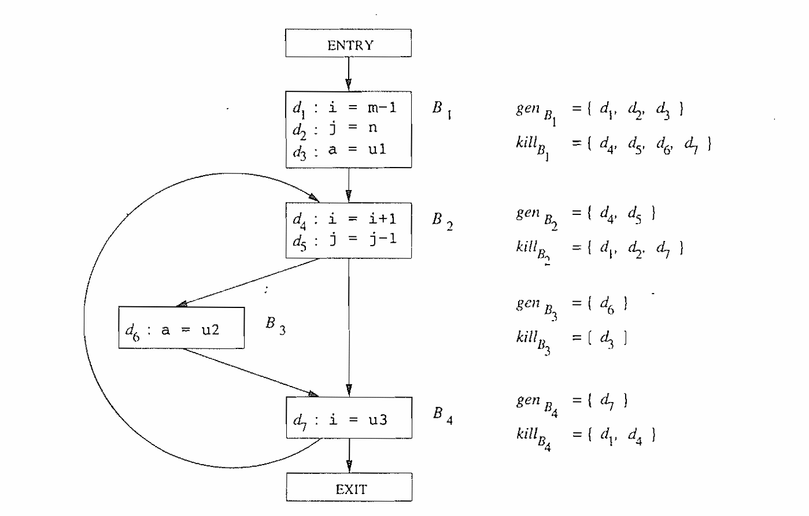
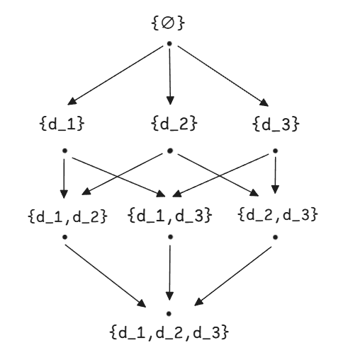

# 到达定值

我们可能希望找出在某个程序点上一个变量可能有哪些值，以及这些值可能在哪里定值。考虑下面这段代码：

$$
\begin{aligned}
&d_1: \quad a \leftarrow 1 \\
&d_2: \quad \text{if read() <= 0 goto } d_6 \\
&d_3: \quad b \leftarrow a \\
&d_4: \quad a \leftarrow 6 \\
&d_5: \quad \text{goto } d_2 \\
&d_6: \quad \text{other instructions} \\
\end{aligned}
$$

我们可能对程序点( $d_6$ )上的所有程序状态进行总结：$a$ 的值总是 ${1, 6}$ 中的一个，而它由 ${d_1, d_4}$ 中的一个定值。*可能*沿着某条路径到达某个程序点的定值称为到达定值(*reaching definition*)。

到达定值是最常见和有用的数据流模式之一。只要知道当控制到达程序中每个点的时候，每个变量 $x$ 可能在程序中的哪些地方被定值，我们就可以确定很多有关 $x$ 的性质。比如，一个编译器能够根据到达定值信息知道 $x$ 在点 $p$ 上的值是否为常量，而如果 $x$ 在点 $p$ 上被使用，则调试器可以指出 $x$ 是否未经定值就被使用。

>   **未定值先使用**
>
>   我们可以在流图的入口处对每个变量 $x$ 引入一个哑定值(dummy definition)。如果 $x$ 的哑定值到达了一个可能使用 $x$ 的程序点 $p$，那么 $x$ 就可能在定值之前被使用。请注意，我们永远不能绝对肯定这个程序包含一个错误。因为有可能存在某种原因使得到达 $p$ 点而没有真正对 $x$ 赋值的路径实际上并不存在。这个原因可能涉及复杂的逻辑问题。考虑以下程序片段：
>
>   ```c
>   int x;		// x_dummy
>   if (不透明谓词（一个复杂的数论真命题）) {
>       x = 10; // x_1
>   }
>   printf("%d\n", x); // x_2
>   ```
>
>   分析器可能无法推导分支条件恒为真。实际上，分析器会插入 $\phi$ 函数（[$\phi$ 函数的作用请参考这里](../../basics/ssa/ssa.md) ）：
>   $$
>   x_2 \leftarrow \phi(x_{dummy}, x_1)
>   $$
>   由于 $x_{dummy}$ 和 $x_1$ 的值一定不同。所以分析器必须假设 $x_{dummy}$ 和 ${x_1}$ 都可能到达第五行代码。但实际上 $x$ 未定义的情况永远不会发生，但是编译器根据分析结果将会报告 $x$ 可能存在未定义被使用。这个反例展示了静态分析的根本局限性，它能识别所有可能的错误路径，但无法确定哪些路径会在实际执行中发生。这就是为什么到达定值分析只能给出“可能存在未定义使用”的警告，而非确定性结论。

## 到达定值的传递方程

我们为到达定值问题设置约束。首先检查单个语句的细节。考虑一个定值：
$$
d: \quad u \leftarrow v \ \theta \ w
$$
在这里 $\leftarrow$ 代表一个赋值操作，$\theta$ 表示一个一般性的二元运算符。

这个语句“生成”了一个变量 $u$ 的定值 $d$，并“杀死”了程序中其他对 $u$ 的定值，而进入这个语句的其他定值都没有收到影响。因此，定值 $d$ 的传递函数可以被表示为
$$
f_d(x) = gen_d \ \cup \ (x - kill_d)
$$
其中 $gen_d = \{ d \}$，即由这个语句生成的定值的集合，而 $kill_d$ 是程序中对所有其他 $u$ 的定值。一个基本块的传递函数可以通过把它包含的所有语句的传递函数组合起来而构造得到。假设有两个函数 $f_1(x) = gen_1 \ \cup \ (x - kill_1)$ 和 $f_2(x) = gen_2 \ \cup \ (x - kill_2)$。那么
$$
\begin{aligned}
f_2(f_1(x)) &= gen_2 \ \cup \ (gen_1 \ \cup \ (x - kill_1) - kill_2 ) \\
&= (gen_2 \ \cup \ (gen_1 - kill_2)) \ \cup \ (x - (kill_1 \ \cup kill_2 )) 
\end{aligned}
$$
这个规则可以扩展到由任意多个语句组成的基本块。假设基本块 $B$ 有 $n$ 个语句，而第 $i$ 个语句的传递函数为 $f_i(x) = gen_i \ \cup \ (x - kill_i), \ i=1,2,...,n$，那么基本块 $B$ 的传递函数可以写成：
$$
f_B(x) = gen_B \ \cup \ (x - kill_B)
$$
其中
$$
kill_B = kill_1 \ \cup \ kill_2 \ \cup \ ... \ \cup kill_n
$$
而
$$
gen_B = gen_n \ \cup \ (gen_{n-1} - kill_n) \ \cup \ (gen_{n-2} - kill_{n - 1} - kill_n) \ \cup \ \\ ... \ \cup \ (gen_1 - kill_2 - kill_3 - ... - kill_n)
$$
和单个语句一样，一个基本块也会生成一个定值集合并杀死一个定值集合。集合 $gen_B$ 包含了所有在紧靠基本块之后的点上“可见”的该基本块中的定值——我们把他们成为“向下可见”的。在一个基本块中，一个定值是向下可见的，仅当它没有被同一个基本块中较后的对同一变量的定值“杀死”。一个基本块的 $kill$ 集就是所有被块中各个语句杀死的定值的集合。

<p align="center">
  
</p>

>   一个定值可能同时出现在基本块的 $gen$ 集和 $kill$ 集中。在这种情况下，该定值会被这个基本块生成，即优先考虑该定值是否在 $gen$ 集中。这是因为在 $gen-kill$ 形式中，$kill$ 集会在 $gen$ 集之前被使用。


## 到达定值的格

到达定值的格元素为定义集合的幂集。假设程序中有三个定义 $d_1, d_2, d_3$ ，我们定义集合 $D$ 为所有定义的集合 $D = \{  d_1, d_2, d_3 \}$，格的元素 $L = 2^D$。即格的所有可能的元素为 $\{ \empty \}, \{ d_1 \}, \{ d_2 \}, \{ d_3 \}, \{ d_1, d_2 \}, \{ d_1, d_3 \}, \{ d_2, d_3 \}, \{ d_1, d_2, d_3 \}$ 。假设需要使用半格 $L = (V, \wedge, \preceq)$ 表示到达定值的格，我们设置半格的顶元素 $\top = \{ \empty \}$，底元素 $\bot = \{ d_1, d_2, d_3 \}$。我们定义 $\wedge$ 操作为 $\cup$ ，根据定义 $x \preceq y  \quad \text{当且仅当} \quad x \wedge y = x$，偏序应该是 $\supe$ 。$\top$ 为半格中的最大元素，而$\bot$ 为半格中的最小元素。因为$a \preceq \top, \forall a \in V \implies a \supe \{ empty \}, \forall a \in V$， 并且 $\bot \preceq \top \implies D \supe \{ \empty \} $。


>    $\wedge$ 操作为 $\cup$ ，$\preceq$ 为 $\supseteq$ ，$\top$ 为半格中的最大元素，而$\bot$ 为半格中的最小元素。这可能有点违反直觉，但实际上它仍然是正确的。在有些文献中，到达定值的格为一个并半格 $L = (V, \vee, \preceq)$，它的并操作 $\vee$ 为 $\cup$，偏序 $\preceq$ 为 $\sube$，最大元素 $\top$ 为 $D$，最小元素$\bot$ 为 $\{ \empty \}$ 。在到达定值分析中，虽然两种的半格表示都是正确的，但是在初始化和迭代方向上有所不同。对与我们的半格 $L = (V, \wedge=\cup, \preceq=\supe)$，在进行
>
>    不过在这里我们并不使用并半格的概念，而是使用 $L = (V, \wedge, \preceq)$ 表示所有半格。


这个半格的图结构表示如下：

<p align="center">
  
</p>

这个格同样是单调性的（如果你不明白单调性的作用，请参考这篇文章 [单调数据流分析框架](../monotone/monotone_data_flow_analysis_frameworks.md) ）。我们知道传递函数的形式为 $OUT[B] = gen_B \cup (IN[B] - kill_B)$。当输入定义集增大时，输出集不会减小，验证：
$$
IN_1 \sube IN_2 \implies OUT_1 = gen_B \cup (IN_1 - kill_B) \sube gen_B \cup (IN_2 - kill_B) = OUT_2
$$


## 初始值和安全值

我们知道到达定值的格结构为 幂格集，其中 $\top$ 是 $\{ \empty \}$ ，表示 “无定义到达”，最乐观假设。$\bot$ 是全集 $D$，表示“所有定义都可能到达”，这是最保守的假设，也是我们优化时最不希望的结果。

到达定值的安全值可以设置为 $\top$ 或者 $\bot$。根据单调性和不动点定理：到达定值的传递函数是**单调**的，且格是有限高度的，迭代算法必然收敛到一个不动点。在到达定值中，无论从 $\top$ 还是 $\bot$ 开始迭代，最终都会收敛到同一个不动点。这是因为，从 $\top$ 开始（空集）：通过传递函数逐步添加定义（$gen_B$），并集合并路径，最终覆盖所有可达定义。收敛速度通常更快（初始值接近最终解），依据标准最小不动点理论。而从 $\bot$ 开始（全集）：通过传递函数移除不可达定义（$kill_B$），并集保留可达定义，最终收敛到相同结果。收敛速度可能更慢（需多轮迭代移除多余定义），依据最大不动点。
