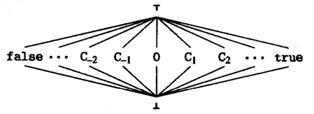
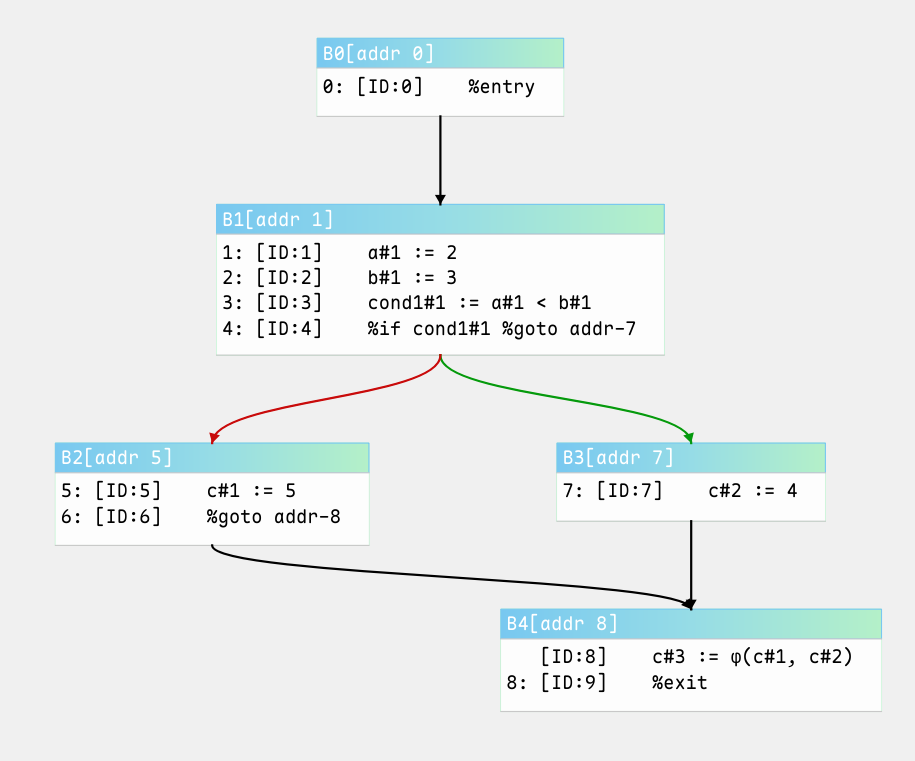
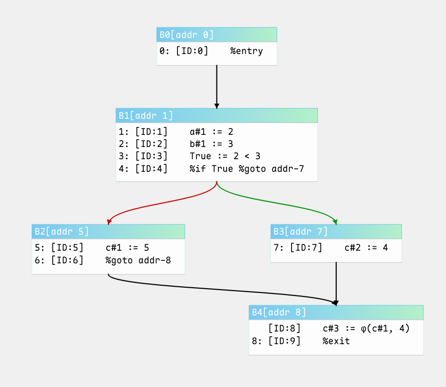

# Sparse Conditional Constant Propagation

## 介绍

常量传播（Constant Propagation）是一种转换，对于给定的关于某个变量 $x$ 和一个常量 $c$ 的赋值 $x \leftarrow c$ ，这种转换用 $c$ 来替代以后出现的 $x$ 的引用，只要在这期间没有出现另外改变 $x$ 值的赋值。常数传播减少了过程需要的寄存器个数，并增加了其他若干优化的效果，这些优化包括常量表达式计算，归纳变量优化，以及基于依赖关系分析的那些转换。

SCCP 是普通常量传播的增强版，结合了**常量传播**与**条件分支分析**，能更精确地处理控制流和稀疏数据流。

为了执行稀疏条件常量传播，我们必须将流图转化为SSA形式，但有一个额外的附带条件，即每一个节点只含有一种运算或 $\phi$ 函数（即控制流扁平化或原子化）。在执行SCCP之前，我们通过迭代必经边界方法将流图转换为最小的SSA形式，并划分基本块为每个节点一条指令，然后对每一个变量引入一条将它唯一定义连接到它的每一个使用的SSA边。这些工作使得信息的传播可以与程序的控制流无关。

> SSA 相关的计算可以查看 [单静态赋值 (SSA) 形式](../../basics/ssa/ssa.md)

我们使用流图的边和SSA边来传递信息实现程序的符号执行。在处理过程中，仅当结点的执行条件满足时，我们才标志它们是可执行的，并且在每一步我们只处理那些可执行的结点，以及那些其SSA前驱已经被处理过的结点 —— 这就是该方法为什么是符号执行，而不是数据流分析的原因。

<p align="center">
  
</p>

上图是一个[常量格(常量格的特性可以参考这篇文章)](./constlat.md)，其中每一个 $C_i$ 是一个可能的常数值，包含 true 和 false 是为了提供关于条件表达式结果的格值。对于程序中的每一个变量，我们在流图中定义这个变量的唯一结点的出口处给它一个相连的格值。给一个变量赋予值 $\top$ 意味着它还有一个还未确定的常数值，而 $\bot$ 则意味着不是常数，或不能确定是常数。我们用 $\top$ 初始化所有的变量。


## 算法实现

SCCP分析器使用`exec_flag`记录流图边是否是可执行的，如果 `exec_flag[(a, b)] == True` 成立，那么在扁平化的流图中，`a -> b` 这条路径就是可以到达的。`lat_cell[ssa_varname]` 是一个存储了SSA变量名的常量格值的字典。我们使用`flow_wl`和`ssa_wl`两个工作列表作为SCCP算法的核心。

```python
class SCCPAnalyzer:
    def __init__(self, cfg: ControlFlowGraph, ssa_builder: SSAEdgeBuilder):
        self.cfg: ControlFlowGraph = cfg
        self.ssa_builder: SSAEdgeBuilder = ssa_builder

        # exec_flag[(a, b), (c, d)] 记录了流图边是否是可执行的
        self.exec_flag: Dict[Tuple[MIRInstId, MIRInstId], bool] = { }

        # lat_cell是一个字典，键为SSA形式的变量名，值为对应的常量格。
        self.lat_cell: Dict[str, ConstLattice] = { }

        # 先进先出队列
        self.flow_wl: deque[Tuple[MIRInstId, MIRInstId]] = deque()
        self.ssa_wl: deque[Tuple[MIRInstId, MIRInstId]] = deque()

        # 基本块扁平化（原子化）
        self.fatten_blocks: FlattenBasicBlocks = FlattenBasicBlocks(cfg)
        self._build()

    # ++++++++ Run ++++++++
    def _build(self):
        self.fatten_blocks.flatten_blocks()
```

分析器使用了几个帮助函数，它们的实现如下：
```python
    # ++++++++ Helper ++++++++
    def flow_succ_edge(self, mir_id: MIRInstId) -> set[Tuple[MIRInstId, MIRInstId]]:
        s = set()
        succ_inst_id_list = self.fatten_blocks.succ[mir_id]
        for succ in succ_inst_id_list:
            s.add((mir_id, succ))
        return s

    def flow_succ(self, mir_id: MIRInstId) -> List[MIRInstId]:
        return self.fatten_blocks.succ[mir_id]

    def ssa_succ_edge(self, mir_id: MIRInstId) -> set[Tuple[MIRInstId, MIRInstId]]:
        s = set()
        succ_inst_id_list = self.ssa_builder.succ[mir_id]
        for succ in succ_inst_id_list:
            s.add((mir_id, succ))
        return s

    def ssa_succ(self, mir_id: MIRInstId) -> List[MIRInstId]:
        return self.ssa_builder.succ[mir_id]

    def edge_count(self, b: MIRInstId, edges: List[Tuple[MIRInstId, MIRInstId]]) -> int:
        """
        return number of executable flowgraph edges leading to b

        :param b:
        :param edges:
        :return:
        """
        i: int = 0
        for e in edges:
            if e[1] == b and self.exec_flag[e]:
                i += 1

        return i

    def inst(self, mir_id: MIRInstId) -> MIRInst:
        return self.cfg.insts_dict_by_id[mir_id]

    def get_insts(self) -> MIRInsts:
        return self.cfg.insts
```

visit_phi 和 visit_inst 函数用来处理指令，并根据符号执行选择流图边或SSA边添加到工作表中。它们的实现如下：

```python
    def visit_phi(self, inst: MIRInst):
        """处理Phi指令"""
        var_list = inst.get_operand_list()
        new_value = ConstLattice()
        for var in var_list:
            new_value &= (self.lat_cell[str(var.value)])

        if new_value != self.lat_cell[str(inst.result.value)]:
            self.lat_cell[str(inst.result.value)] &= new_value

            for succ_id in self.flow_succ(inst.id):
                self.flow_wl.append((inst.id, succ_id))
            for user in self.ssa_succ(inst.id):
                self.ssa_wl.append((inst.id, user))


    def visit_inst(self, k: MIRInstId, inst: MIRInst, exec_flow: Dict[Tuple[MIRInstId, MIRInstId], bool]):

        """处理普通指令"""

        """
        target 变量为当前指令的目的操作数，他是一个SSA变量的字符串形式。
        需要结合自己的MIR定义来对这个变量进行赋值，这里就不给出了。

        lat_eval 是一个帮助函数，用来对指令进行求值，返回一个常量格。
        """

        val: ConstLattice = self.lat_eval(inst)

        if val != self.lat_cell[target]:
            self.lat_cell[target] &= val

            for succ_id in self.ssa_succ(inst.id):
                self.ssa_wl.append((inst.id, succ_id))

        k_succ_edges_set = self.flow_succ_edge(k)

        if val.is_top():
            for succ_edge in k_succ_edges_set:
                self.flow_wl.append(succ_edge)

        elif not val.is_bottom():
            """ constant """
            if len(k_succ_edges_set) == 2:
                for succ_edge in k_succ_edges_set:
                    if (val.is_cond_true() and exec_flow[succ_edge] == True) \
                        or (not val.is_cond_true() and exec_flow[succ_edge] == False):
                        self.flow_wl.append(succ_edge)

            elif len(k_succ_edges_set) == 1:
                self.flow_wl.append(k_succ_edges_set.pop())
```

在运行SCCP分析之前，我们首先需要对分析器进行初始化。首先我们需要将控制流图的第一条指令（通常是扩展MIR的 `%entry` 指令）的边添加到流图工作表中。接着把所有边设置为不可执行，并初始化`lat_cell`，将所有SSA变量都设置为 $\top$ 状态。

```python
    def initialize(self):

        # 将控制流图的第一条指令的边添加到流图工作表中
        first_inst_id = self.cfg.insts.ret_inst_by_idx(0).id
        self.flow_wl.append((first_inst_id, self.flow_succ(first_inst_id)[0]))

        for p in self.fatten_blocks.edges:
            self.exec_flag[p[0], p[1]] = False

        for i in self.cfg.insts.ret_insts():
            if i.is_assignment():
                self.lat_cell[str(i.result.value)] = ConstLattice()

```

SCCP分析器的工作原理如下：

```python
    def run(self):
        while self.flow_wl or self.ssa_wl:
            if self.flow_wl:
                e = self.flow_wl.popleft()
                # a = e[0]
                b = e[1]

                # 沿着流图边进行常量传播
                if not self.exec_flag[e]:
                    self.exec_flag[e] = True
                    if self.inst(b).is_phi():
                        self.visit_phi(self.inst(b))

                    elif self.edge_count(b, self.fatten_blocks.edges) == 1:
                        self.visit_inst(b, self.inst(b), self.fatten_blocks.exec_flow)

            # 沿着SSA边传播常量
            if self.ssa_wl:
                e = self.ssa_wl.popleft()
                # a = e[0]
                b = e[1]

                if self.inst(b).is_phi():
                    self.visit_phi(self.inst(b))
                elif self.edge_count(b, self.fatten_blocks.edges) >= 1:
                    self.visit_inst(b, self.inst(b), self.fatten_blocks.exec_flow)
```

ssa_wl 用来处理变量之间的依赖关系。当变量值发生改变（例如，一个变量从TOP状态转换到常量状态），所有直接引用这个变量的指令都需要添加到 ssa_wl 中并重新计算这些指令的结果。我们不需要严格按照控制流图的结构对循环进行重复求值，而是根据SSA边（变量之间的依赖关系）对相关指令进行重新评估。由于常量格的单调性，我们的算法一定会收敛（到达终止状态）。

## 总结

**1. 双工作列表的完美协同**

- **控制流工作列表 (`flow_wl`)**：
  负责探索程序的控制流结构，发现新的可执行路径
  处理控制流敏感的指令（如phi函数和分支）
  确保只处理可达的基本块

- **SSA依赖工作列表 (`ssa_wl`)**：
  处理数据依赖关系，独立于控制流
  当值变化时触发重新计算依赖指令
  实现高效的值更新传播

**2. SSA形式的重要作用**

- **精确依赖追踪**：
  算法利用SSA的use-def链，精确找到所有依赖该值的指令

- **局部性优化**：
  值变化只影响直接依赖的指令，不触发全局重新计算

- **格值单调性保证收敛**：
  每个值在格中只能向下移动（TOP → 常量 → BOTTOM）
  最多3次状态变化（格高度为3），确保算法终止

**3. 分离关注点的优雅设计**

**控制流处理**

```python
if self.inst(b).is_phi():
    self.visit_phi(self.inst(b))
elif self.edge_count(b) == 1:
    self.visit_inst(b, self.inst(b))
```
- 专门处理phi函数（控制流合并点）
- 单前驱块直接处理（无控制流合并）

**数据流处理**

```python
if self.inst(b).is_phi():
    self.visit_phi(self.inst(b))
elif self.edge_count(b) >= 1:
    self.visit_inst(b, self.inst(b))
```
- 统一处理phi和普通指令
- 只要有前驱就处理（不要求单前驱）

**4. 理论完备性的体现**

1. **单调框架(Monotone Framework)**：
   - 值在格中单调向下移动
   - 传递函数是单调的

2. **有限高度格保证终止**：
   ``` 
   Lattice: TOP > Constant > BOTTOM
   Height: 3 (有限)
   ```

3. **最小不动点求解**：
   - 从初始状态开始
   - 应用传递函数直到收敛

## 示例

示例的MIR：
```
    %entry
    a := 2
    b := 3
    cond1 := a < b
    %if cond1 %goto &L1
    c := 5
    %goto &L2
L1:
    c := 4
L2:
    %exit
```

在进行SCCP优化之前：

<p align="center">
  
</p>

进行SCCP优化之后，并对优化结果进行常量折叠，我们得到：

<p align="center">
  
</p>
