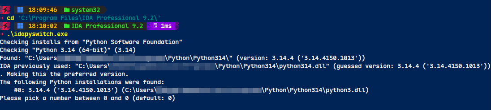

# IDA 脚本开发环境搭建

### 基本开发环境搭建

**1. 切换IDA的python版本**

在 IDA的安装目录下会自带一个`idapyswitch.exe`的程序，用来指定IDA使用的python环境。



**2. 配置VSCode的开发环境**

在 VSCode 中按 `Ctrl+Shift+P`，输入 `Python: Select Interpreter`，选择系统里的 Python 3.14 路径。它会自动在当前工作目录下生成一个`.vscode`文件夹，里面包含一个`settings.json`文件。写入以下配置（请将路径替换为你实际的 IDA 安装路径）：

```json
{
    "python.analysis.extraPaths": [
        "C:/Program Files/IDA Professional 9.2/python/"
    ],
    "python.autoComplete.extraPaths": [
        "C:/Program Files/IDA Professional 9.2/python/"
    ]
}
```

### 高效开发工作流 (热重载机制)

在开发过程中，最痛苦的莫过于修改了脚本，却发现 IDA 缓存了旧代码，必须重启 IDA 才能生效。

**解决方案：放弃 `import`，拥抱 `require`。**

在你的主脚本（比如在 IDA 界面里按 `Alt+F7` 运行的那个入口脚本）中，如果你分离了其他功能模块，请使用 IDA 提供的 `idaapi.require()` 而不是原生的 `import`。

Python

```
import idaapi

# 每次执行此脚本时，IDA 都会强制重新加载 my_custom_module.py
# 这样你在 VSCode 里修改代码后，直接在 IDA 里再运行一次即可生效，无需重启！
my_module = idaapi.require("my_custom_module")

def main():
    my_module.do_something()

if __name__ == "__main__":
    main()
```

### 使用 VSCode 动态调试 IDAPython

打印 `print` 调试太低效了，我们可以通过 `debugpy` 让 VSCode 直接 Attach（附加）到 IDA 进程中，实现真正的下断点、单步调试和变量查看。

- **第一步：** 在你的 Python 3.14 环境中安装 debugpy：

  Bash

  ```
  pip install debugpy
  ```

- **第二步：** 在 VSCode 的 `.vscode/launch.json` 中添加附加配置：

  JSON

  ```
  {
      "version": "0.2.0",
      "configurations": [
          {
              "name": "Attach to IDA",
              "type": "debugpy",
              "request": "attach",
              "connect": {
                  "host": "localhost",
                  "port": 5678
              }
          }
      ]
  }
  ```

- **第三步：** 在你想要调试的 IDAPython 脚本最前面，加入启动监听的代码：

  Python

  ```
  import debugpy
  import idaapi
  
  # 启动监听 5678 端口
  debugpy.listen(5678)
  print("Waiting for VSCode debugger to attach on port 5678...")
  
  # 阻塞脚本，直到你在 VSCode 里点击了 "Start Debugging (F5)"
  debugpy.wait_for_client() 
  print("Debugger attached!")
  
  # 下面是你正常的脚本逻辑...
  ```

当脚本运行到 `wait_for_client()` 时，IDA 会卡住。此时你在 VSCode 里按下 `F5` 执行 "Attach to IDA"，代码就会继续往下走，并且完美停在你在 VSCode 里打的断点上。


