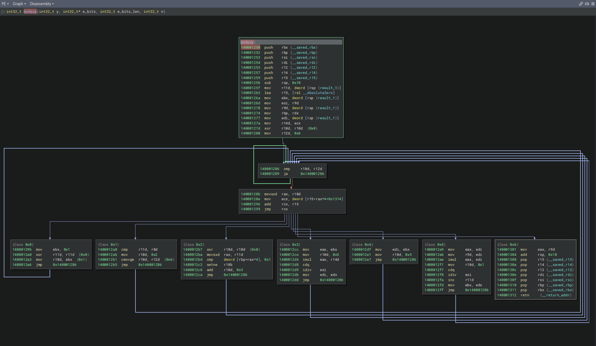

# angr 介绍

## Stash

“Stash”（储物箱）是 angr 模拟管理器中用于**对状态进行逻辑分组**的核心机制。通过将状态放入不同的 stash，你可以精细控制“哪些状态需要继续执行”、“哪些已经到达目标”、“哪些需要丢弃”等，从而实现在符号执行过程中的多路径管理。

在 `SimulationManager` 中，stash 本质上是**一个以字符串为键、状态列表为值的字典**（可以把它想象成 `dict[str, list[SimState]]`），但它提供了一整套专用方法来安全地操作这些列表，并保持内部数据一致性。

- 每个 stash 就是一个**状态容器**。
- 默认情况下，创建 `SimulationManager` 时会自动生成 `active` stash，初始状态全部放在这里面。
- 你可以**随意创建新的 stash**，只需在移动状态 (`simgr.move()`) 时给出一个不存在的名字，angr 就会自动创建它。

​	

angr 对一些 stash 有**预定义的语义**，执行引擎会根据状态的特性自动把状态移到对应的 stash 中：

**引擎预定义 stash（执行引擎自动迁移状态）**

这 5 个 stash 是 `SimulationManager` 内部硬编码的语义，引擎在 `step()` 时会根据状态特性**自动**将状态移入对应 stash，无需用户显式调用。

| Stash 名称 | 含义 | 触发条件 |
|------------|------|----------|
| `active` | 当前正在被调度的活跃状态 | 初始状态默认在此；`step()`/`run()` 默认执行此 stash |
| `deadended` | 无法继续执行的状态 | 状态执行了退出系统调用（如 `exit`），或无任何后继基本块 |
| `pruned` | 被剪掉的不可满足状态 | 启用了 `LAZY_SOLVES` 选项，并在某时刻通过 `satisfiable()` 发现约束矛盾（状态变为 unsat） |
| `unsat` | 不可满足状态（需主动开启保存） | 构造函数中设置 `save_unsat=True`，当状态约束矛盾时放入这里，而非直接丢弃 |
| `unconstrained` | 指令指针不受约束的状态 | 构造函数中设置 `save_unconstrained=True`，当 PC 被符号化且无任何约束时放入此处 |

> **注意**：`pruned` 的触发还与 `LAZY_SOLVES` 相关，若未启用该选项，不可满足状态可能在 `step()` 时直接被丢弃，不进入任何 stash。`unsat` 和 `unconstrained` 默认不保存，需要显式开启。


**由方法或探索技术动态创建的 stash**

这些 stash **不是**引擎自动创建的，而是由特定方法或探索技术在需要时动态生成，名称通常固定，语义由创建者定义。

| Stash 名称 | 创建者 | 含义 |
|------------|--------|------|
| `found` | `SimulationManager.explore(find=...)` | 存放满足 `find` 条件（如到达目标地址）的状态。默认找到 1 个就停止，可通过 `num_find` 调整 |
| `avoided` | `SimulationManager.explore(avoid=...)` | 存放满足 `avoid` 条件（需要避开）的状态。这些状态会被移出 `active`，不再继续探索 |
| `deferred` | `DFS` 探索技术（深度优先搜索） | DFS 技术每次只保持一个状态在 `active`，其余后继放入 `deferred`，等当前路径穷尽后再从中取出 |
| `spilled` | `Spiller` 探索技术 | 当活跃状态数量超过阈值时，Spiller 会将部分状态序列化到磁盘，移入 `spilled` stash 以释放内存 |
| `spinning` | `LoopSeer` 探索技术 | 检测到状态在循环中执行次数过多时，将其移入 `spinning` stash，当没有其他可用状态时再尝试恢复 |

这些 stash 会像普通 stash 一样出现在 `simgr.stashes` 字典中，可以被用户继续移动、合并或删除。


**特殊错误列表（非 stash）**

| 名称 | 类型 | 说明 |
|------|------|------|
| `errored` | **list**（不是 stash） | 存放执行过程中引发异常的状态记录。每条记录是 `ErrorRecord` 对象，包含属性 `state`（出错前的状态）、`error`（异常对象）和 `debug()` 方法（启动事后调试） |

`errored` 不参与 stash 的 `move()`、`step()` 等操作，只能作为列表访问。


**stash管理**

`simgr.move()` 是最常用的 stash 管理方法，签名如下：

```python
simgr.move(from_stash, to_stash, filter_func=None)
```

- **`from_stash`**：源 stash 名称。
- **`to_stash`**：目标 stash 名称，若不存在会被自动创建。
- **`filter_func`**：一个谓词函数 `lambda state: bool`，只移动返回 `True` 的状态。若未提供，则移动全部。

**示例：** 将 `deadended` 中所有输出包含 `"Success"` 的状态移到新建的 `successful` stash。

```python
simgr.move('deadended', 'successful',
           filter_func=lambda s: b'Success' in s.posix.dumps(1))
```

移动后原 stash 中这些状态会被移除，目标 stash 中会增加相应的状态。

因为 stash 本身就是列表，可以直接用 `append`、`extend` 或移除列表元素等原生操作。但**推荐使用 `move()` 来保证正确性**，因为直接操作列表可能会绕过模拟管理器的某些内部维护。

删除一个 stash可以使用 Python 的 `del` 语句：

```python
del simgr.my_custom_stash
```

所有该 stash 内的状态会被释放（垃圾回收）。

合并 stash 需要用 `move()` 将一个 stash 全部移动到另一个：

```python
simgr.move('stash_A', 'stash_B')   # 所有 stash_A 状态移到 stash_B
```

之后 `stash_A` 可能变为空列表，你可以选择是否删除它。

配合 `step()` 与 `explore()` 使用

- **`step(stash='active')`**：默认对 `active` 执行，但你可以指定任何 stash，例如：

  ```python
  simgr.step(stash='my_special_stash')
  ```

  这样你可以让不同 stash 以不同节奏前进。

- **`explore()`** 方法内部使用了 stash 机制：

  - 目标状态会被自动放入 `found` stash。
  - 要避免的状态进入 `avoided` stash。
  - 可以通过 `find` 和 `avoid` 参数来控制移动条件。

你也可以在 `explore()` 运行完毕后，继续手动挪移 `found` 或 `avoided` 中的状态进行二次分析。


## 使用示例

### 符号执行中的不透明谓词 (Opaque Predicates) 消除

```c
int modexp(int y, int x[], int w, int n)
{
	int R, L, k, s;
	int next = 0;

	for (;;)
	{
		switch (next) {
			case 0:
				k = 0;
				s = 1;
				next = 1;
				break;

			case 1:
				if (k < w)
					next = 2;
				else
					next = 6;
				break;

			case 2:
				if (x[k] == 1)
					next = 3;
				else
					next = 4;
				break;

			case 3:
				R = (s * y) % n;
				next = 5;
				break;

			case 4:
				R = s;
				next = 5;
				break;

			case 5:
				s = R * R % n;
				L = R;
				k++;
				next = 1;
				break;

			case 6:
				return L;

		}
	}
}
```

我们使用MSVC编译器，该编译器是以跳转表的方式来实现switch




```python
import angr, claripy
from visualizer import CFGVisualizer

BINARY_PATH = "./examples/rsa_example.exe"
FUNC_ADDR = 0x140001250
DISPATCHER_START = 0x14000128b # 分发器第一条指令 (movsxd rax, r10d)
DISPATCHER_JMP = 0x140001299   # 分发器跳转指令 (jmp rcx)

VOLATILE_REGS = ['rax', 'rcx', 'rdx', 'r8', 'r9', 'r10', 'r11']


# 14000128b  movsxd  rax, r10d
# 14000128e  mov     ecx, dword [r15+rax*4+0x1314]
# 140001296  add     rcx, r15
# 140001299  jmp     rcx

def deobfuscate_dispatcher():
    """
    偏移型跳转表
    基于符号执行的广度优先搜索 (BFS)
    """
    
    print("[*] 正在加载二进制文件...")
    # 开启 auto_load_libs=False 加快分析速度
    p = angr.Project(BINARY_PATH, auto_load_libs=False)

    # 获取 r15 的值，基地址；
    # 因为跳转依赖于 r15，我们必须先知道 r15 是多少
    print("[*] 正在执行函数序言，提取基址寄存器 r15...")
    init_state = p.factory.blank_state(addr=FUNC_ADDR)
    simgr_init = p.factory.simulation_manager(init_state)
    # 默认num_find就为 1
    simgr_init.explore(find=DISPATCHER_START, num_find=1)
    
    if not simgr_init.found:
        print("[-] 无法从函数入口执行到分发器！")
        return
    
    prologue_state = simgr_init.found[0]
    r15_value = prologue_state.solver.eval(prologue_state.regs.r15)
    print(f"[+] 成功提取 r15 的值: 0x{r15_value:x}")


    # 继续单步执行，穿过分发器，直到跳出分发器范围
    disp_simgr = p.factory.simulation_manager(prologue_state)
    while disp_simgr.active:
        current_addr = disp_simgr.active[0].addr
        if current_addr < DISPATCHER_START or current_addr > DISPATCHER_JMP:
            break
        disp_simgr.step()

    first_real_block = disp_simgr.active[0].addr
    print(f"[+] 第一个真实块地址: 0x{first_real_block:x}")
    
    print("\n[*] 启动 BFS ，挖掘所有真实块...")
    worklist = [first_real_block]
    processed = set()
    
    transitions = [ ]

    def explore_block(block_addr):

        # 继承上下文，保留所有状态变量
        state = prologue_state.copy()
        state.regs.rip = block_addr

        # 将参与运算的易失性寄存器和标志位强制“符号化”
        # 这样 cmp r11d, r8d 就会产生不确定的结果，迫使 cmovge 囊括所有可能
        for reg in VOLATILE_REGS:
            size = getattr(state.regs, reg).size()
            setattr(state.regs, reg, claripy.BVS(f"sym_{reg}", size)) # 设置为 claripy.BVS（符号变量）

        # 将标志寄存器设为符号化，抹除历史具体的比较结果
        state.regs.eflags = claripy.BVS("sym_eflags", 32)

        # 此时这些寄存器都是未知数，迫使程序去探索所有可能的路径
        
        # 当我们符号化之后，继承修改过的状态继续符号执行
        sm = p.factory.simulation_manager(state)
        # 执行直到抵达分发器
        sm.explore(find=DISPATCHER_START)

        if not sm.found:
            print("[-] 未能到达分发器入口，检查条件或路径可行性")
            return
        
        results = []
        for found_state in sm.found:
            """
            由于从真实块结尾到分发器的路径是确定的（没有条件分支），sm.found 通常只有一个状态。
            但是，如果这段路径上存在符号分支，angr 会生成多个满足条件的状态。遍历 sm.found 可以覆盖所有可能性。
            """
            
            # 构建一棵运算树，我们不在这里求值，而是继续往前走
            # 以 found_state 为唯一的初始状态，构建一个新的模拟管理器 disp_sm。
            # 这样接下来的步进、分叉、移除操作都不会影响外面的其他状态，逻辑干净。
            disp_sm = p.factory.simulation_manager(found_state)
            
            # 步进遍历分发器，捕获 angr 的自动分叉 (Fork)
            while disp_sm.active:
                disp_sm.step()
                
                # 由于存在符号分支，angr 会自动产生多个后继状态，每个后继对应一个可能的跳转目标，
                # 并且各自的路径约束中会添加“目标地址等于该具体值”的约束。
                
                # 检查所有存活的状态
                for s in disp_sm.active[:]:
                    # 如果状态的 PC 飞出了分发器的范围，说明 jmp rcx 发生并完成了分叉
                    if s.addr < DISPATCHER_START or s.addr > DISPATCHER_JMP:
                        disp_sm.active.remove(s)
                        # 将跳出的状态存入自定义的 stash 中
                        disp_sm.stashes.setdefault('exited', []).append(s)
            
            # 在分叉后的分支中提取 r10
            if 'exited' in disp_sm.stashes:
                for target_state in disp_sm.stashes['exited']:
                    target_addr = target_state.addr
                    # 因为 angr 根据目标地址分叉了路径，此时的 r10 被加上了路径约束
                    # eval 此时只会返回在这条唯一路径下 r10 的确定值
                    r10_val = target_state.solver.eval(target_state.regs.r10)
                    results.append((r10_val, target_addr))
                    
        return results

    while worklist:
        current_block = worklist.pop(0)

        if current_block in processed:
            continue

        processed.add(current_block)

        print(f"    -> 正在符号执行真实块: 0x{current_block:x}")
        next_targets = explore_block(current_block)
        
        if not next_targets:
            print(f"       [!] 块 0x{current_block:x} 没有跳回分发器 (可能是 Return 块)")
            continue
            
        for r10_val, dst_block in next_targets:
            print(f"       [+] r10={r10_val} => 目标块: 0x{dst_block:x}")
            transitions.append((current_block, dst_block, r10_val))
            
            if dst_block not in processed and dst_block not in worklist:
                worklist.append(dst_block)
    
    print(f"\n[*] 分析完成！共发现 {len(processed)} 个真实块。")

    
    
    vis = CFGVisualizer()
    vis.show_graph(processed, transitions, sparsity=3.0)
    
if __name__ == "__main__":
    deobfuscate_dispatcher()
```

在Windows x64 ABI中，寄存器被分为两类：

**非易失性寄存器（Callee-saved / Non-volatile）**：`rbx`, `rbp`, `rsi`, `rdi`, `r12`, `r13`, `r14`, `r15`。

如果代码要使用它们，必须先在栈上保存它们的值，用完后再恢复。

混淆器通常用它们来**存储全局常量或基址**。比如你前面汇编里的 `r15` 存的是模块基址，`r12d` 存的是常量 `0x6`。我们**绝对不能**把它们符号化（变成未知数），否则基址丢失，程序直接崩溃。

**易失性寄存器（Caller-saved / Volatile / Scratch）**：`rax`, `rcx`, `rdx`, `r8`, `r9`, `r10`, `r11`。

可以随便用，不需要保存和恢复。

混淆器通常把它们当成“草稿纸”。在计算下一个真实块的跳转状态时（比如 `cmp r11d, r8d`），这些寄存器里装的都是“上一步计算的中间结果”。

```python
# 将参与运算的易失性寄存器和标志位强制“符号化”
# 这样 cmp r11d, r8d 就会产生不确定的结果，迫使 cmovge 囊括所有可能
volatile_regs = ['rax', 'rcx', 'rdx', 'r8', 'r9', 'r10', 'r11']
for reg in volatile_regs:
    size = getattr(state.regs, reg).size()
    setattr(state.regs, reg, claripy.BVS(f"sym_{reg}", size))
```


