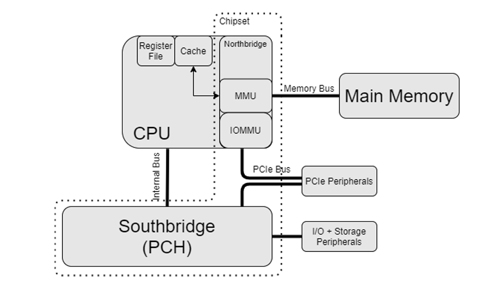
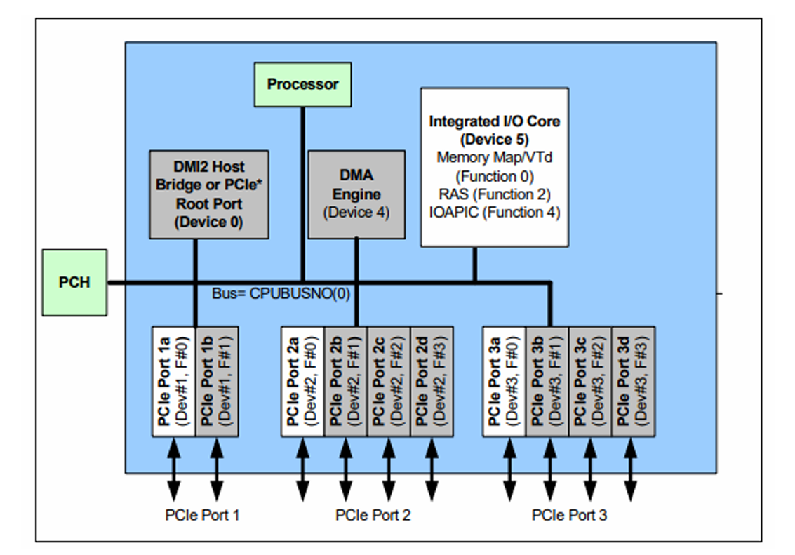
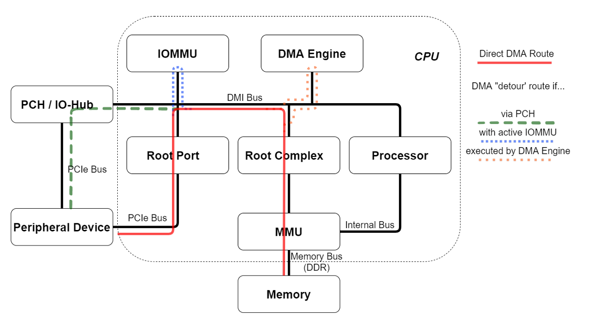
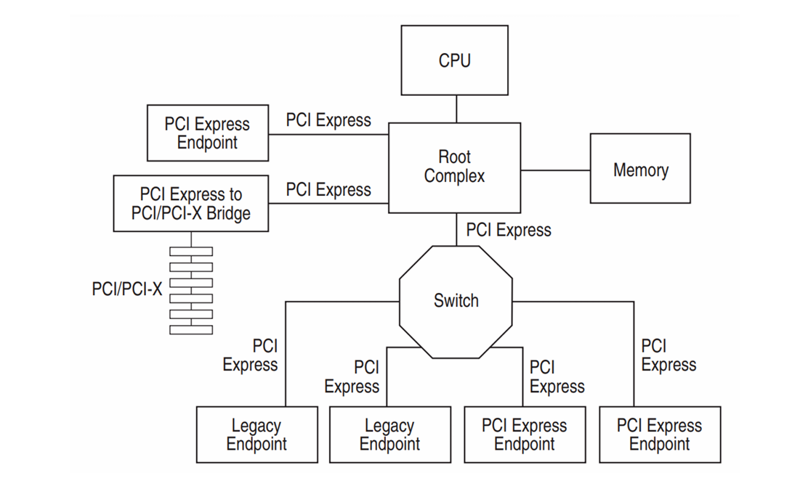
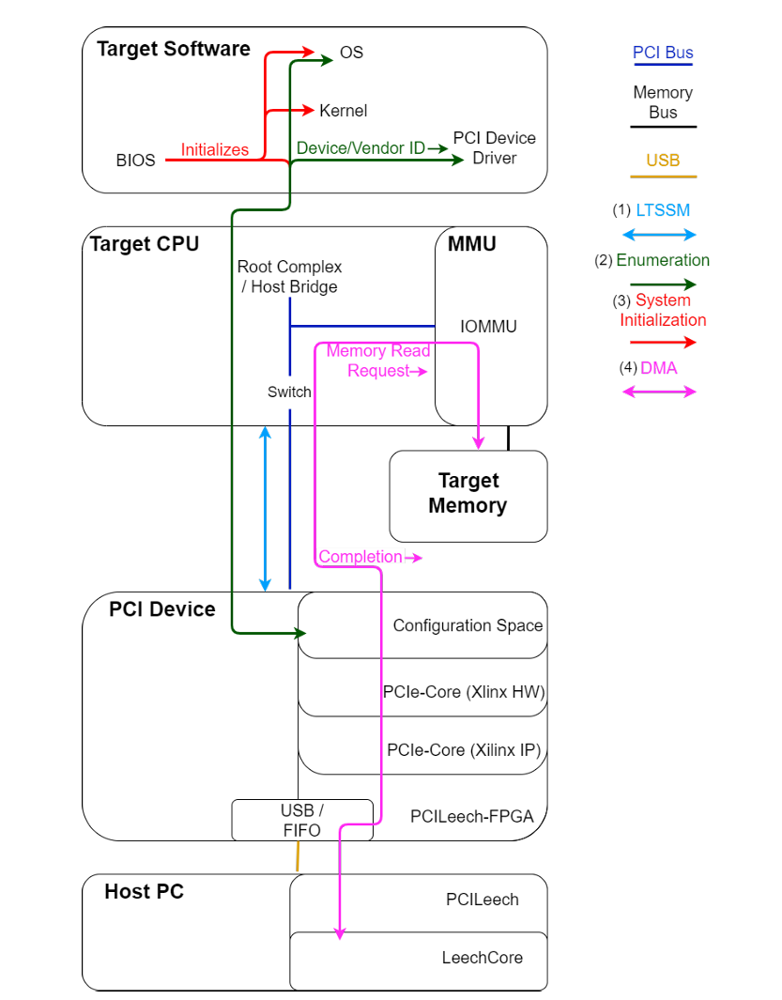
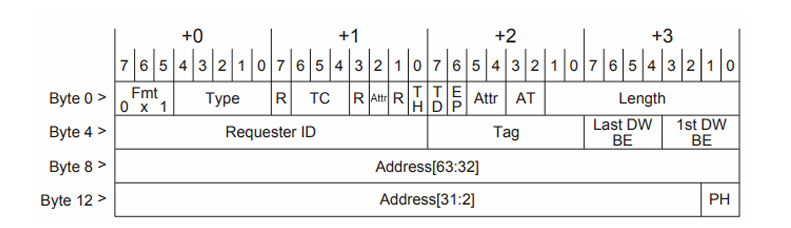
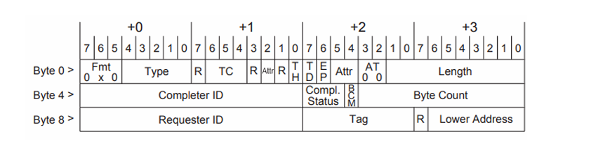

# PCIe 内存获取技术

## 现代计算机体系结构的内存组织

### 现代内存组织

主存通过MMU连接到CPU，其他更外围的设备连接到南桥，它通过内部总线直接与CPU连接。目前的南桥实现的最重要的功能是作为一个I/O Hub(I/O Controller Hub, ICH)，为一些常用的总线提供连接，例如SPI，LPC，SATA或PCIe，也可能包含其他的设备。北桥负责控制内存并为一些高速的外围设备提供连接（例如，PCIe上的图形卡）。

PCIe总线被同时用于高速图形（它更可能直接连接到CPU，也可能使用IOMMU连接）和常规外围设备（它们被连接到南桥）。因此PCIe可以同时被连接到南桥和CPU，取决于平台。

  

外围长期存储器设备使用南桥或者PCIe总线上的IO集线器。SATA是一种常用的总线被用来将外围设备连接到系统。SATA由于引脚数量较少而受到带宽的限制，近些年mSATA或M.2（工作在PCIe上）备受青睐。另一种可以控制长期存储器的设备叫做存储控制器。存储控制器可以实现RAID(Redundant Array of Independent Disks)，它利用多个独立磁盘在存储中按顺序创建冗余以防止永久存储设备中的故障并从中恢复。

### IOMMU

IOMMU使得外围设备能访问虚拟地址空间，该机制类似于MMU为进程提供虚拟地址空间。它通过基于设备的PCIe ID来限制对内存区域的DMA访问。三种主要的CPU制造商都对IOMMU提供了支持：

- Intel - Virtualization for Directed IO / VT-d
- AMD - AMD-Virtualization / AMD-V / AMD-Vi
- ARM - System MMU / SMMU

多数操作系统对某些IOMMU提供了支持，但是并不总是默认开启的，BIOS 或 UEFI 通常都支持开启 Virtualization。

Virtualization for Directed IO / VT-d 是一个建立在Intel CPU上的一个硬件单元。它的核心机制在多年以来没有太大变化。VT-d被集成在DMI总线上的内部。该单元由多个DMA重映射硬件设备或DRHD组成。每个设备提供了基于页的翻译功能，用来将IO虚拟地址请求的设备PCIe ID和请求的虚拟地址翻译到物理地址。

  

### PCH

PCH(Platform Controller Hub), 是Intel芯片组上的用来将传统南桥和北桥的一些功能集成到一个单一的芯片上的重要组件，处理传统上由北桥和南桥芯片单独管理的各种功能。它通过DMI(Direct Media Interface)总线连接CPU，这是Intel创建的一个专用链接。DMI本质上是PCI Express，使用多通道和差分信令来形成点对点链路。
以下是PCH处理的一些常见功能：

- USB端口：PCH管理所有USB连接，包括USB 2.0、USB 3.0和USB Type-C。
- 音频编解码器：它处理板载音频编解码器及其与音频设备的交互。
- PCI Express（PCIe）插槽：PCH为扩展卡使用的PCIe插槽提供连接。
- SATA端口：它控制用于连接硬盘驱动器和SSD的SATA端口。
- 以太网控制器：PCH包括用于网络连接的以太网控制器。
- 集成Wi-Fi：一些PCH变体包含了集成Wi-Fi功能。
- BIOS/固件：它与系统BIOS或固件交互，用于引导和系统设置。
- 电源管理：PCH具有针对各种系统状态的高级电源管理功能。
- 安全性：它可能包括硬件级别的安全功能，如受信任的平台模块（TPM）。
  这些功能对计算机的操作至关重要，因为它们为各种组件和外围设备提供了必要的接口和控制机制。PCH已经发展成为这些功能的中心集线器，简化了主板设计并提高了系统性能。

### DMA

DMA(Direct Memory Access)，DMA使得外围设备可以直接访问内存，而不需要CPU的干涉。DMA理论上来说可以发生在任何 IO 总线上。最普遍的支持DMA的协议就是PCIe了。

DMA进程的起点可以是CPU或者设备自身，CPU可以使用自身内部的一个被称为 DMA引擎 (DMA engine)的组件。DMA引擎可以控制设备到内存或者两个独立的设备的两块内存之间的DMA传输。当设备自身不能执行DMA时就需要使用到DMA引擎，或者两台独立的计算机系统之间需要共享内存时也需要用到DMA引擎。外围设备也可以通过它们自己来初始化DMA进程。外围设备被分配了一个叫做“Bus Master”的标志，当该标志被设置时，设备就被允许访问内存并执行DMA。反过来并不成立：并不禁止没有启用Bus Master标志位的设备访问内存。

  

DMA传输流并不是一成不变的，取决于谁启动了本次事务，以及DMA运行在哪个协议之上。上图展示了不同的DMA流，并给出了一个外围设备连接在PCIe上使用DMA的示例，它可以访问它连接到的系统上的主存。外围设备也可通过 Root Complex 的一个 Root Port 来连接到系统，Root Complex被连接到MMU，而MMU被连接到主存。设备也可能通过PCH连接，只不过需要使用不同的路径选择，而并没有任何功能上的差异。如果 IOMMU 启用，该流也将经过IOMMU，例如翻译内存访问地址。如果设备自身不能执行DMA，那么DMA引擎将会接管控制该流。DMA引擎可以受到的处理器指示去工作。注意上图直接将处理器和MMU连接在一起，处理器通过该内部总线进行定期存储器访问，该内部总线还可以包括例如到高速缓存的通信。

## Peripheral Component Interconnect Express

### PCI和PCIe

Peripheral Compoent Interconnect, PCI 是一个为外围设备于计算机系统通信而开发的通信协议。它的后继者，PCI Express(PCIe)，普遍存在于当前所有类型的模块化的计算机系统。

PCIe是高速串行连接总线，通过它可以在总线上为两台设备建立链接。两台设备之间使用基本请求，对请求的回答以及中断的方式通信。设备的通信的速率很大程度上由设备之间通道的数量来决定。PCIe支持多通道，设备间的每个通道由两条串行差分成对导线组成（每个通道由两根导线组成。“串行”表示数据是按顺序发送的，一位接一位，而不是并行发送。“差分”是指每组导线使用两个独立的导体，信号是它们之间的电压差。这种方法降低了噪声，提高了数据传输的可靠性）。PCIe总线支持多种类型的设备，最常见的类型为端点(endpoint)，它通过PCIe暴漏自己的核心功能，主要完成一些来自其他设备的请求。交换机(Switches)提供了一种支持多设备同时连接的方式，并且可以路由数据包到正确的目的地。桥(Bridges)可以将PCIe翻译为其他不同协议。根复合体(Root Complex)设备处于架构中央，连接到CPU，但是也可以包含当前系统中以连接的其他设备的信息。在更新的架构中，根复合体与主桥(host bridge)集成在一起，共同连接到CPU。与CPU的连接不一定需要根复合体，系统中的其他设备也可以扮演这个角色。

  

PCIe拥有多种版本，但是它们向后兼容之前的版本，甚至是PCI。然而，老版本并不能使用更新的功能。当首次连接时，双方将会协商它们将要使用的协议。

### 协议层

PCIe协议被划分为三层

- 物理层(Physical Layer): 该层包含电气和逻辑子块，并为简单的数据传输提供基础。
- 数据链路层(Data Link Layer): 该中间层提供了诸如错误检测/报告之类的功能，以支持事务层。
- 事务层(Transaction Layer): 该层包含通信的主要来源：事务层数据包（TLP）。TLP用于与PCIe外围设备的所有高级通信。

  

**物理层**
物理层的电气部分仅仅将逻辑信号转换为电信号时才会涉及，反之亦然。逻辑块(logical block)实现了物理层提供的核心功能。PCIe传输的数据都会经过符号编码。取决于传输速率，要么是8b/10b编码，要么就是128b/130b。这意味着，使用10bits传输时，只能传输8bits的数据。一些符号和符号组合可以用来代表数据，其他则被用来代表发送给其他层的数据包的开始或结束标志。如果不止有一个通道可用，数据被交织地在通道上发送，以便为了增加带宽并防止不同的数据包同时到达。所有的控制和中断信息使用也都使用数据通道。数据符号也可以使用伪随机LFSR(pseudo-random LFSR)机制进行混淆。该机制默认是开启的，也可以在初始化期间关闭。

**数据链路层**
该层主要关心数据包的交付的正确性。它使用确认包(Acknowledgment packets)或者叫做ACK，它用来确认数据包已经正确到达了目的地。NACK则刚好相反，用来确认数据包在传输中发送了错误。这种机制允许发送者和接收者确保每一个包都被正确的发送并被正确的接受。
In order to not send more packets than the link is physically capable of, 接收者给发送者一定的额度(credits)，每次发送数据包时都会消耗一点额度。如果额度清空，发送者将不能发送且必须等待接收者给它更多的额度。租借系统使用数据链路层数据包(Data Link Layer Packets, DLLPs)处理。数据链路层并不检查它自身的额度，租借系统的由事务层实现。
数据链路层在TLPs中使用循环冗余检查(Cyclic Redundacy Checks, CRCs)提供差错检测。在TLP到达时出现错误的情况下，数据链路层提供TLP缓冲，从而允许重新发送TLP。

**事务层**
该层创建并控制事务层数据包(Transaction Layer Packets, TLP)。它也维护在数据链路层提到的租借系统。TLP由头部和紧跟着头部的数据组成。头部包含了目的地，接收者以及数据包的内容的相关信息。TLPs普遍被用来：

- 读/写配置：它被允许访问配置空间寄存器。
- 读/写内存：它允许设备读/写主存。他是PCIe上进行DMA传输的支柱功能。
- Completions(with or without data)：一种响应的包，被用来确定一次接受TLP包的动作是否完成。
- 消息：它包含多种信息，例如电源管理，中断，设备制造商定义的信息等。

### PCIe 外围设备

一个PCIe设备通过PCIe总线连接到计算机系统。

**链路训练 (Link Training)**
在PCIe上，一个新设备想要连接到系统并与其他设备通信，它首先需要启动一个称为“链路训练”(Link Training)的过程。该过程首先使用标准化的训练序列数据包进行时钟同步。随后，设备与其**最近的上游设备**（通常是根联合体或交换机端口）协商并确定链路的物理层参数细节，例如支持的最高数据速率（如Gen3, Gen4, Gen5）和实际使用的通道宽度（如x1, x4, x8, x16）。协商过程由一个称为**LTSSM (Link Training and Status State Machine，链路训练与状态状态机)** 的硬件状态机处理。一旦链路训练成功完成，设备就准备好使用协商好的协议在总线上传输有效的数据包了。

LTSSM完全在物理层实现，但其状态结果（如链路是否激活、当前速率和宽度）会被更高层（如数据链路层）使用，以确保物理层功能的正确性并指导上层操作。当设备以“正常”方式工作时，链路通常处于**L0状态**（活动状态），此时设备已准备好接收和发送数据包。

**枚举 (Enumeration)**
当“链路训练”阶段成功结束，系统便进入“枚举”阶段。在该阶段，系统为设备分配一个**唯一的标识符**，使设备能够知道其在PCIe拓扑结构中的位置，其他设备也能通过此标识符定位它。这个标识符被称为**PCIe ID**或更常用的**BDF (Bus/Device/Function，总线号/设备号/功能号)**，它由三部分组成：
*   **总线号 (Bus Number)**: 分配给PCIe交换机或网桥的下游端口所连接的总线段。
*   **设备号 (Device Number)**: 用于标识同一总线上的不同设备（通常最多32个）。
*   **功能号 (Function Number)**: 用于标识同一物理设备（如多端口网卡）内部提供的不同逻辑功能（通常最多8个）。

枚举过程本质上是一个**深度优先搜索 (Depth-First Search, DFS)** 算法。系统软件（BIOS/UEFI 或操作系统内核）执行一个**穷尽的搜索**：它从根联合体开始，按顺序查询每个可能的PCIe位置（总线号、设备号、功能号组合），读取该位置设备的第一个配置寄存器（即 **Vendor ID** 和 **Device ID**）。如果查询的PCIe ID位置存在一个设备，该设备会响应其真实的 **Vendor ID** 和 **Device ID**；如果该位置没有设备，上游设备（如根联合体或交换机）会返回一个默认值 `0xFFFF`。如果设备自身的 Vendor ID 和 Device ID 被错误地配置为 `0xFFFF`，软件就无法区分这是真实设备的响应还是默认的空响应，因此也无法正确识别和初始化该设备。

基于读取到的 **Vendor ID** 和 **Device ID**，系统软件就能在驱动数据库中查找并加载合适的设备驱动程序，然后在软件层面正确地初始化该设备。

枚举过程通常在系统引导阶段由 BIOS/UEFI 启动，或者在操作系统运行时显式地触发 PCIe 总线重新扫描（例如在支持热插拔的场景下）。在 Linux 系统上，向 `/sys/bus/pci/rescan` 文件写入操作会触发内核执行枚举序列。枚举过程通常伴随着**内存映射I/O (MMIO)** 地址的分配：
*   系统软件为设备的功能（特别是其配置空间和 BAR 请求的内存/IO 空间）分配地址范围。
*   根联合体 (Root Complex) 使用的 MMIO 地址空间通常是系统预留的（称为“保留内存空间”），在操作系统启动后通常无法再被其他设备或应用程序访问。
在 Linux 上，手动扫描 PCIe 总线也会触发所有连接到该总线上新设备的枚举。通过在内核中启用 PCIe 调试信息，可以详细观察到内核在枚举序列中与新设备的交互过程。

**设备配置 (Device Configuration)**
PCIe设备提供了一种通用的配置方式：通过访问其**配置寄存器**。**内存映射I/O (MMIO)** 机制使得系统软件（驱动程序或操作系统本身）能够像访问内存一样方便地访问这些寄存器。

*   **配置空间 (Configuration Space)**: 这是一组标准化的寄存器区域（对于PCIe设备通常是4KB），所有PCIe设备都必须实现其头部部分。配置空间包含了关键信息：
    *   **Vendor ID** 和 **Device ID**: 用于识别设备类型和制造商，是加载正确驱动程序的基础。
    *   **状态寄存器 (Status Register)**: 设备向软件报告其当前状态（如中断状态、错误状态、是否支持某些功能等）。
    *   **命令寄存器 (Command Register)**: 软件通过此寄存器控制设备的基本操作（如启用/禁用设备响应内存访问、I/O访问、中断等）。
    *   **基地址寄存器 (Base Address Registers, BARs)**: PCIe 终端设备 (Endpoints) 的标准配置空间至少包含 2 个 BAR（通常最多 6 个）。BAR 用于声明设备需要映射到系统地址空间（内存空间或 I/O 空间）的区域大小和类型（32位/64位，可预取/不可预取）。软件在枚举过程中读取 BAR 的值以确定设备请求的资源大小，然后分配实际的物理地址范围并回写到 BAR。驱动程序随后就可以通过访问这些映射区域来与设备的特定功能寄存器进行通信（例如，发送/接收数据的寄存器、DMA控制寄存器等）。配置空间寄存器也可以通过 **TLP (事务层数据包)** 进行读写访问。例如，驱动程序可以通过配置写请求来设置中断寄存器或控制超时、链路速率等选项的寄存器。

*   **扩展能力寄存器 (Extended Capability Registers)**: 这些寄存器位于配置空间的扩展区域（偏移量 0x100 之后）。它们通过一种**链表结构**组织起来：每个扩展能力的头部包含一个指针（偏移量），指向下一个扩展能力的头部。软件可以遍历这个链表来发现设备支持的额外高级功能。常见的扩展能力包括：
    *   **高级错误报告 (Advanced Error Reporting, AER)**: 扩展了标准错误报告机制，提供更详细的错误信息（如错误发生的具体TLP内容、错误类型分类），极大方便了系统调试和错误恢复。
    *   **地址转换服务 (Address Translation Services, ATS)**: 允许支持IOMMU/SMMU的设备直接使用虚拟地址（VA）发起DMA请求，设备内部或配套硬件可以执行虚拟地址到物理地址（PA）的转换，减少CPU介入，提高DMA效率（尤其对虚拟化环境有益）。
    *   其他如 **MSI/MSI-X** (消息信号中断)、**电源管理**、**虚拟通道 (VC)** 等也通过扩展能力报告。软件利用这些功能可以优化与设备的交互方式。

**热插拔 (Hot-plug)**
根据 PCIe 规范，支持 **热插拔 (Hot-plug)** PCIe 设备。这需要系统三个不同部分的共同支持：**软件**（操作系统）、**PCIe 插槽**（硬件）和 **PCIe 设备**（本身）。

由 **PCI-SIG** (PCI 标准组织) 制定的规范中，热插拔的核心原则是：**插槽**和**设备**必须共同协作，随时向**软件**报告设备的当前连接状态（在位/不在位）。这样，软件就能预知设备的**添加**或**移除**事件，并可以向插槽和设备提供正确的操作指导（例如何时安全地移除电源、何时通知驱动程序加载/卸载）。

*   **“插槽能力”寄存器 (Slot Capabilities Register)**: 这是一个位于提供该插槽的**交换机 (Switch)** 或**根端口 (Root Port)** 中的标准配置寄存器。它提供有关插槽的信息，其中最重要的标志之一就是是否**支持热插拔 (Hot-plug capable)**。软件通过读取此寄存器来判断一个插槽是否支持标准热插拔操作。
*   **支持现状**: 目前，软件（现代操作系统）和设备本身支持热插拔相对常见。然而，**主板上的物理 PCIe 插槽本身支持规范定义的热插拔功能**却并不普遍。测试中使用的两台服务器的PCIe插槽就不具备标准热插拔能力。这种情况未来可能会随着 **Thunderbolt**（基于 PCIe 技术，广泛支持热插拔）等支持 PCIe 的用户接口的普及而改变。

热插拔支持可以分为两个主要部分：
1.  **电气热插拔 (Electrical Hotplug)**: 涉及**设备**和**插槽/主板**的物理、电气特性。这包括：
    *   插槽的带电插入/拔出设计（如更长的接地引脚，分阶段供电）。
    *   设备对热插入/拔出的电气鲁棒性设计。
    *   成功完成插入后的链路训练 (LTSSM)。
    *   成功意味着设备物理上已正确连接到主板，并且 PCIe 链路已成功训练到活动状态 (L0)。
2.  **软件热插拔 (Software Hotplug)**: 涉及**插槽**（报告状态变化给软件）和**操作系统**（响应变化）。这包括：
    *   操作系统检测到插槽状态变化（通常由插槽控制器产生中断）。
    *   操作系统触发 PCIe 总线重新扫描（枚举新设备）或通知驱动程序设备已移除。
    *   为新设备加载驱动并初始化，或安全卸载移除设备的驱动并释放资源。
    *   成功意味着设备已被操作系统识别、枚举、驱动程序加载并初始化完成，设备可正常使用（对于移除，则是资源被完全释放）。

**重要说明**：即使**电气热插拔**成功（设备物理连接好，链路训练完成），如果**软件**没有被正确通知（例如，插槽不支持或未正确报告热插拔事件，或者操作系统没有响应事件），设备可能不会被自动识别和使用。这时，可能需要**手动触发软件重新扫描**（例如在Linux中执行`echo 1 > /sys/bus/pci/rescan`）才能完成枚举和初始化。

如果系统**完全不支持电气热插拔**（即插槽和主板设计未考虑热插拔），强行在系统运行时插入或拔出 PCIe 设备可能会导致系统出现意外行为，甚至严重故障：
*   在某些系统上，插入新设备可能导致系统**立即彻底崩溃并关机**（可能由于电源冲击或总线冲突）。
*   在其他系统上，操作系统可能开始**严重卡顿、变慢**。
*   或者，操作系统可能**看似没有响应、继续运行**，但总线状态已不一致，可能导致数据损坏或设备功能异常。因此，**切勿在未明确支持热插拔的系统上带电插拔PCIe设备。**

### 根复合体

根复合体是PCIe层次结构中的顶层实体。它的PCIe ID总为0x0000，它的主要功能是提供与内存的交互，通常与主机桥相结合。例如处理器和PCIe总线之间的桥接器。在引导期间，BIOS或操作系统使用配置寄存器配置根复合体。

根复合体通常位于CPU内的DMI总线上（南桥（PCH）和CPU之间的内部总线）通常被描述为主桥。它也是DMA过程的一部分。枚举过程就是从根复合体开始的。BIOS和操作系统利用根复合体向枚举请求的PCIe总线发送和接受数据包。

根复合体也提供与内存的交互。使用PCIe的DMA使用下一节中描述的数据包。这些数据包被发送到根复合体，并且根复合体还发回所需的Completion数据包。

### 使用PCIe的DMA

这节讨论在PCIe上实现的DMA。当设备被准备好向主存准备读/写时，PCIe外围设备便可以在PCIe总线上发送一个读/写内存的TLP，它会自动路由到根复合体。The data from the memory is uesd by the root complex to route a Completion packet back based on a requester ID send with the request TLP. 请求者ID即在枚举阶段获取的PCIe ID。这意味着没有PCIe ID的设备将不能执行DMA。

  

因此，使用PCIe的DMA主要使用PCIe总线上的TLP来执行。有两种主要的TLPs在DMA请求期间来回发送，分别是MRd(Memory Read)和Cpl/CplD(Completion/Completion+Data).

**Memory Read Requests**
有两种类型的MRd TLPs：MRd32和MRd64。它们的差异主要是TLP包含的地址的长度和TLP首位的fmt字段的改变，用来标识头的长度。一些协议支持PCIe，但是并不支持64位地址。下面展示了MRd64头格式.

  

TLP由下列字段组成：

- **Fmt+Type** 它用来标识TLP类型。对于MRd64则为0x010000。
- **Traffic Class(TC)** TLP的流量类别。这可能会改变TLP的路由方式。每个TC可以属于用于更高优先级路由或另一不同路由处理的虚拟信道。
- **Attributes** 用于配置请求顺序的几个属性。还包含一个“无窥探(no snoop)”首选项，用于硬件一致性管理，可以防止其他设备解释（窥探(snooping)）数据包。
- **Trafficking and Processing Hints (TH & PH)** TH表示处理提示的存在（以PH表示）。PH可以用于帮助存储器完成器获得关于存储器请求的频率和时间位置的信息。
- **TLP Digest** TD表示存在TLP摘要。例如，使用ECRC来验证TLP的完整性。
- **Error Forwarding / Data poisoning** 当数据包格式不正确时，仍然将数据包路由到目的地可能会有用。在这种情况下，设置EP比特是为了确认格式错误的数据包。
- **Address Translation** 用于指示TLP中的地址是否已转换。用于ATS。
- **Length** 用于指示请求的内存长度。
- **Requester ID** 请求者的源PCI ID。Completion将路由回该地址。
- **Tag** 用于标记事务。Completion将返回相同的标记，允许请求者将请求与Completion链接起来。
- **DW Enable** 一个是否应该写出双字（或用MWr64写入）的掩码。用于对读或写进行细粒度控制。
- **Address** 内存请求的实际基地址。

**Memory Read Completion**
也有两种的Completion TLP：Cpl 和 CplD。两种的差异主要是第二种包含了数据并根据发回的数据大小改变了长度字段。

  

大多数Cpl TLP字段与MRd TLP类似。在CplD TLP情况中，数据跟随在头部后面。Cpl TLP包含了一些不同的字段：

- **Completer ID** 已经完成事务的设备。对于MRd请求，完成符是根复合体，这意味着该字段将设置为0x0000。
- **Completion Status** 指示完成的状态。在没有错误的情况下，这被设置为全部0。对于不受支持的请求，例如试图访问不可访问的内存空间时，状态设置为1。
- **Byte Count Modified** 仅由PCIX Completers使用。