---
tags:
  - GhostDrop
  - Dropper/Loader
  - 进程注入
  - 恶意软件分析报告
date: 2026-06-02
star: true
---

# 针对 svchost 的寄生链：某高级恶意软件加载器的深度技术剖析


[TOC]


## ⚠️ 免责声明 (Disclaimer)

**【郑重声明】** 本文档及其中包含的所有逆向分析过程、代码片段、伪代码和技术细节，**仅供网络安全防御研究、学术交流及反恶意软件技术探讨使用**。

为了避免被恶意利用及保护相关受害者，文中涉及的所有敏感信息（包括但不限于：C2 服务器 IP、域名、通信端口、特定业务标识符及相关真实路径）均已进行严格的**脱敏与打码处理**。

请读者严格遵守相关网络安全法律法规。**未经授权，任何人不得利用本文中探讨的技术手段进行任何形式的非法攻击、入侵或破坏活动。** 因读者滥用本文中提及的技术或情报所引发的任何直接或间接法律责任及后果，均由行为人自行承担，原作者对此不负任何法律连带责任。

**[Disclaimer]** The analysis, code snippets, and technical details provided in this article are strictly for **educational purposes, cybersecurity defense research, and malware analysis discussions**.

All sensitive Information of Compromise (IoCs), including but not limited to C2 IP addresses, domains, ports, and specific business identifiers, have been **redacted and obfuscated** to prevent malicious use and protect potential victims.

Readers must comply with all applicable cybersecurity laws and regulations. **Any unauthorized or illegal use of the techniques discussed in this article for malicious attacks or system compromises is strictly prohibited.** The author assumes no liability for any direct or indirect consequences, damages, or legal responsibilities arising from the misuse of the information contained herein.


## 1. 执行摘要

近日，我们的安全团队捕获到一个集成多种系统探测与高级注入技术的恶意载荷。该样本的核心恶意逻辑被封装于一个动态链接库（DLL）中，由其母体程序（Dropper）动态释放并加载执行。本文将对该高级恶意软件加载器（Loader）展开深度技术剖析。分析表明，该恶意软件在执行阶段对 Windows 系统进程 `svchost.exe` 展现出了高度的针对性。作为系统中极为常见且具备高信任度的核心宿主进程，`svchost.exe` 成为了攻击者的绝佳伪装。通过本篇报告，我们将详细揭示该恶意软件是如何利用严苛的筛选机制精准锁定目标，并实施高隐蔽性注入攻击的。

本报告的核心发现包括：

- **严苛的环境感知与指纹锁定：** 样本利用 FNV-1a 算法结合计算机名生成唯一 GUID，用于创建互斥体并进行 XOR 加密日志记录，实现防碰撞与精准的受控机指纹管理；同时内置国产主流杀软黑名单，具备极强的反侦察意识。
- **高维度的防御规避：** 区别于传统的粗暴注入，该样本集成了基于密码学哈希“雪崩效应”的内存申请规避技术（动态修改 `.text` 段填充字节以欺骗 EDR 扫描），以及严格的宿主匹配（完整路径、64位架构、当前会话用户）机制。
- **弹性的多级注入战术：** 样本设计了极具韧性的降级执行链路：
  - **方案 2：** 首选对安全过滤后的完美 `svchost.exe` 进行注入，并衍生出“伴生看门狗”进行 24 小时高频探活。
  - **方案 4：** 当常规注入失败时，无缝切换至 SCM 滥用，劫持具有当前用户上下文特征的 Windows Unistack 后台服务。
  - **方案 5：** 作为终极兜底，实施高级的**父进程欺骗（PPID Spoofing）**，以挂起模式伪造合法系统进程，并结合 CPU 硬件特征（`GenuineIntel`）自适应执行远程线程注入或更隐蔽的线程劫持（Thread Hijacking）。

该样本将复杂的注入手法与缜密的行动安全策略相结合，是一起典型的针对现代 EDR 监控基线的针对性绕过攻击。

## 2. 执行流程

```
[母体程序 (Dropper) 释放并加载恶意 DLL]
       │
       ▼
[阶段一：环境初始化与静默感知]
       │
       ├─► 提权操作 ─► 尝试获取 SeDebugPrivilege (调试上帝模式)
       │
       ├─► 指纹生成 ─► 获取计算机名 ─► FNV-1a 哈希计算 ─► 生成唯一 GUID
       │
       ├─► 防重感染 ─► 创建 GUID 互斥体 & 初始化 XOR 加密日志体系
       │
       └─► 杀软规避 ─► 遍历进程树 ─► (命中内置 360/QQ管家 等杀软黑名单？) ─► [是] ─► 隐蔽装死退出
                                                         │
                                                        [否]
                                                         ▼
[阶段二：完美宿主精细筛选] ◄──────────────────────────────┘
       │
       └─► 循环遍历系统进程 ─► 严格过滤候选者：
             ├─ 1. 进程名必须为 svchost.exe
             ├─ 2. 路径必须在 C:\Windows\System32 (防止蜜罐伪造)
             ├─ 3. 必须为 64 位原生进程 (非 WOW64 兼容模式)
             └─ 4. 必须属于当前登录用户 (防止跨会话操作异常)
             │
             ▼
[阶段三：弹性降级注入战术 (Fallback Execution)]
       │
       ├─► [方案 2：常规高危注入] ─► 针对阶段二筛选出的目标直接注入
       │     │
       │     ├─ 成功 ─► 检查自身状态 ─► [初始阶段] ─► 母体一击脱落并静默退出
       │     │                       └─ [驻留阶段] ─► 启动 24 小时内存探活“看门狗”
       │     │
       │     └─ 失败 / 权限不足 ─► 降级至方案 4
       │
       ├─► [方案 4：Unistack 服务滥用]
       │     │
       │     ├─ 两次调用 EnumServicesStatusExW 动态拉取系统服务数据库
       │     ├─ 匹配特定前缀 (如 OneSyncSvc_ / UserDataSvc_ 等每用户服务)
       │     ├─ 提取目标服务 PID ─► 尝试注入 ─► [成功] ─► 启动 24 小时内存探活“看门狗”
       │     │
       │     └─ 失败 / 被拦截 ─► 降级至方案 5
       │
       └─► [方案 5：父进程欺骗 (PPID Spoofing) - 终极兜底]
             │
             ├─ 获取合法生父句柄 ─► 首选 services.exe (备选：后台静默拉起 notepad.exe)
             ├─ 伪装启动参数 ─► 构造 "svchost.exe -k LocalServiceNetwork -p"
             └─ 创建僵尸进程 ─► 携 CREATE_SUSPENDED 挂起标志与 0x20000 (挂载伪造的父进程属性)
             │
             ▼
[阶段四：核心注入引擎 (fn_InjectPayloadEx) 与武器化释放]
       │
       ├─► 架构适配 ─► 动态提取匹配宿主的 x86 或 x64 Bootstrap Shellcode
       │
       ├─► 内存欺骗 (对抗 EDR 拦截)
       │     ├─ 裸调 VirtualAllocEx 申请内存 ─► [若被 EDR 拦截拒绝]
       │     └─ 触发哈希雪崩效应 ─► 动态篡改自身 .text 段 CC 填充为 00 ─► 变更文件特征骗过 EDR 后重试
       │
       ├─► 载荷组装 ─► 以 PAGE_READWRITE 写入 1.4MB 恶意本体 ─► 提权保护至 PAGE_EXECUTE_READ
       │
       └─► 硬件分流与终极执行 (CPUID 探测)
             │
             ├─ [若为 GenuineIntel 且线程处于挂起状态 (方案5)] 
             │     └─► 篡改寄存器上下文 ─► 执行高级 线程劫持 (Thread Hijacking)
             │
             └─ [若为 非原生Intel 或 常规运行进程 (方案2/4)] 
                   └─► 降级调用 CreateRemoteThread ─► 实施 远程线程注入
```


## 3. 核心技术深度剖析

当母体释放并调用 `LoadLibrary` 加载了该动态链接库，该恶意软件就会里面创建一个新的线程去执行恶意行为，避免母体因为 `DllEntryPoint` 执行过长而卡死。

### 3.1 获取调试权限

在Windows 安全模型中，拥有 `SeDebugPrivilege`（调试权限）相当于获得了用户态的“上帝模式”。它允许进程绕过常规的 DACL（自主访问控制列表）检查，直接对绝大多数 `NT AUTHORITY\SYSTEM` 权限的进程（如 `svchost.exe`、`winlogon.exe`、`spoolsv.exe` 等）执行 `OpenProcess(PROCESS_ALL_ACCESS, ...)`，从而进行内存读写和远线程注入。

为了后续的系统环境探测和注入行为能顺利进行。在主函数的开始会调用系统API尝试将自己提升至调试权限。如下图所示：

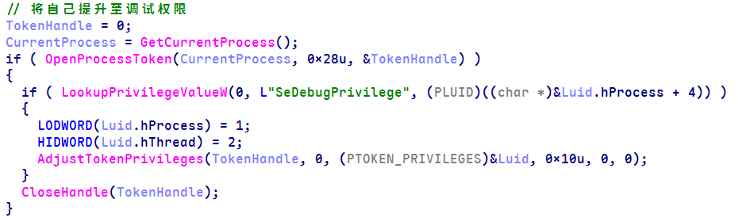

### 3.2 唯一性标识与主机信息记录

为了确保在同一台受害主机上不重复部署、不发生异常冲突，恶意软件通过获取本地计算机名与内置标识拼接之后进行哈希处理，恶意软件的作者自己实现了 **FNV-1a** 32-bit **hash**，生成唯一的 GUID。

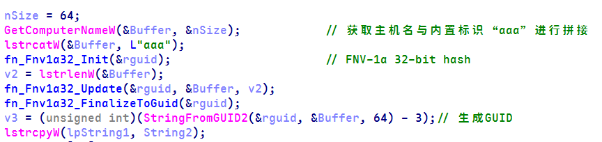

随后，该 GUID 被用于创建互斥体（Mutex），用以唯一标识当前运行的样本实例。在分析环境中，这个标识为 `L"200EA0E3-A0E3-200E-E3A0-0E20E3A00E20"`。对于每个机器，它的标识都是不同的。通过这种方式恶意软件在一定程度上减小了通过全局对象而被用户判断当前系统已经被感染的可能性。

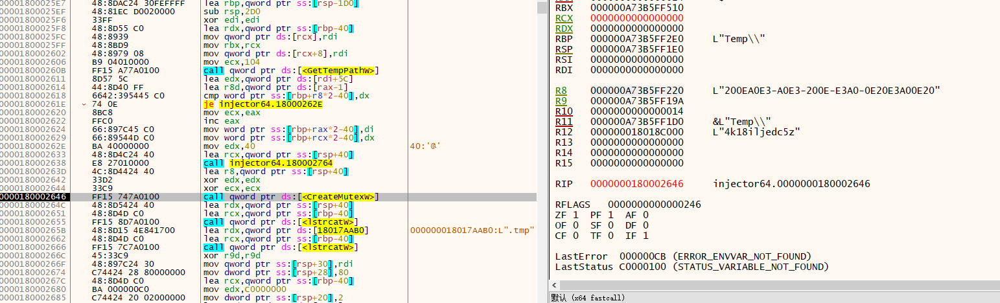

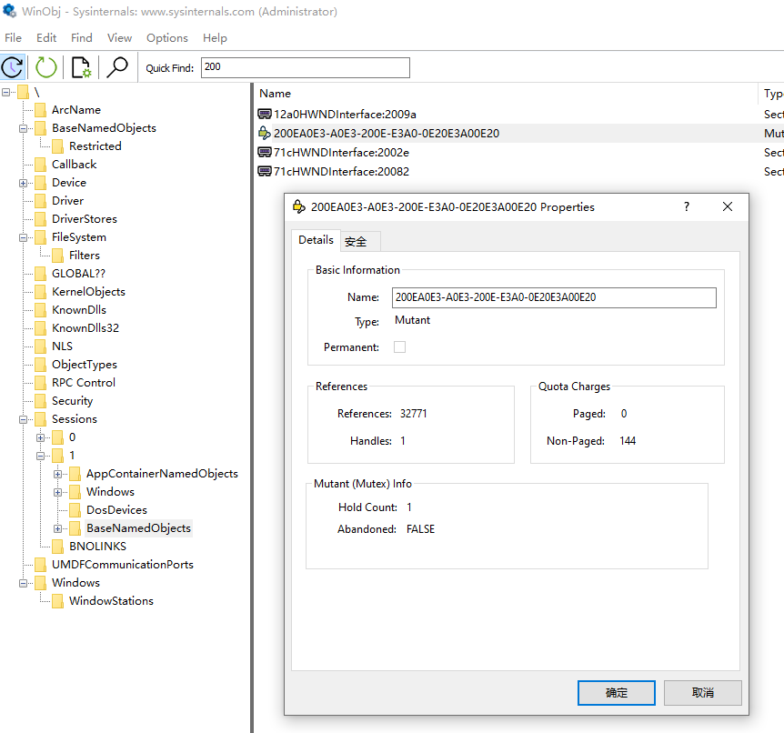

除了作为全局互斥体对象，恶意软件也会利用它费尽心思计算的GUID作为日志对象标识。在日志记录设计上，恶意软件也实现了两种方式：1）在临时目录创建文件。2）创建基于页文件的命名共享内存。通过代码可以看到，恶意软件选择文件写入作为主要手段，如果文件创建失败则退回共享内存的方式。

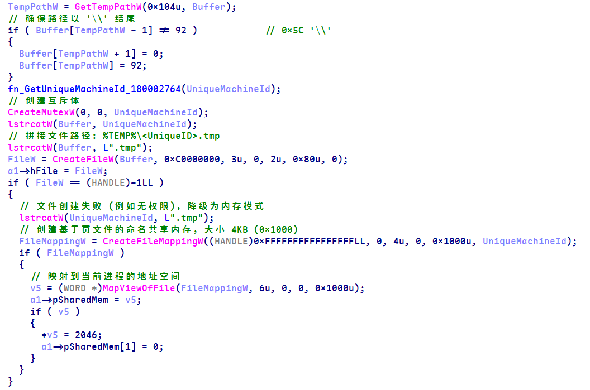

查看该进程的句柄可以很清晰的看到恶意软件创建/打开的对象（日志文件和互斥体对象）。

```
C:\Users\WIN10-~1\AppData\Local\Temp\200EA0E3-A0E3-200E-E3A0-0E20E3A00E20.tmp
\Sessions\1\BaseNamedObjects\200EA0E3-A0E3-200E-E3A0-0E20E3A00E20
```

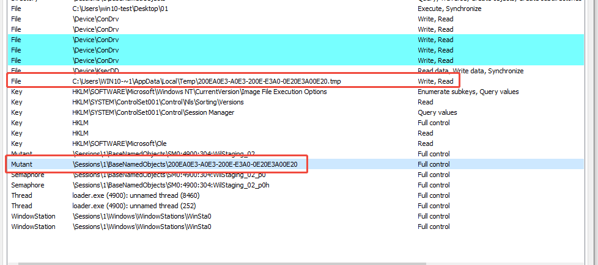

恶意软件并不会直接以明文的方式保存日志信息，在写入到共享内存或文件之前，会对信息进行一个双字节的XOR加密之后再写入。

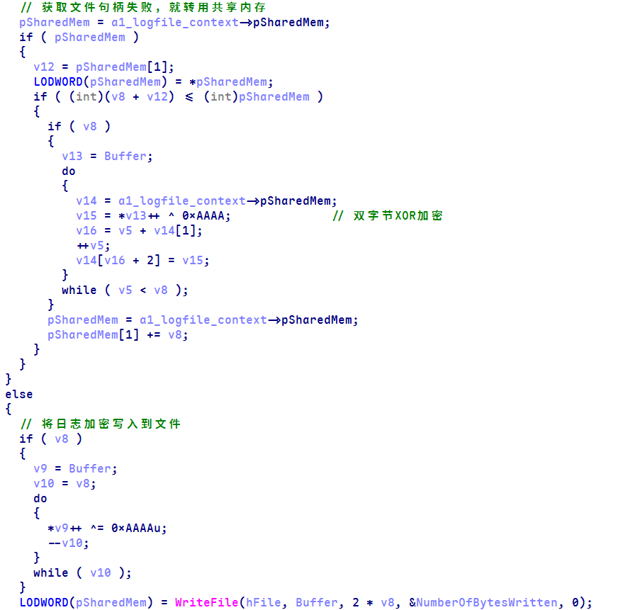

### 3.3 精心筛选的svchost目标

恶意软件并不是仗着自己有调试权限就随便选择一个`svchost.exe`，而是通过一系列的判断，最终在众多`svchost.exe` 中筛选出适合隐蔽自己行为的。

在设计层面，该恶意软件展现出了高度的模块化工程思维。通过将“进程遍历”与“目标筛选”解耦，攻击者利用回调函数机制实现了灵活的代码复用。这种设计不仅提升了恶意代码的执行效率与运行稳定性，还允许攻击者在后续迭代中轻松替换注入逻辑。

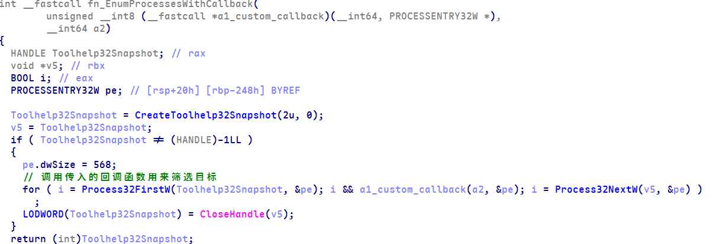

当恶意软件启动时，它可能启动的较早（比如通过注册服务来实现持久化）。恶意软件会进行循环等待，直到获取到了 `explorer.exe `的PID，紧接着就通过该进程来获取当前登录用户的用户名。作者定义了一个结构体用来存储目标进程的信息。

```c
struct _TARGET_PROCESS_CONTEXT
{
    WCHAR	CurrentUserName[64];			 // 从 explorer.exe 提取的当前用户名
    DWORD	MatchCount;						// 已找到的 svchost 数量
    DWORD	MatchedPIDs[64];				 // 收集到的 PID 数组
}
```

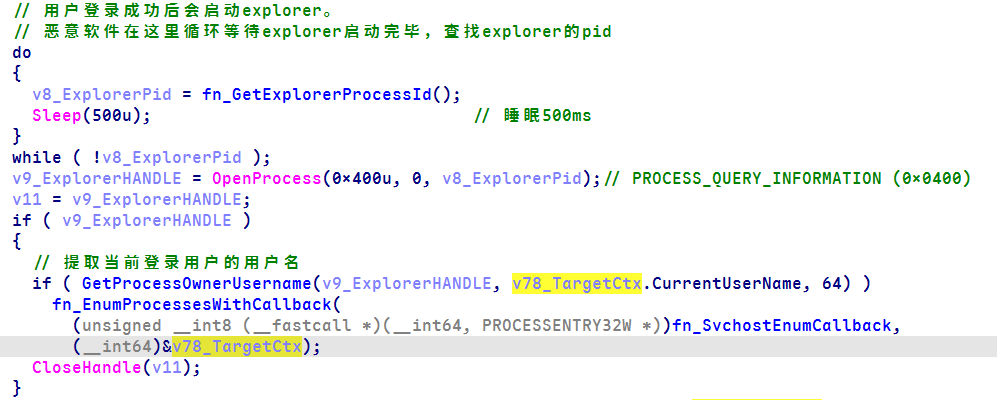

在对svchost目标的选择上，作者实现了高安全标准的进程筛选器来进行过滤，它只为上层调用者记录满足以下所有条件的 `svchost.exe`：

1. **名称为** `svchost.exe`
2. **位于** `C:\Windows\System32` 目录（防止伪造）
3. **是 64 位原生进程**（不通过 WOW64 运行）
4. **所属用户**与当前登录用户一致（防止跨会话干扰）

代码如下：

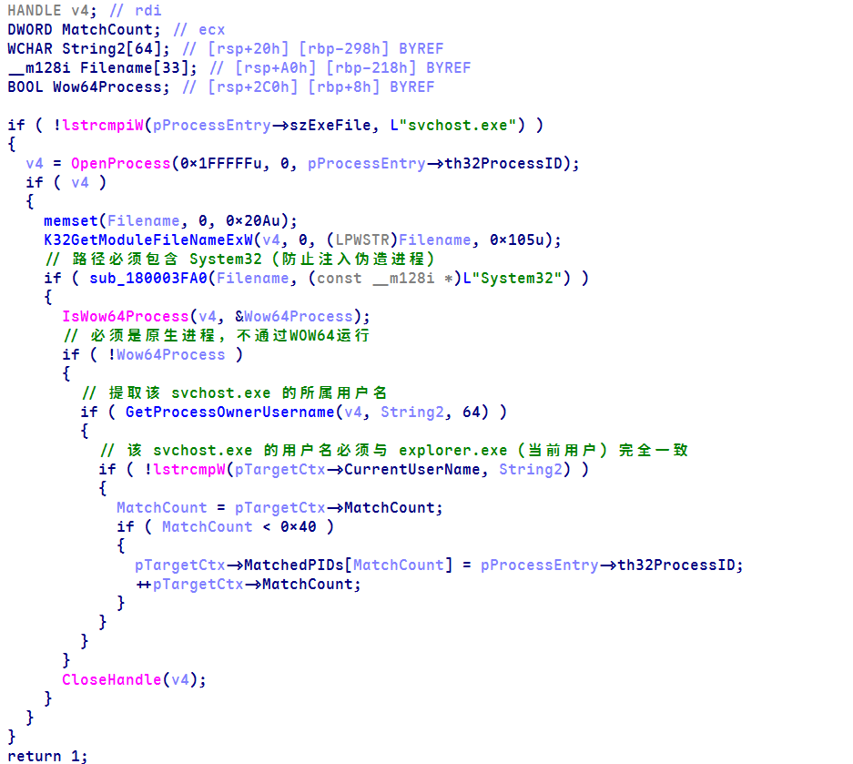

筛选出来的 PID 会被存入 `pTargetCtx->MatchedPIDs` 数组，供后续逻辑使用。同样，这些信息也会以加密的方式写入到日志记录中。

在执行注入前，恶意软件会进行环境探测，如果检测到杀软也不运行。与之前的进程探测类似，作者实现了一个杀毒软件进程筛选器来过滤。在恶意软件内部硬编码了一个国产主流杀软的数组，如果匹配到任意一个，就直接装死不运行。

```c
LPCWSTR g_ChineseAvProcessNames[AV_LIST_COUNT] = {
    L"360tray.exe", L"360safe.exe", L"dsmain.exe", L"2345safe.exe", 
    L"qqpcrtp.exe", L"QQPCMgr.exe", L"KWatch.exe", L"kav32.exe", 
    L"ccenter.exe", L"rfwsrv.exe", L"Ravmond.exe", L"RSTary.exe", 
    L"RavTask.exe", L"HipsDaemon.exe", L"HipsTray.exe"
};
```

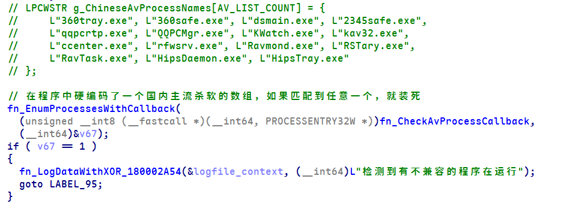

### 3.4 方案 2：对完美宿主执行高危注入与持久化监控

当避开所有杀软雷区并成功筛选出完美的 `svchost.exe` 宿主后，恶意软件将正式进入核心的武器化利用阶段（即代码日志中所指的“方案 2”执行链路）。

恶意软件并没有采用粗暴的全局注入，而是精细地遍历存储在 `pTargetCtx->MatchedPIDs` 数组中的候选 PID。针对每一个极具隐蔽性的目标，代码会尝试利用 `OpenProcess` 获取访问权限，并调用其内部封装的核心注入引擎 `fn_InjectPayloadEx`，尝试将高达 1.4 MB（`0x160000` 字节）的恶意 Payload 完整写入目标进程内存中。

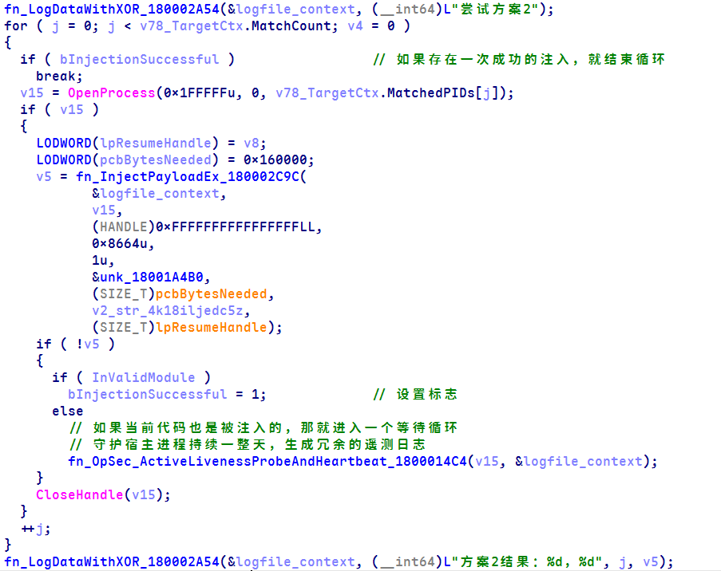

在这段注入逻辑中，该恶意软件展现出了极高的“操作安全”意识与多阶段控制能力。根据恶意代码当前运行的上下文环境（即自身是否已被注入过），它在注入成功后会走向两条截然不同的战术分支：

- 分支 A：母体进程的“一击脱落”

  如果恶意软件检测到当前处于初始运行阶段（Stage 1 Dropper，即 `InValidModule` 标志成立），它在成功感染任意一个候选进程后，会将标志位置 1 并直接 `break` 退出循环。母体程序在完成历史使命后会立刻隐蔽退出。

- 分支 B：驻留阶段的“伴生看门狗”

  如果判定当前已经处于注入状态或特定持久化模式下，恶意软件不选择退出，而是调用一个复杂的伴生监控函数。
  
  - 存活探测：该函数会进入一个生命周期长达 24 小时（`0x15180` 秒）的循环。每隔一秒，它都会尝试在宿主进程中申请并立即释放 1KB（`0x400`）的读写内存（`VirtualAllocEx` / `VirtualFreeEx`）。这种“主动式”探活能让恶意软件第一时间感知到宿主是否被意外关闭，比传统的句柄挂起更敏锐。
  - 生成冗余遥测日志（Telemetry）：这种持续且高频的良性内存分配操作，会在一天内产生数万条无害的系统遥测日志。

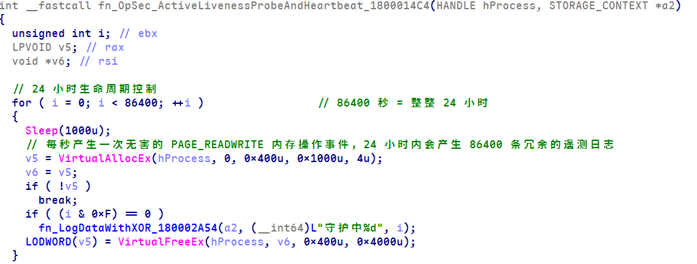

### 3.5 方案 4: Windows Unistack 用户服务滥用

当常规的 `svchost.exe` 注入链路（即日志中的“方案2”）因权限不足或 EDR 拦截而失败时，该恶意软件展现出了极强的战术韧性，无缝切换至“方案4”——基于服务控制管理器（SCM）的动态枚举与 Unistack 服务劫持。

恶意代码首先调用 `OpenSCManagerW` 申请 `SC_MANAGER_ENUMERATE_SERVICE` (0x0004) 权限。这一操作相对低危，不易直接触发行为拦截。 在获取服务列表时，攻击者熟练使用了 Windows API 的经典“两步走”探路范式：

- 初次探测： 传入空缓冲区调用 `EnumServicesStatusExW`，故意触发 `ERROR_MORE_DATA` (234) 错误，从而精准获取系统当前所有服务信息所需的内存大小（`cbBufSize`）。
- 内存分配与二次拉取： 根据返回的大小动态分配堆内存后，再次调用该 API，将系统中所有的服务状态完整拉取到自建的结构体中。这种不硬编码缓冲区大小的设计，保证了恶意软件在面对拥有海量后台服务的不同宿主环境时的绝对稳定性。

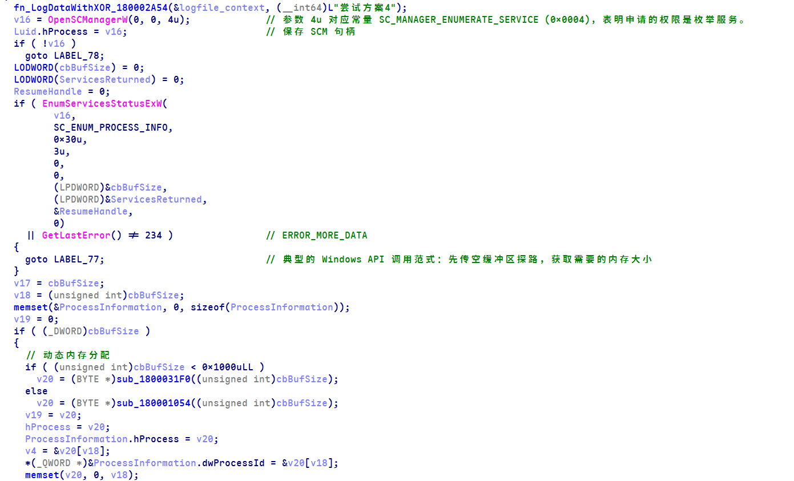

恶意软件在枚举服务后，并没有寻找高权限的系统服务，而是针对以下四个特定的前缀进行模糊匹配：

- `OneSyncSvc_` (同步主机)

- `PimIndexMaintenanceSvc_` (联系人数据索引)

- `UnistoreSvc_` (用户数据存储)

- `UserDataSvc_` (用户数据访问)

这四个服务属于 Windows 10/11 引入的 Unistack / Per-User Services（每用户服务）。操作系统的设计机制决定了，当用户登录时，系统会为这些服务动态生成一个带有随机字母数字后缀（对应当前用户会话标识符）的实例。这些服务运行在当前用户的上下文中，而非 SYSTEM 权限。 即使“方案2”失败，通过劫持这些 Unistack 服务，恶意软件依然能够完美继承目标用户的权限，从而畅通无阻地窃取浏览器凭据、DPAPI 密钥或监控桌面，达成预期的战术目标。

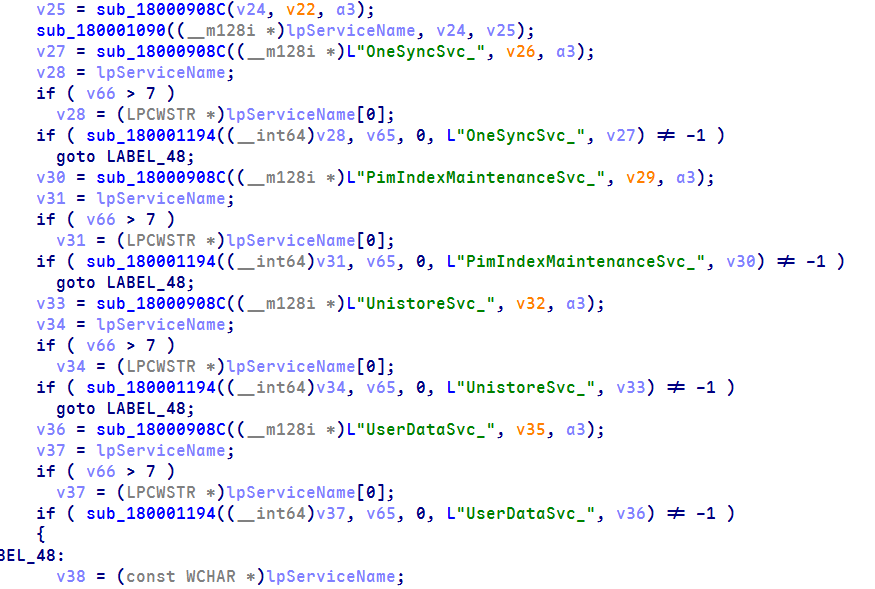

在成功匹配到目标的 Unistack 服务名后，攻击链路进入最后的闭环。 调用 `OpenServiceW` 获取服务句柄，随后利用 `QueryServiceStatusEx` API 提取 `SERVICE_STATUS_PROCESS` 结构体，精准定位该服务在当前系统中的物理进程 PID。获取 PID 后，恶意软件复用 `OpenProcess` 获取内存访问权限，并再次调用核心注入引擎 `fn_InjectPayloadEx_180002C9C`，尝试将高达 1.4 MB 的恶意 Payload 空投至该服务进程中。 若注入成功，进程控制流会再次平滑移交至 `fn_OpSec_ActiveLivenessProbeAndHeartbeat_1800014C4`（即前文分析的 24 小时看门狗机制），确保持久化存活。

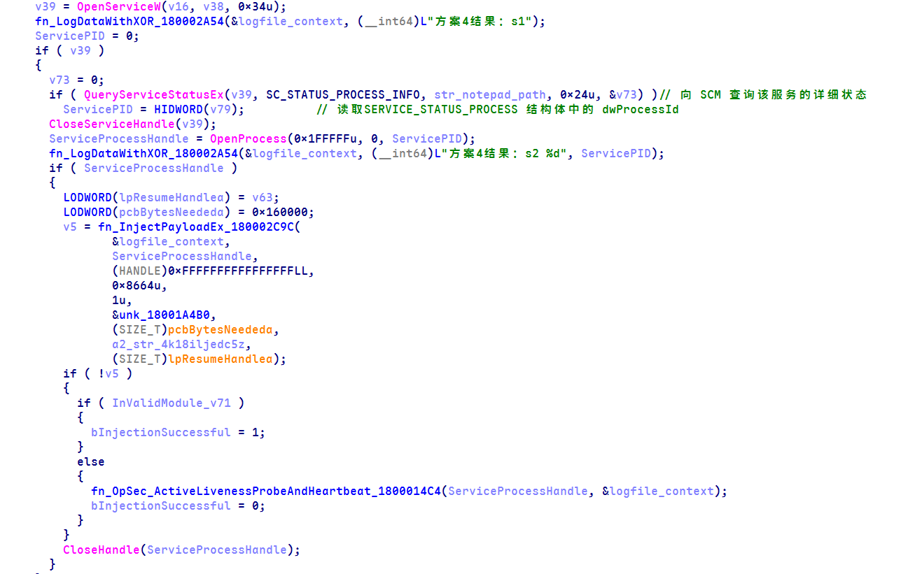

### 3.6 方案 5：父进程欺骗

当常规的跨进程注入与服务劫持均被防御体系阻断时，该恶意软件展现出了其武库中最具隐蔽性的一环——“方案 5”。此方案彻底放弃了对现有系统进程的依附，转而采用“凭空创造、关系伪造、硬件分流”的战术。

为了逃避 EDR 对异常进程树（Process Tree）的追踪，恶意软件必须为其即将创建的恶意子进程寻找一个“合法且高信誉”的父进程。

- 首选目标（合法伪装）： 代码首先尝试通过绝对路径获取 `C:\Windows\System32\services.exe`（服务控制管理器）的句柄。如果成功，后续生成的恶意进程在系统中看起来就像是由系统原生服务管理器启动的正常服务。
- 备用目标（捏造替身）： 如果因为权限隔离无法触达 `services.exe`，代码立即启动备用方案——在后台静默（隐藏窗口）拉起一个 `notepad.exe`（记事本），并将其作为“代理生父”。

为了确保 `services.exe` 是权威合法的Windows服务进程，程序不再像普通的恶意软件那样仅仅通过名字（比如只要叫 `services.exe` 就行）来寻找进程，而是进行了多重校验，以防被安全人员用重命名的伪造进程欺骗（例如运行在 `C:\Temp\services.exe` 的蜜罐）。

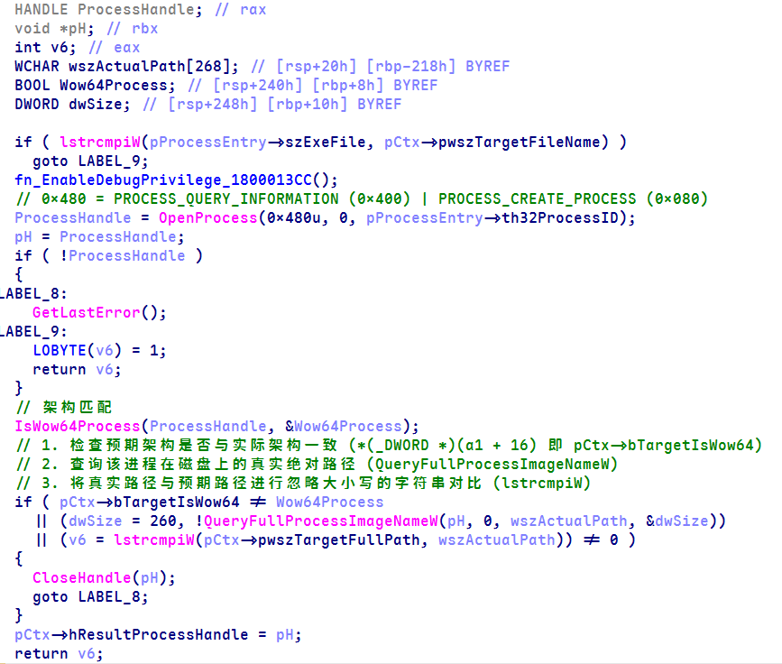

在这里作者再次确保自己为调试权限，然后以 `PROCESS_QUERY_INFORMATION (0x400) | PROCESS_CREATE_PROCESS (0x080)` 来打开 `services.exe`。恶意软件在这里非常谨慎，即使获得了调试权限也没有使用 ` PROCESS_ALL_ACCESS (0x1FFFFF)` 避免因全权限操作产生巨大噪音被感知。

如果对 `services.exe` 的权限获取失败，恶意软件会以静默的方式拉起一个 `notepad.exe` ，并获取这个 `notepad.exe` 同样赋值给 `ParentProcessHandle`。

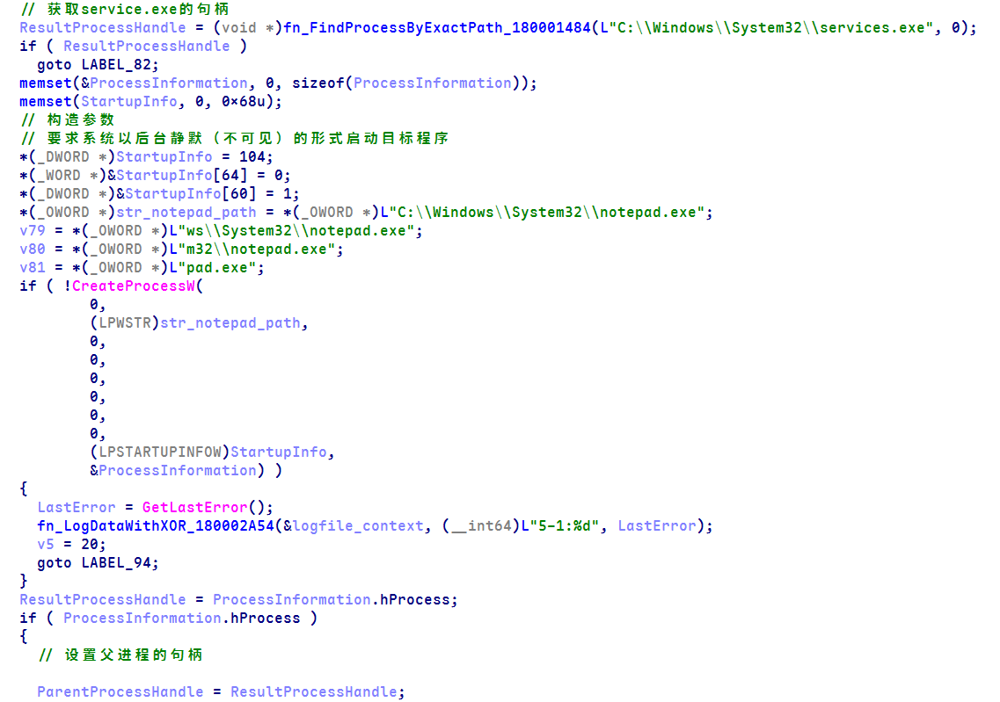

在 Windows 中，当一个进程启动另一个进程时，通常会形成父子进程树。安全软件（如 EDR）会严格监控进程树。如果一个未知的木马程序（比如叫 `malware.exe`）突然启动了一个系统进程 `svchost.exe`，EDR 会立刻报警并拦截。

准备好“代理生父”的句柄后，恶意软件利用了 Windows Vista 引入的扩展进程创建机制，实施高级的 父进程欺骗（PPID Spoofing）。

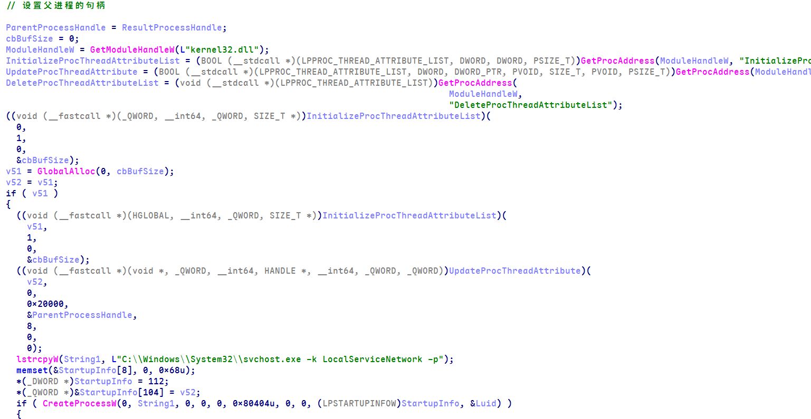

代码动态调用 `InitializeProcThreadAttributeList` 分配内存，并使用 `UpdateProcThreadAttribute` 函数，传入了极为关键的魔数 `0x20000`（即 `PROC_THREAD_ATTRIBUTE_PARENT_PROCESS`）。这一操作将强行篡改新进程的 PPID，使其在内核结构（EPROCESS）中绑定到之前获取的 `services.exe` 或 `notepad.exe` 上。

启动参数被精心伪造为 `-k LocalServiceNetwork -p`，这是 Windows 正常网络服务的标准后缀，极具迷惑性。`CreateProcess` 的标志位被设置为 `0x80404u`。这是一个复合标志位，包含：`0x00080000` (`EXTENDED_STARTUPINFO_PRESENT`)：启用扩展属性（使得 PPID Spoofing 生效）。`0x00000004` (`CREATE_SUSPENDED`)：以挂起状态创建主线程。

这样一来，在任务管理器和安全软件眼中，即将启动的新进程是由合法的系统服务管理器 (`services.exe`) 启动的，看起来完美无瑕。

在注入方式中，本次选择了与之前完全不同的方案。在对该恶意软件核心注入引擎 `fn_InjectPayloadEx_180002C9C` 的分析中，我们发现了恶意软件使用的另一种高级的防御规避手段：基于 CPU 厂商特征的武器级动态分流。恶意软件在执行进程注入前，会调用内部函数（`fn_IsGenuineIntelCpu`）通过内联汇编触发 `CPUID` 指令，验证宿主是否为真实的 Intel 处理器（即 CPUID[0] 返回 `GenuineIntel`）。根据硬件环境的不同，恶意软件展现出了截然不同的攻击形态。

由于刚刚创建进程是以挂起的形式，此时传入的参数值 2 ，正是后续对应的线程劫持注入技术。

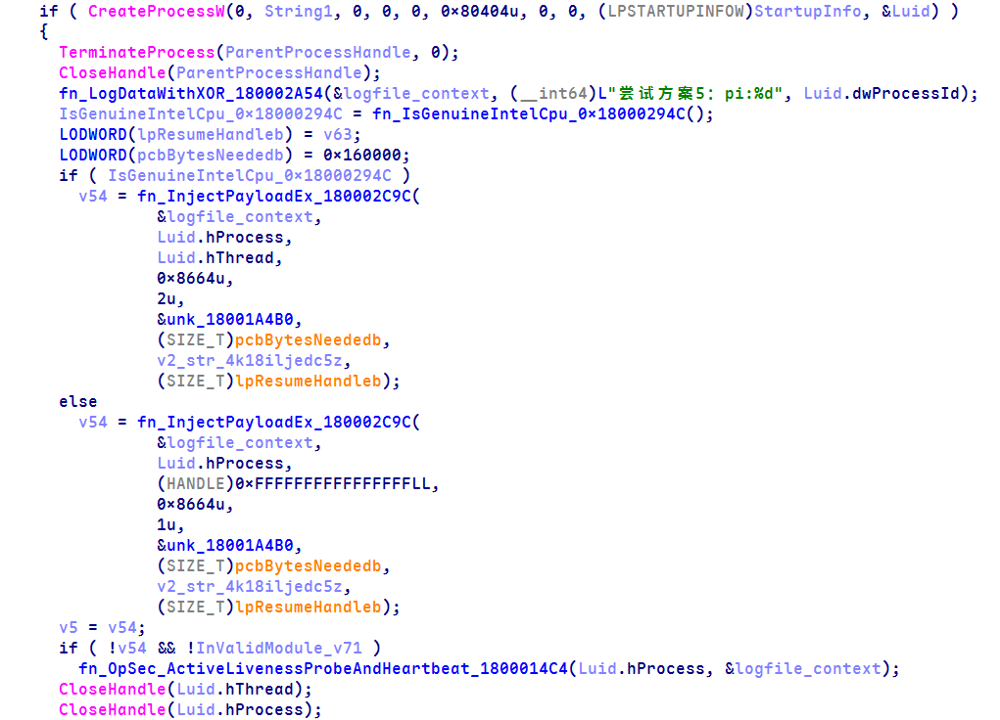

### 3.7 核心注入器机制拆解：架构自适应与高级 EDR 规避

`fn_InjectPayloadEx_180002C9C` 是该恶意软件实现最终武器化的核心注入引擎。该函数集成了架构感知、内存欺骗、载荷组装与动态执行分流等多重高级技术。其完整的函数声明如下：

```c
__int64 __fastcall fn_InjectPayloadEx_180002C9C(
        STORAGE_CONTEXT *pIpcContext,
        HANDLE hTargetProcess,                  // 目标进程句柄
        HANDLE hTargetThread,                   // 目标线程句柄（用于劫持）
        DWORD dwMachineType,                    // 目标架构：0x14C (x86) 或 0x8664 (x64)
        DWORD dwInjectionMethod,                // 注入模式：1 (远程线程) 或 2 (线程劫持)
        LPCVOID pPayloadData,                   // 恶意载荷本体
        SIZE_T cbPayloadSize,
        LPCVOID pConfigData,                    // 配置文件数据
        SIZE_T cbConfigSize
)
```

恶意软件内部硬编码了两套独立的 Bootstrap Shellcode，分别针对 32 位和 64 位架构进行适配。这两段 Shellcode 以明文形式隐蔽在自身的资源表中。

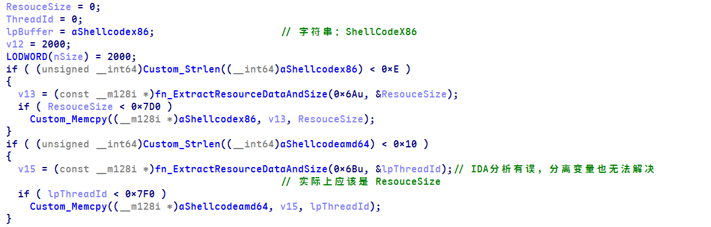

引擎会根据传入的 `dwMachineType` 参数（`0x14C` 或 `0x8664`），动态提取并装载与目标宿主进程架构相匹配的 Shellcode，从而避免因架构不匹配导致的进程崩溃与告警。

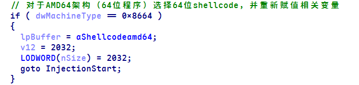

在申请内存时，恶意代码展现出了极其狡猾的防御规避策略。它首先会直接裸调 `pTargetMemory = VirtualAllocEx(...)`。 在现代 Windows 系统中，单纯申请 1.4MB 的内存由于系统资源耗尽而失败的概率几乎为零。如果 `pTargetMemory` 为 0（申请失败），最大可能的原因是被杀毒软件或 EDR 拦截并强行拒绝了访问。

此时，恶意软件不会直接退出，而是启动一套极具迷惑性的“变脸”机制：

它通过纯手工计算偏移的方式解析自身的 PE 头，精准定位到 `.text`（可执行代码）段。随后，它在代码段中按 16 字节对齐进行扫描，寻找由编译器自动生成的四个字节的空闲填充区（`CC CC CC CC`，即 `int 3` 断点指令）。

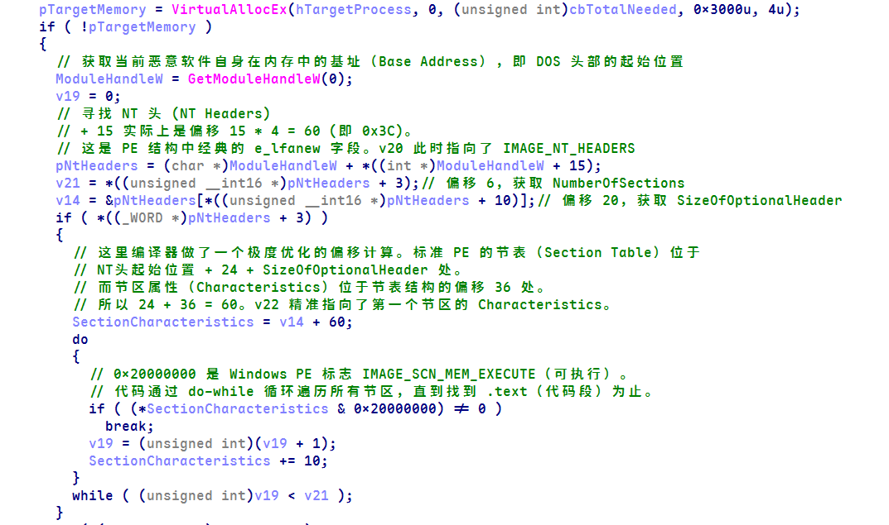

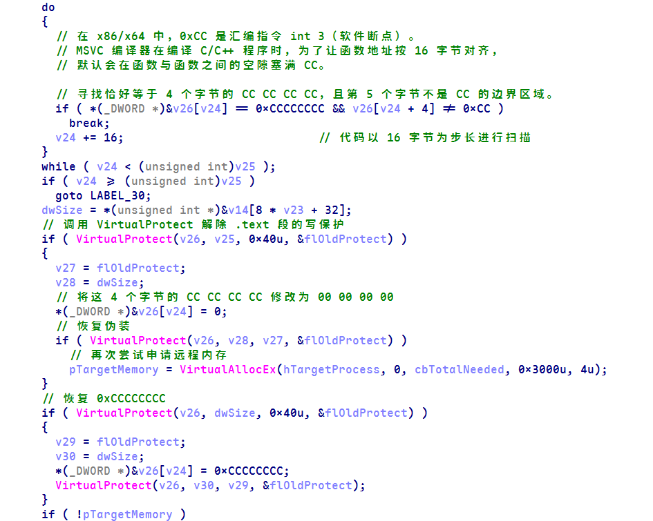

修改这 4 个无意义的填充字节对程序的实际运行逻辑没有任何影响，但对于 EDR 来说，这四个字节的改变，直接摧毁了它的“静态身份识别”机制。

现代 EDR 在拦截到 `VirtualAllocEx` 这一高危动作时，为了兼顾性能，通常不会进行全量指令逆向，而是对调用者（恶意软件）的 `.text` 段进行极速的密码学哈希（如 SHA-256）扫描，以验证其“指纹”是否在已知黑名单中。

这段代码完美利用了哈希算法的底层密码学特性——**雪崩效应**。

恶意代码巧妙利用了密码学哈希的**雪崩效应（Avalanche Effect）**：当输入数据发生哪怕 1 个 Bit 的改变，输出的哈希值也会发生翻天覆地的变化。

当这句 `VirtualAllocEx(...)` 再次执行时，执行流会再次被底层 EDR 的 Hook 拦截。此时 EDR 再次对当前进程的 `.text` 段进行哈希扫描（验证指纹）。由于填充区的 `CC` 变成了 `00`，哈希雪崩效应触发，产生了一个全新的指纹。EDR判断这似乎是个没见过的新程序，或者只是个巧合的良性进程，放行 API。

随后代码跳出这个块，把 `00` 还原回 `CC`，就像什么都没发生过一样，继续完成它后续的恶意载荷写入工作。

在成功骗取到目标进程的内存空间后，恶意软件采取了精细的数据打包与最小权限原则来组装其武器库。

值得注意的是，初始申请的内存权限仅为可读可写（`PAGE_READWRITE`），这是为了规避 EDR 针对直接分配可执行内存（RWX）的启发式监控。只有在所有恶意数据完全写入完毕后，它才会调用 `VirtualProtectEx`，瞬间将整块内存的权限提权为可执行（`PAGE_EXECUTE_READ`），完成临门一脚的武器化准备。

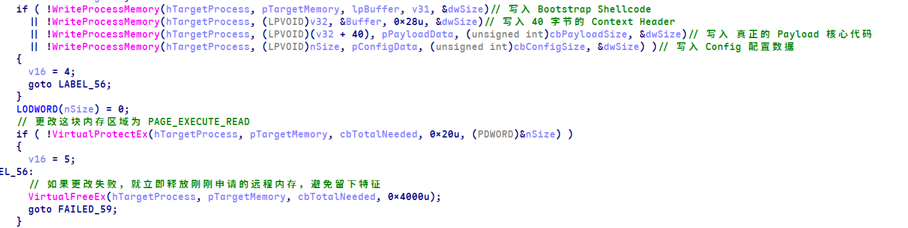

在内存就绪后，注入器根据传入的 `dwInjectionMethod` 参数，实施多层级的动态执行分流。当值为 1 时，采用经典的远程线程注入方式，虽然容易产生特征日志，但在未知环境下具备最高的运行兼容性。

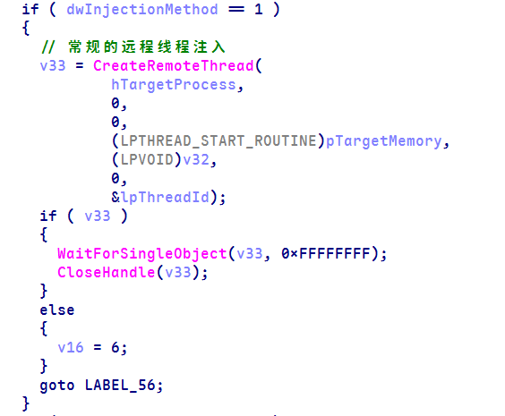

当环境条件苛刻且目标线程已知时（例如由父进程欺骗机制挂起创建的进程），恶意软件切换至最高级的劫持模式。它直接读取目标线程的上下文（Context），并强行篡改指令指针及关键寄存器（如利用 x64 ABI 标准修改 RCX/RDX 进行传参），将原本正常的执行流强行扭转至注入的 Bootstrap Shellcode 处。这种无文件级别的劫持，极大地提升了最终执行动作的隐蔽性。

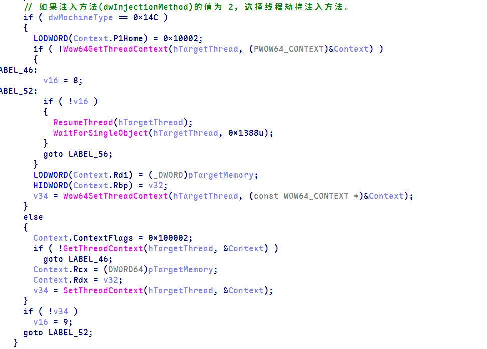


## 4. 攻击者画像与实战能力评估

站在实战攻防与免杀武器化开发的视角，综合前文的深度逆向分析，我们对该恶意软件及其背后的开发者（或组织）的技术水平做出如下评估：

### 4.1 极强的通用性与工程化思维

该样本展现出了成熟的恶意软件工程化能力。其高度模块化的设计、灵活的异常处理，以及根据目标 CPU 环境（`IsGenuineIntelCpu`）自适应切换 线程劫持/远程线程 注入的技术，证明开发者对 Windows 底层运行机制及现代 EDR 的防御边界有着深刻的理解。整体框架具备极强的通用性和实战灵活性。

### 4.2 目标选择与检测机制的局限性

尽管核心注入手法精湛，但该样本在行动安全与防御规避的统筹策略上暴露出明显的短板：

- **高频探针触发行为基线：** 程序在主逻辑中频繁调用系统 API 创建进程快照以遍历进程树，这种高频的非定常行为极易触碰现代 EDR 系统的行为监控基线，从而引发高危告警。
- **违背常理的进程关系：** 在父进程欺骗（PPID Spoofing）的降级策略上存在逻辑硬伤。当首选的高特权目标 `services.exe` 获取失败时，样本生硬地回退到以 `notepad.exe`（记事本）作为伪装父进程来启动系统服务宿主 `svchost.exe`。在蓝队溯源视角下，这种极其违和的父子进程调用链无异于掩耳盗铃，极大地暴露了其恶意特征。
- **内存取证痕迹较重：** 在载荷执行层面，虽然样本利用 Shellcode 来引导恶意 DLL，但并未采用当前高级武器库中标配的反射式 DLL 注入（sRDI）或更为隐蔽的内存模块（Memory Module）自加载技术。其现有的引导过程依然伴随着敏感的内存分配与权限修改，在内存扫描（Memory Scanning）面前不够隐蔽。
- **静态特征极易暴露：** 更为致命的是，恶意软件直接将核心 DLL 与 Shellcode 载荷嵌入 PE 文件的资源段（.rsrc）中。这种缺乏外层高熵混淆或分离加载（Staged Payload）的设计，使其极易被传统杀毒软件的静态特征匹配与异常熵值分析引擎拦截。

综上所述，从专业免杀框架的工程化标准审视，该样本虽然在特定环节（如注入方案）表现出“炫技”色彩，但在应对高对抗性沙箱与现代 EDR 的体系化监控时，其整体环境探测与隐蔽性设计仍显粗糙。

### 4.3 消失的拼图：版本迭代与裁剪痕迹

在对样本内置的明文信息及执行流进行分析时，我们发现了一个有趣的细节：样本的注入模块包含了清晰的“方案 2”、“方案 4”与“方案 5”的执行逻辑及日志输出，但贯穿整个二进制文件，并未发现“方案 1”与“方案 3”的任何实现代码或相关引用。 这为我们提供了两个关于攻击者开发习惯的推论：

1. 模块化动态编译： 攻击者拥有一套庞大的私有免杀生成框架，方案 1 和方案 3 可能是较为陈旧或已被各大杀软拉黑的注入手法（如最基础的 `CreateRemoteThread` + `LoadLibrary`）。为了降低样本的整体熵值或减小体积，攻击者在编译当前版本时直接裁剪了这部分模块。
2. 快速迭代的测试品： 这也可能是一个正在灰度测试中的版本。

## 5. IoCs


- SHA-256: `af7fcb94e1db49735f2099af9fe0a6edbeb63894a60b2e4ca21b4398e30936f0`
- MD5: `cd27118d936b6dd84e97353273f65a25`
- SHA-1: `74a8b3787411e4361be2f78579357f988825a97f`
- 日志文件: `C:\Users\{用户名}\AppData\Local\Temp\{GUID}.tmp`
- 互斥体: `{GUID}`

---

- [[computer-security/reports/Malware Reports]]
- [[computer-security/reports/rat-597c5e69c854/rat-597c5e69c854|远控木马分析报告]]
- [[computer-security/mechanism/reflective-dll/reflective-dll-injection|Reflective DLL 注入技术]]
