---
tags:
  - 勒索病毒
  - 恶意软件分析报告
date: 2026-04-21
---
# 勒索病毒威胁情报分析报告：48877a3a4c72c1daf3a80e3c034b56a04cec7ce3856887fed73e645e53c76b96


[TOC]


## ⚠️ 免责声明 (Disclaimer)

**【郑重声明】** 本文档及其中包含的所有逆向分析过程、代码片段、伪代码和技术细节，**仅供网络安全防御研究、学术交流及反恶意软件技术探讨使用**。

为了避免被恶意利用及保护相关受害者，文中涉及的所有敏感信息（包括但不限于：C2 服务器 IP、域名、通信端口、特定业务标识符及相关真实路径）均已进行严格的**脱敏与打码处理**。

请读者严格遵守相关网络安全法律法规。**未经授权，任何人不得利用本文中探讨的技术手段进行任何形式的非法攻击、入侵或破坏活动。** 因读者滥用本文中提及的技术或情报所引发的任何直接或间接法律责任及后果，均由行为人自行承担，原作者对此不负任何法律连带责任。

**[Disclaimer]** The analysis, code snippets, and technical details provided in this article are strictly for **educational purposes, cybersecurity defense research, and malware analysis discussions**.

All sensitive Information of Compromise (IoCs), including but not limited to C2 IP addresses, domains, ports, and specific business identifiers, have been **redacted and obfuscated** to prevent malicious use and protect potential victims.

Readers must comply with all applicable cybersecurity laws and regulations. **Any unauthorized or illegal use of the techniques discussed in this article for malicious attacks or system compromises is strictly prohibited.** The author assumes no liability for any direct or indirect consequences, damages, or legal responsibilities arising from the misuse of the information contained herein.


## 报告摘要

- 威胁定性：企业级勒索软件
- 核心影响：该样本不仅会深度加密受害主机的本地文件（针对虚机文件有极速加密策略），还会彻底破坏系统级备份与恢复机制。
- 分析结论：**数据无法通过密码学手段暴力破解。** 经过对底层汇编指令的逆向工程确认，该勒索软件采用了极度严密的自定义伪随机数混合架构。其结合了系统时间戳、Delphi 线性同余发生器、真随机硬件噪音（Jitter）以及复杂的“密码学搅拌机”，导致最终生成的 AES 密钥具备极高的熵值，完美抵抗已知明文攻击与时间戳碰撞。**恢复数据的唯一途径为获取攻击者 RSA 私钥，或在系统未重启/密钥未轮换前进行活体内存取证。**

## 样本身份信息

- **MD5**: 54C6BAA3308FCBD9A51FACAB9786D333
- **SHA-256**: 48877a3a4c72c1daf3a80e3c034b56a04cec7ce3856887fed73e645e53c76b96
- **文件大小**: 522.50 KB (535040 bytes)
- **文件类型**: Portable Executable 64

## 破坏链路

**阻断系统恢复**

病毒在执行加密前或加密过程中，会调用 `cmd.exe` 执行一系列高权限系统命令，旨在彻底切断受害者的自救途径
```
C:\Windows\System32\cmd.exe /c vssadmin delete shadows /all /quiet
C:\Windows\System32\cmd.exe /c wbadmin DELETE SYSTEMSTATEBACKUP -keepVersions:0
C:\Windows\System32\cmd.exe /c wbadmin DELETE BACKUP -keepVersions:0
C:\Windows\System32\cmd.exe /c wmic SHADOWCOPY DELETE
C:\Windows\System32\cmd.exe /c bcdedit /set {default} recoverenabled No
C:\Windows\System32\cmd.exe /c bcdedit /set {default} bootstatuspolicy ignoreallfailures
```

- **清理卷影拷贝 (VSS)：** `vssadmin delete shadows /all /quiet` 及 `wmic SHADOWCOPY DELETE`，彻底删除 Windows 自带的磁盘快照。
- **摧毁系统级备份：** `wbadmin DELETE SYSTEMSTATEBACKUP -keepVersions:0` 和 `wbadmin DELETE BACKUP -keepVersions:0`，删除 Windows Server 备份。
- **禁用高级恢复模式：**
    - `bcdedit /set {default} recoverenabled No`：关闭 Windows 启动恢复环境。
    - `bcdedit /set {default} bootstatuspolicy ignoreallfailures`：强制系统在遇到错误时忽略失败并正常启动，防止受害者通过蓝屏修复进入安全模式。

**加密共享文件夹的数据**

病毒会进行网络扫描使用反向DNS获取主机域名来进一步扩大加密范围。

**磁盘覆写**

病毒在执行过程中会擦除空闲磁盘空间。当正常删除一个文件（或者病毒加密完原文件并将其删除，有些文件只是进行重命名后加密）时，文件的数据并没有真正从硬盘上消失，只是文件表里的记录被抹掉了。受害者通常可以使用类似 Recuva、DiskGenius 等数据恢复软件把被删的明文文件找回来。为了防范这一点，勒索病毒会生成大量的“垃圾临时文件”，一直往硬盘里写，直到把整个硬盘剩余的空闲空间全部占满（覆盖掉旧数据的物理扇区）。

## 行为流程分析

病毒在启动时会进行大量的初始化，并对后续行为进行初步配置。所有的加密文件都会被设置为`trial-recovery.{随机名}.-encrypted`

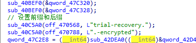

病毒会首先选择虚拟机文件作为高价值目标

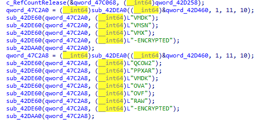

接着配置启动线程循环`kill/stop` 黑名单服务和进程

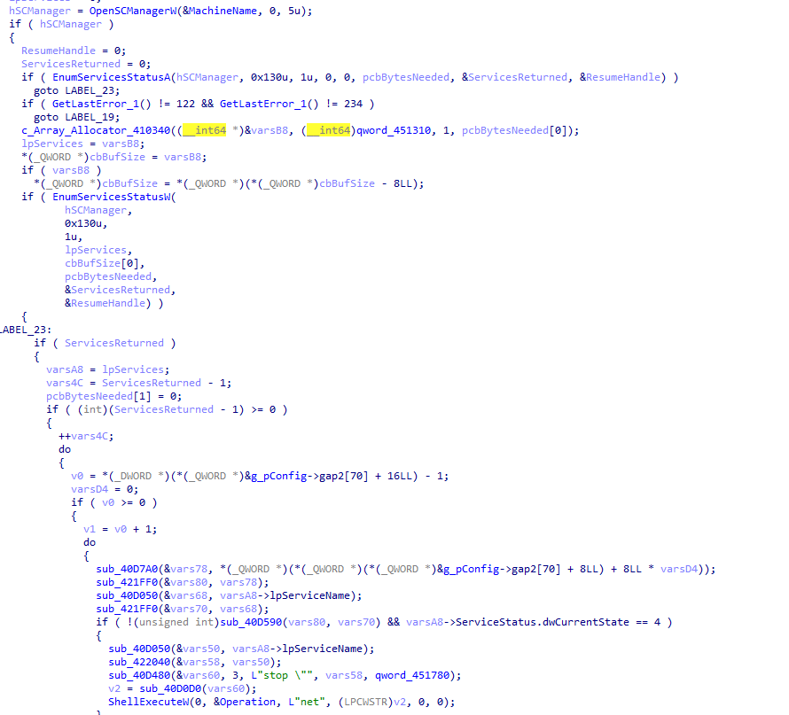


**配置加密目标**

全盘扫描，A盘到Z盘无差别覆盖

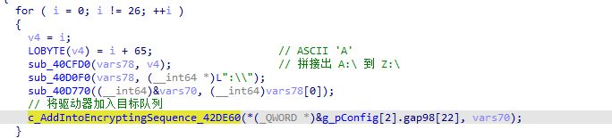

**磁盘覆写**

勒索病毒会生成大量的“垃圾临时文件”，一直往硬盘里写，直到把整个硬盘剩余的空闲空间全部占满（覆盖掉旧数据的物理扇区）

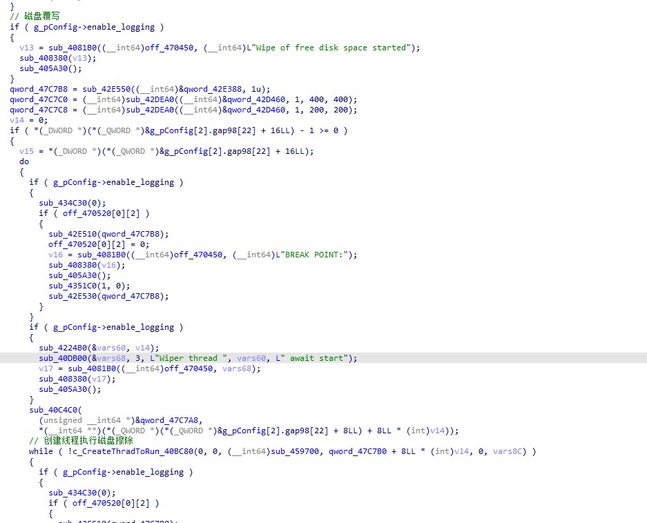

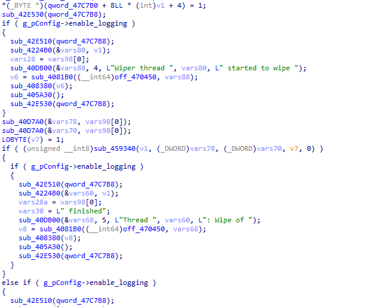

最后再删除生成的垃圾数据防止引起用户警觉

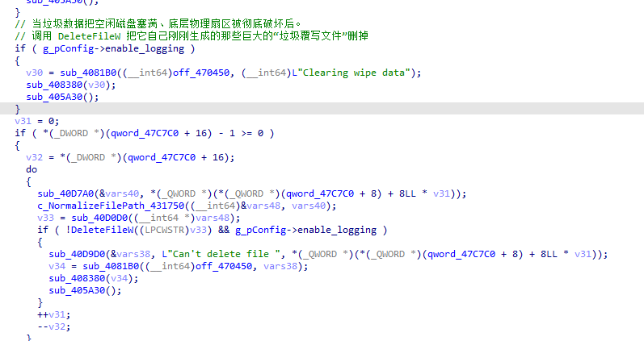

**网络扫描**

病毒在执行磁盘覆写的过程中同时新开线程执行网络扫描，记录存活主机

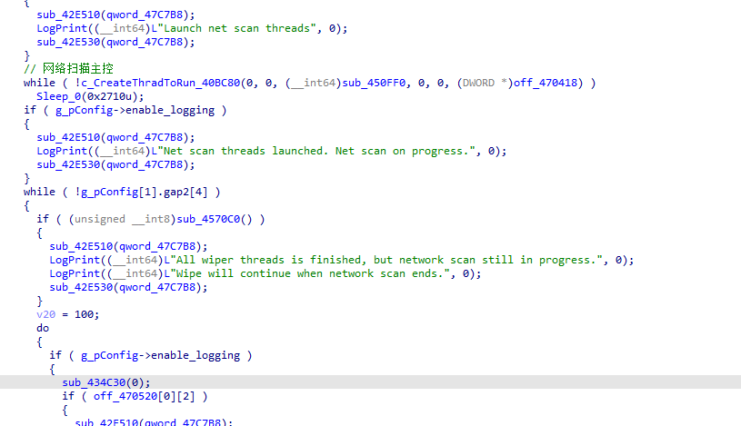

使用`gethostbyaddr`获取真实主机名，方便后续的SMB连接

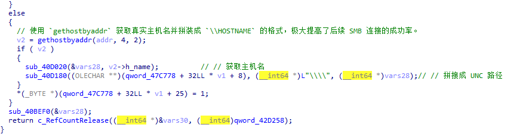

尝试加密SMB共享的文件

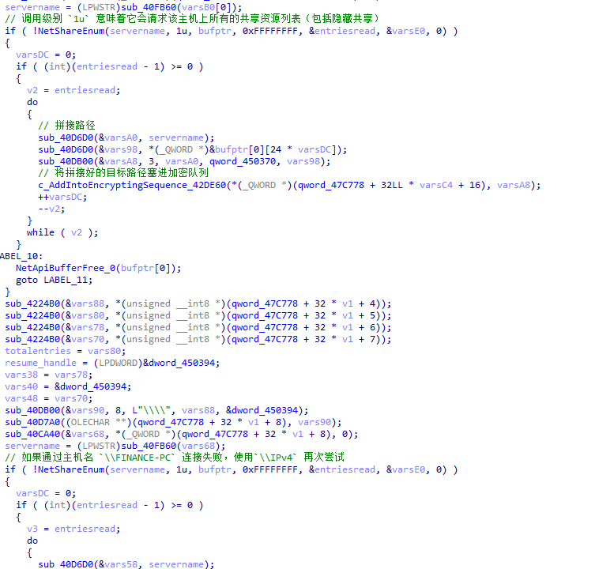

**清除自身实体**

病毒在加密完成后会根据配置选项来清除自身实体

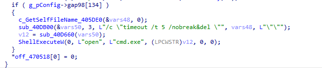

## 核心加密架构逆向

(本节证明为何数据无法被暴力破解，详述攻击者的加密流水线)

该勒索软件展现了高级的密码学工程能力，其 AES 主密钥的生成生命周期如下：

在病毒开始运行时会使用`GetTickCount`或高精度性能计数器获取初始伪随机种子，

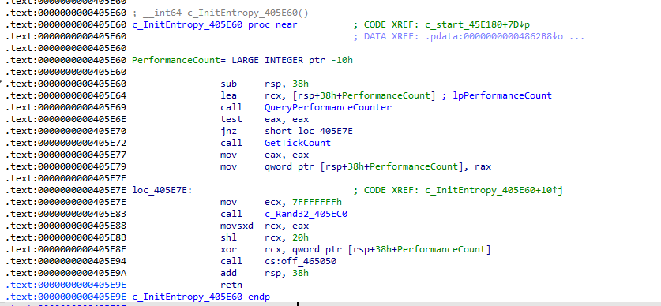

带入内置的Delphi线性同余算法(LCG)

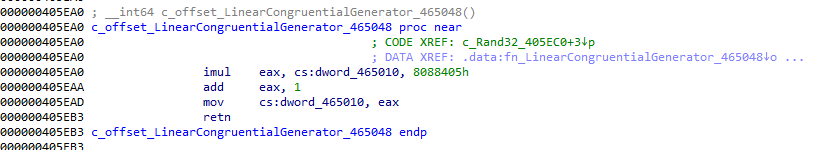

接着生成一个64字节的`MD5State`:

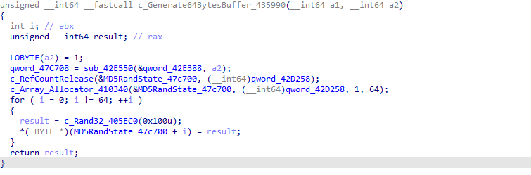

病毒使用物理硬件噪音收集器，生成一个16比特的数据

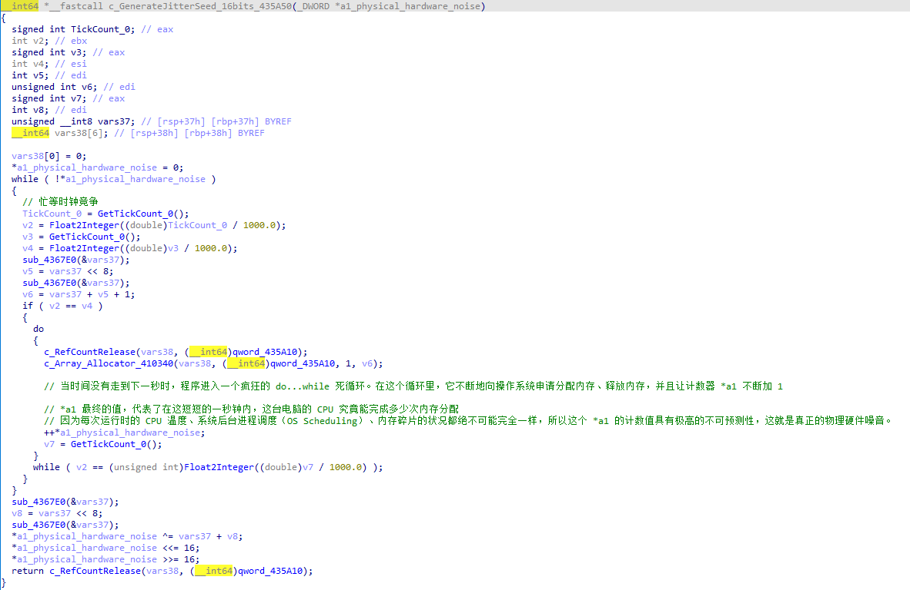

循环调用这个噪音函数，生成一个32字节的纯随机噪声数据，与最开始的MD5State进行拼接。

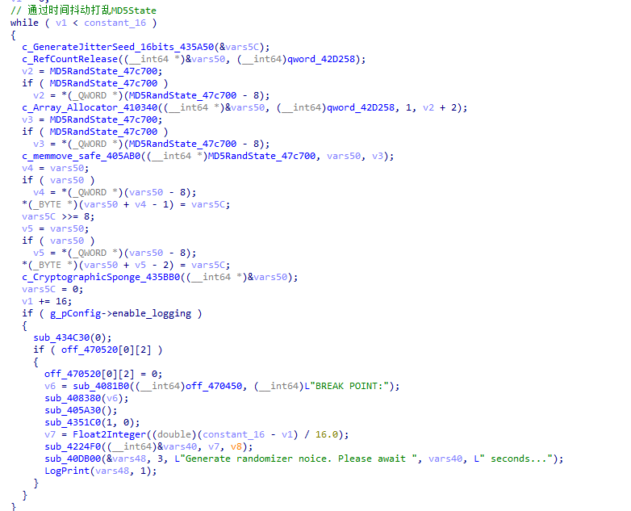

在循环时，病毒会调用一个称为密码学搅拌机的函数

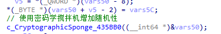

如果这个 15 秒的噪音收集过程被完整执行，那么无论拥有多么精确的时间锚点，暴力破解都是不可能的。因为其中混入的纯物理噪音，这是目前的算力极限无法逾越的高墙。


在AES主密钥生成阶段，它会使用刚刚充分与物理噪音混合的MD5State结合MD5生成32字节的AES密钥

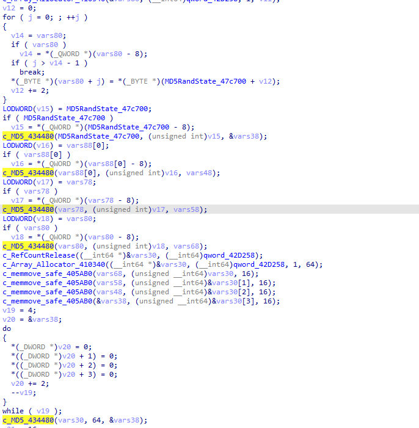

生成32字节的AES密钥

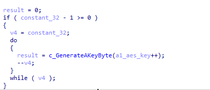

在密钥生成之后，病毒会使用黑客内置的RSA公钥加密这个AES密钥

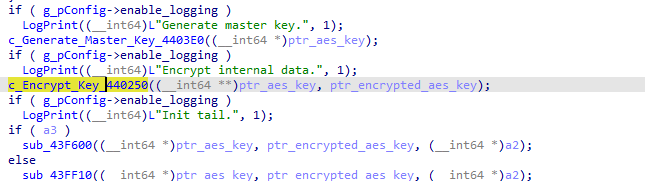

RSA公钥内容如下

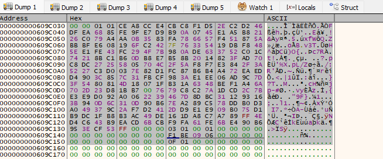

病毒使用同一个密钥但是对每个文件使用不同的IV进行AES加密，如果超过一定的时间就重新生成一把AES密钥进行加密

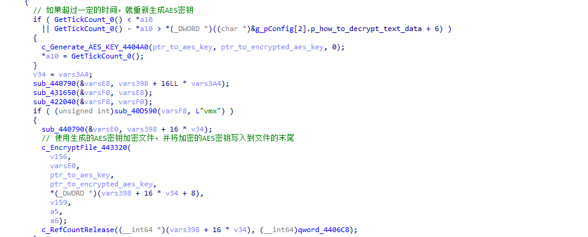

病毒不会加密整个文件，而是通过文件的大小来确定加密量。如果一个文件只有几个字节，则只加密第一个字节。如果较大，就加密前几个字节。依此类推。

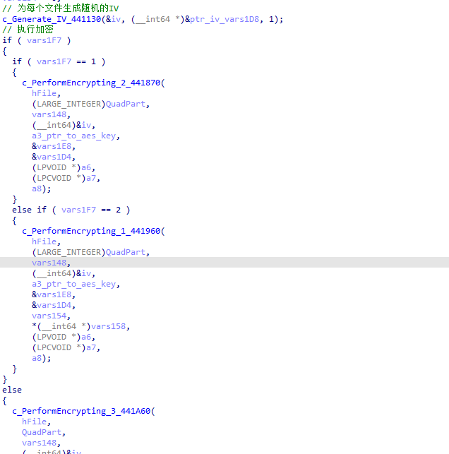

勒索病毒使用`AES-256-OFB`加密算法进行加密

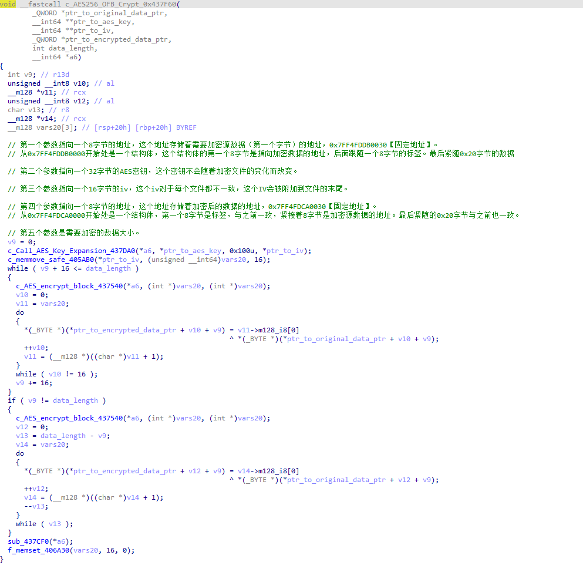

最后在加密算法完成之后本次文件加密生成的IV和使用RSA公钥加密的AES-KEY写入到文件当中

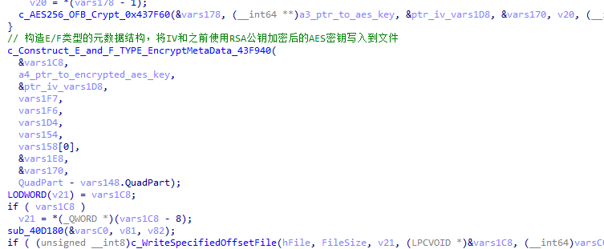

## 应急响应

鉴于密码学维度的坚不可摧，所有的防御与抢救措施必须转向底层运维与内存取证：

1. 介于SMB共享文件加密行为，必须切断失陷主机与内网其他资产的文件共享。
2. 如果病毒仍然在运行，必须保证病毒的存活：
   1. 虽然AES密钥会被加密，但是病毒在加密文件的过程中，内存必须存在AES密钥明文。即使病毒存在定时轮换密钥的机制，不过凭借这点仍然看一看使用内存中搜寻到的密钥并解密一部分被加密的数据。
   2. 如果发现机器正在被加密，应立即断开网线，挂起虚拟机或休眠物理机
3. 活体内存取证:
   1. 使用内存获取工具分析虚拟机快照内存或对存活主机的物理内存进行完整Dump。
   2. 从内存Dump中搜索并提取残留的32字节AES密钥明文。这是唯一在不交赎金情况下恢复部分数据的战术。

## IoCs

- 网络特征：扫描存活主机

- 破坏性命令：

  ```
  vssadmin delete shadows /all /quiet
  wbadmin DELETE SYSTEMSTATEBACKUP -keepVersions:0
  bcdedit /set {default} recoverenabled No
  ```

- 文件特征：
  - 勒索信：`how_to_decrypt.txt`
  - 加密文件：`trial-recovery.{随机字符串}.-encrypted`

- SHA-256：`48877a3a4c72c1daf3a80e3c034b56a04cec7ce3856887fed73e645e53c76b96`
