---
tags:
  - 蠕虫
  - 恶意软件分析报告
date: 2026-06-09
star: true
---

# 寄生蠕虫（PE/RAR感染）深度分析报告


[TOC]


## ⚠️ 免责声明 (Disclaimer)

**【郑重声明】** 本文档及其中包含的所有逆向分析过程、代码片段、伪代码和技术细节，**仅供网络安全防御研究、学术交流及反恶意软件技术探讨使用**。

为了避免被恶意利用及保护相关受害者，文中涉及的所有敏感信息（包括但不限于：C2 服务器 IP、域名、通信端口、特定业务标识符及相关真实路径）均已进行严格的**脱敏与打码处理**。

请读者严格遵守相关网络安全法律法规。**未经授权，任何人不得利用本文中探讨的技术手段进行任何形式的非法攻击、入侵或破坏活动。** 因读者滥用本文中提及的技术或情报所引发的任何直接或间接法律责任及后果，均由行为人自行承担，原作者对此不负任何法律连带责任。

**[Disclaimer]** The analysis, code snippets, and technical details provided in this article are strictly for **educational purposes, cybersecurity defense research, and malware analysis discussions**.

All sensitive Information of Compromise (IoCs), including but not limited to C2 IP addresses, domains, ports, and specific business identifiers, have been **redacted and obfuscated** to prevent malicious use and protect potential victims.

Readers must comply with all applicable cybersecurity laws and regulations. **Any unauthorized or illegal use of the techniques discussed in this article for malicious attacks or system compromises is strictly prohibited.** The author assumes no liability for any direct or indirect consequences, damages, or legal responsibilities arising from the misuse of the information contained herein.


## 危害评估

本次捕获的恶意样本为一个具备极高隐蔽性和复杂传染机制的**复合型寄生蠕虫**。该恶意软件有别于传统直接破坏系统的勒索或木马病毒，其核心战略在于“静默潜伏”与“无感知横向传播”。

在执行感染时，该恶意软件能精准避开带有官方数字签名的系统核心文件以及主流应用（如腾讯、百度等）的安装目录，专门针对受害者个人文件区及移动存储介质（U盘/移动硬盘）下手，对其中的 `.exe` 可执行文件与 `.rar` 压缩包实施难以察觉的“毒中投毒”式感染。此外，该蠕虫原本被设计为会连接外部黑客服务器，以期下载更具破坏性的第二阶段载荷。

截至本次分析，经本地沙箱模拟验证，该样本内置的远程服务器 / 域名已处于离线/失效状态。意味着**攻击者目前已丧失对被感染主机的直接远程控制权，当前暂无敏感数据持续外发的高危风险**。然而，蠕虫在本地局域网和移动介质中的横向移动机制（PE/RAR 感染）仍在持续运作。

## 核心执行流图


```
[受害者运行被感染程序 / 木马本体]
       │
       ▼
[阶段一：环境初始化与探测] ─── (检测宿主基址 vs 自身内存基址)
       │
       ├─► 状态1: 独立进程 ─► [阶段二：内核隐身] ─► 提权并调用 NtSystemDebugControl 摘除 EPROCESS 链表
       │
       └─► 状态2: 寄生进程 ─► [创建后台隐蔽线程] ─► 宿主程序继续正常运行，病毒转入后台
       │
       ▼
[阶段二：全盘扫描与目标侦察]
       │
       ├─► 驱动器遍历 ─► 忽略光驱(CD-ROM)及软驱(A/B盘)
       │
       └─► 目录树遍历 ─► (命中内置解密黑名单？) ─► [是] ─► 跳过该目录 (保护系统与杀软)
                                     │
                                    [否]
                                     ▼
[阶段三：双轨感染分发] ◄────── (提取文件后缀名)
       │
       ├─► [.exe 文件]
       │     │
       │     ├─ 检查数字签名 (存在则放弃感染)
       │     ├─ 检查感染标记 (若为旧版则执行热更新回滚)
       │     └─ 开辟新节区 ─► 注入恶意 Payload ─► 劫持入口点 (OEP) ─► 恢复时间戳
       │
       └─► [.rar 压缩包]
             │
             ├─ 检查容量阈值与 .NLS 感染账本哈希 (防止重复/超大文件感染)
             ├─ 劫持本机 Rar.exe 实施后台静默解压至 %TEMP%
             ├─ 对解压目录执行 [阶段三] 递归感染
             └─ 静默重打包 ─► 覆盖原压缩包 ─► 更新哈希账本 ─► 恢复时间戳
       │
       ▼
[阶段四：清理与持久化]
       │
       └─► 释放自删除批处理 (.bat) 销毁初始载体
```


## 恶意行为深度逆向分析

### 运行环境探测

恶意软件在启动之初面临的首要问题是：“我是谁，我在哪？” 恶意软件可能是被感染的程序启动的，也可能是被受害者直接运行等。为了处理这些情况，恶意软件在启动时会执行环境探测。

该恶意软件使用一个全局变量 `g_State_834D88` 作为状态锁，确保复杂的内存探测逻辑在整个进程生命周期内只执行一次，避免多线程环境下的重复初始化或死锁。

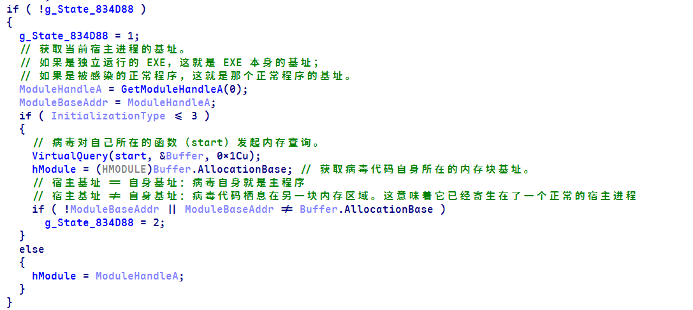

通过对环境的探测，该恶意软件会选择不同的应对方式，并传入一个 `CurrentRunningMode` 的参数。

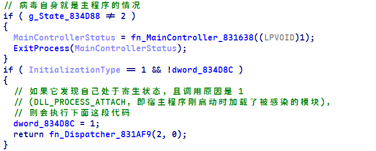

`fn_Dispatcher_831AF9` 的部分代码如下，在寄生的情况下，会传入参数 2，根据switch的处理，此时该样本也只是会创建一个新线程去执行主控代码。功能上与独立运行模式的行为一致。

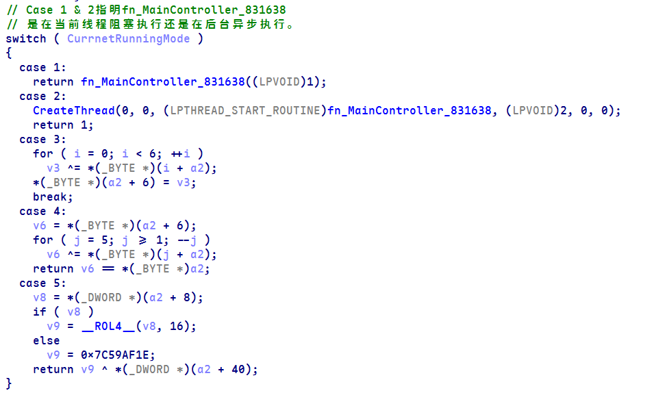

### 主函数

主函数的部分代码片段如下：

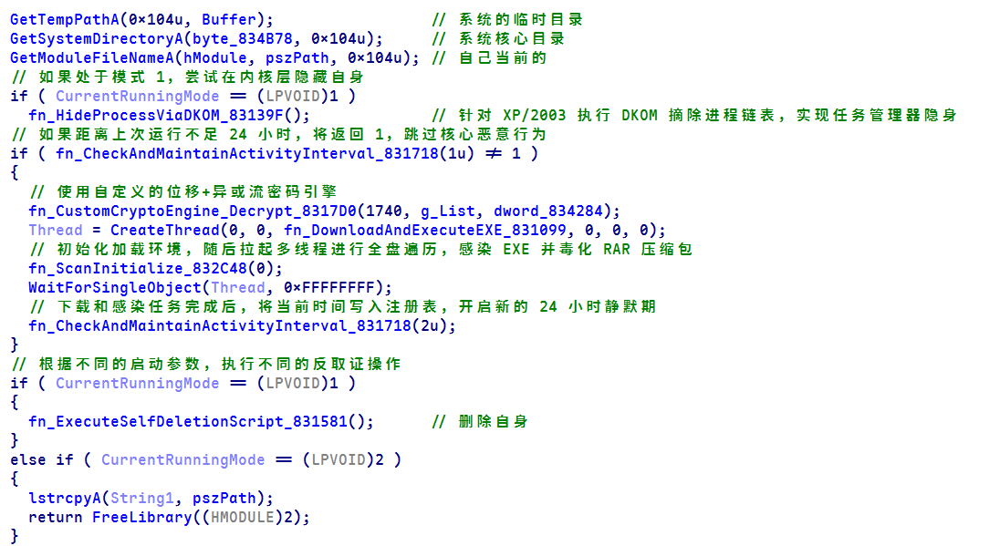

### DKOM 隐藏进程

如果恶意软件作为独立进程运行，它会尝试将自己从进程列表摘除自身。如果被感染进程启动，则不需要进行这一操作。

这段代码的专门针对的是较老的 Windows 操作系统（Windows XP 和 Windows Server 2003）或更早的版本。该恶意软件利用了早期 Windows 操作系统中的一个已知安全缺陷：拥有 `SeDebugPrivilege`（调试特权）的管理员级用户模式进程，可以通过调用未文档化的原生 API `NtSystemDebugControl` 来实现对任意内核内存（Ring 0）的读写。通过这种越权访问，该恶意软件直接在内核空间中篡改了操作系统的核心调度数据结构（`EPROCESS` 链表），从而将自身进程从任务管理器的视野中彻底抹除。

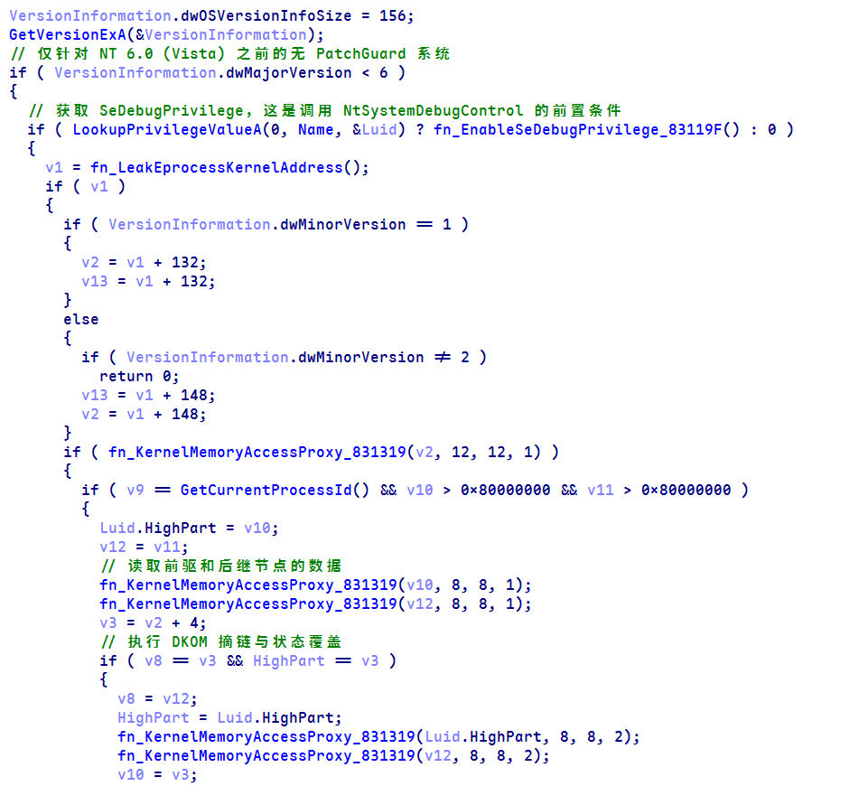

该恶意软件利用 `NtQuerySystemInformation` 泄露内核对象地址的经典手法获取自身 `EPROCESS` 结构体的内核基址。

> **Note**
>
> 在 Windows 系统中，句柄（Handle）只是一个在用户态使用的 32 位整数（比如 0x104），它本身没有意义。它的本质是系统内核“句柄表”中的一个索引，指向内核中真正的对象（比如文件、进程、线程的结构体）。


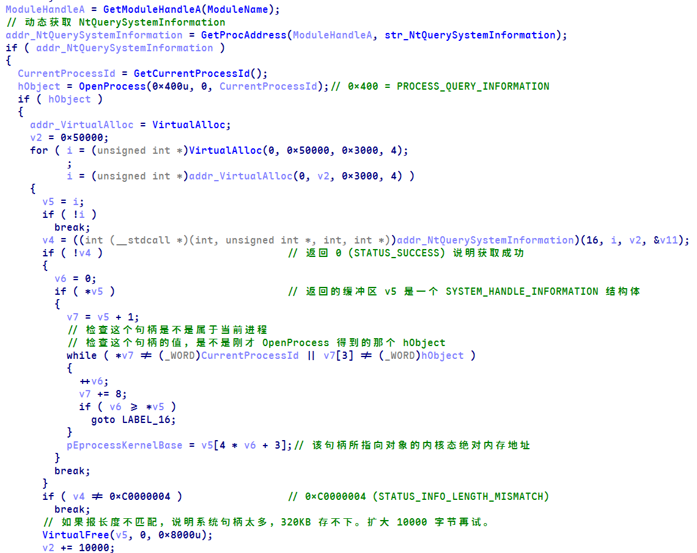

下面这段代码非常具有辨识度：

```c
v2 = 0x50000; // 初始分配 320 KB
for ( ... ) {
  v4 = NtQuerySystemInformation(16, i, v2, &v11); // 16 = SystemHandleInformation
  if ( !v4 ) break; // 返回 0 (STATUS_SUCCESS) 说明获取成功
  if ( v4 != 0xC0000004 ) break; // (STATUS_INFO_LENGTH_MISMATCH)
  // 如果报长度不匹配，说明系统句柄太多，320KB 存不下。扩大 10000 字节再试。
  VirtualFree(...);
  v2 += 10000;
}
```

这是调用该 API 的标准范式。因为系统句柄数量是实时变动的，所以必须用 `STATUS_INFO_LENGTH_MISMATCH` 配合死循环来动态调整缓冲区大小。

```c
#ifndef _NTEXAPI_H

// Note: This information class is deprecated since values are limited to 65535. Use SystemExtendedHandleInformation instead.
typedef struct _SYSTEM_HANDLE_TABLE_ENTRY_INFO
{
    USHORT UniqueProcessId;
    USHORT CreatorBackTraceIndex;
    UCHAR ObjectTypeIndex;
    UCHAR HandleAttributes;
    USHORT HandleValue;
    PVOID Object;
    ACCESS_MASK GrantedAccess;
} SYSTEM_HANDLE_TABLE_ENTRY_INFO, *PSYSTEM_HANDLE_TABLE_ENTRY_INFO;

#endif
```

在 `SYSTEM_HANDLE_TABLE_ENTRY_INFO` 结构体中，**偏移 12 正是 `PVOID Object`** —— 即该句柄所指向对象的**内核态绝对内存地址**。

`fn_KernelMemoryAccessProxy_831319` 的核心代码如下，

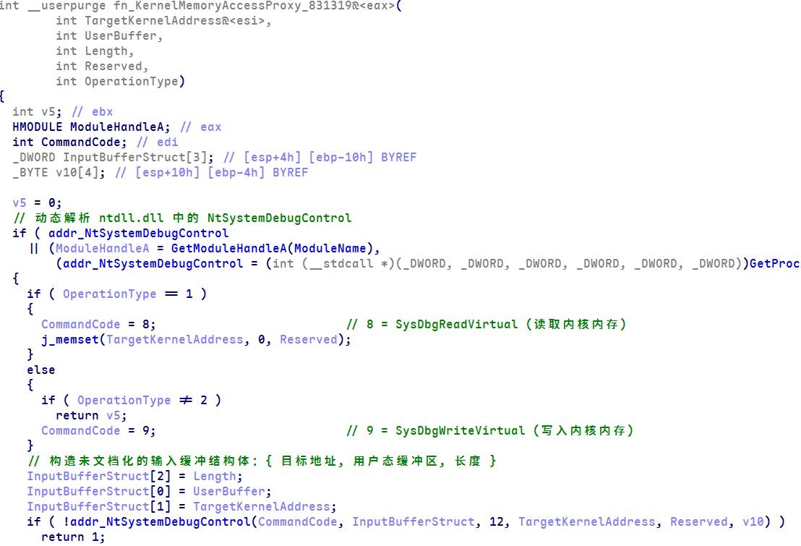

通过这种方式，该恶意软件就可以实现对内核内存的任意读写从而实现进程隐藏。

### 文件扫描与过滤

**黑名单解密**

该恶意软件内置了一个黑名单，该名单中的目录都会被恶意软件放过。同时为了防止这些信息以明文的方式出现在文件中，该恶意软件自己实现了一个加密算法，在运行时才会对这个名单解密。

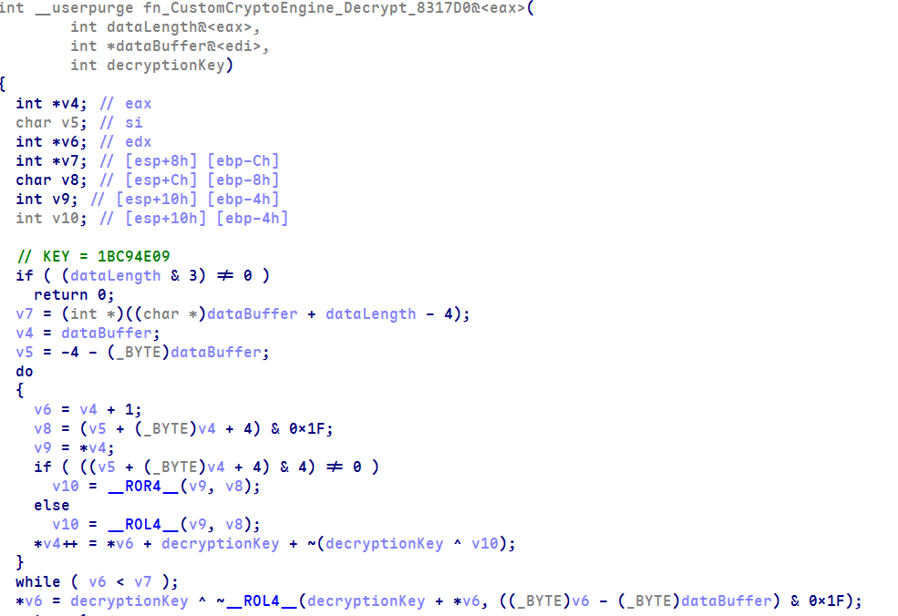

解密后的内容如下：

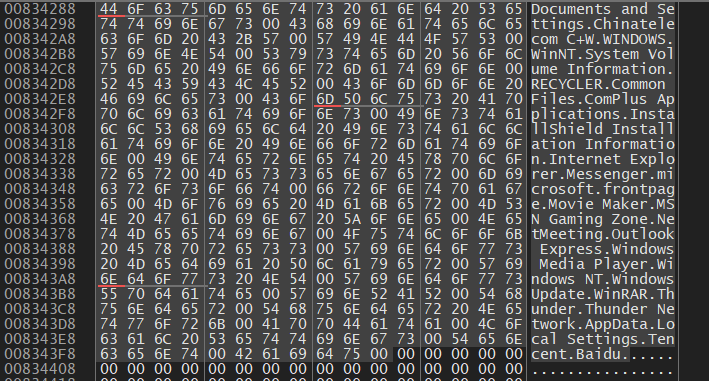

黑名单，这个黑名单目录下的所有文件都不会被感染。

```
Documents and Settings
Chinatelecom C+W
WINDOWS
WinNT
System Volume Information
RECYCLER
Common Files
ComPlus Applications
InstallShield Installation Information
Internet Explorer
Messenger
Microsoft
FrontPage
Movie Maker
MSN Gaming Zone
NetMeeting
Outlook Express
Windows Media Player
Windows NT
WindowsUpdate
WinRAR
Thunder
Thunder Network
AppData
Local Settings
Tencent
Baidu
```


**文件扫描**

对与每个磁盘驱动器，首先检查该驱动器的类型，如果是CD-ROM就跳过。对于其他类型，新开一个扫描线程去执行感染。

扫描器初始化核心代码如下：

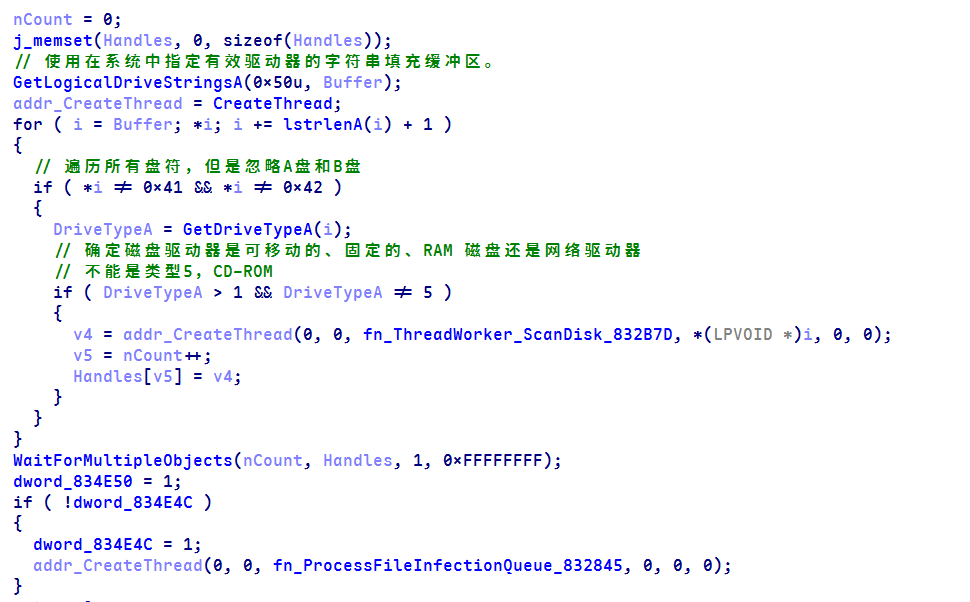

通过对`GetLogicalDriveStringsA` 的调用，该恶意软件会获取资源管理器显示的所有驱动器名单。

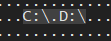

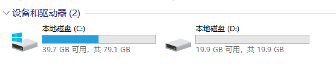

在扫描的初始阶段， 检查目标路径是否以 `C:\` 开头。如果目标是 C 盘，引擎会提取当前目录名（`DirName`），并进入一个预设的内存解密黑名单（`g_List`）比对循环，命中则直接跳过该目录。如果目标是非系统盘（如 D 盘或可移动存储设备），则直接跳过黑名单校验，执行无差别全盘扫描。

对于每个目录，该恶意软件都会与内置的黑名单进行比对。如果当前扫描的目录不在黑名单上，那就进行目录中的文件和子目录扫描，实施感染。这个函数会被递归的调用，即，如果当前目录的存在子目录，依然会传入子目录的路径调用这个函数，并对子目录的名字执行一遍目录比对。通过这种全盘全文件的扫描方式，恶意软件会精准的筛选出来需要感染的目标，同时尽最大可能的降低用户发现它们常用的软件（如系统程序或腾讯，百度，迅雷等）遭受到感染的可能性。

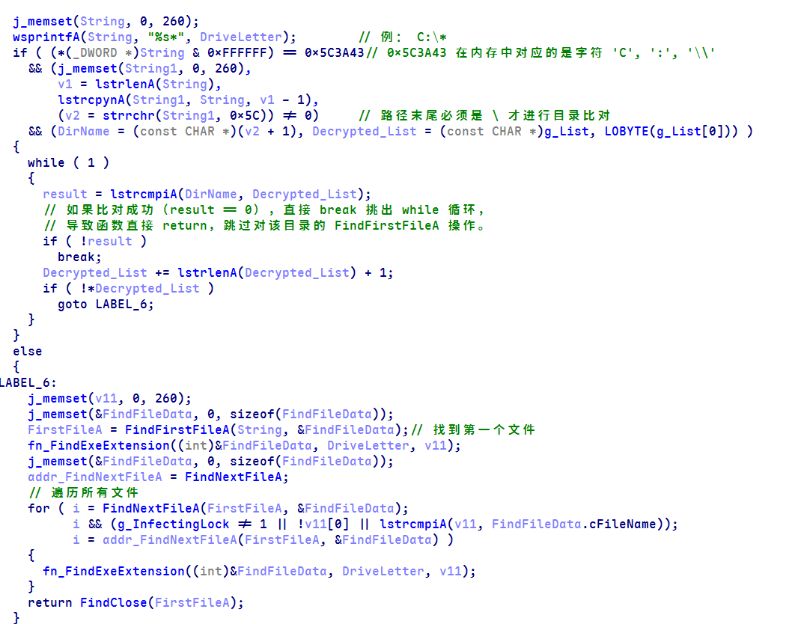

该恶意软件会根据文件的属性来判断是目录还是文件，并提取出文件的扩展名。并且该恶意软件只针对可执行文件（.exe结尾）和压缩包（.rar结尾）的文件进行感染。核心代码如下：

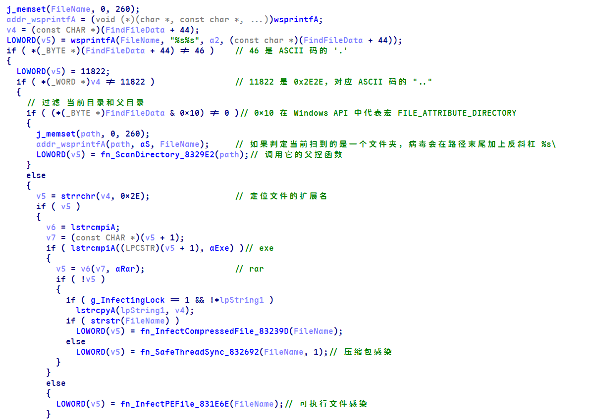

### 感染可执行文件与压缩包

**压缩包感染**

为了防止对压缩包的重感染，该恶意软件内置了一个“账本”，如果对已感染的压缩包就进行跳过。如果感染时的版本比较低，就重新感染。

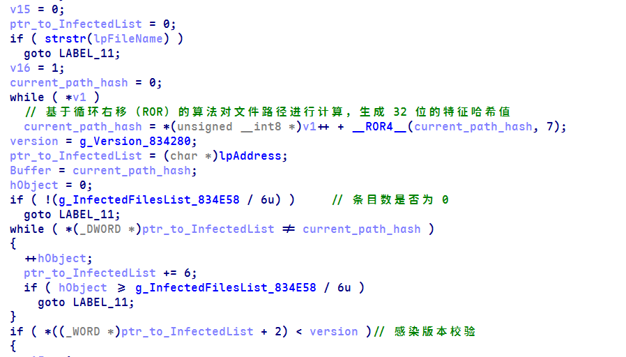


代码通过 `GetFileSize` 严格检查目标文件大小。仅当文件大小处于约 10 KB 到 10 MB（`0x9FD800`）之间时才发起攻击。这是一种“防打扰”策略，因为解压超大文件会导致 CPU 飙升和硬盘狂转，极易引起受害者警觉

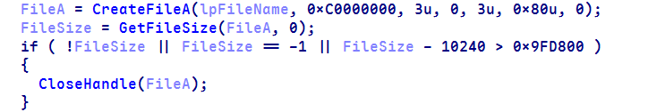

该恶意软件通过系统的WinRAR执行解压缩到TEMP目录下，然后对这个临时目录调用目录扫描函数，从这个目录开始，又会递归的扫描执行感染。等到所有文件都被感染之后，重新打包会压缩包形式。

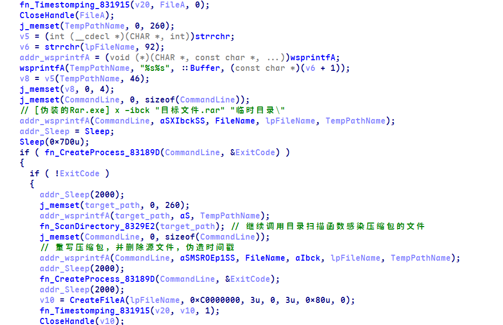

当恶意行为执行完毕，该恶意软件会记录此次感染，并删除刚刚释放的临时文件。

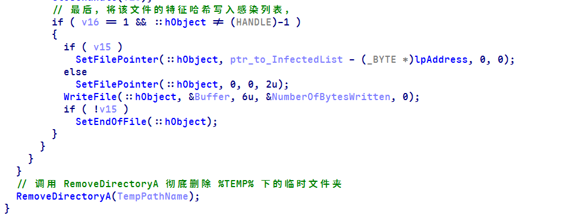

**可执行文件感染**

该恶意程序并不是盲目感染所有可执行文件。它首先获取文件大小，并通过 `CreateFileMappingA` 仅仅映射前 1024 字节。核心在于对 `OptionalHeader.DataDirectory[4]` (数字签名目录) 的非零检查。这意味着病毒**主动避开所有拥有微软或其他厂商有效数字签名的系统组件或杀软文件**，尽最大可能避免用户察觉或造成源程序不可用。

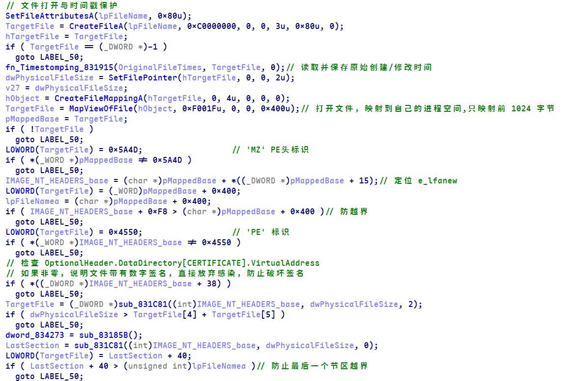

该恶意软件会对已感染的程序进行恶意代码的更新。如果发现目标身上带有旧版本载荷的痕迹，它会执行一段精密的“回滚（Rollback）”逻辑：将旧的节区计数减一，恢复 OEP 和 Image 大小。这相当于给宿主程序做了一次清理，为植入最新版本的载荷腾出空间。

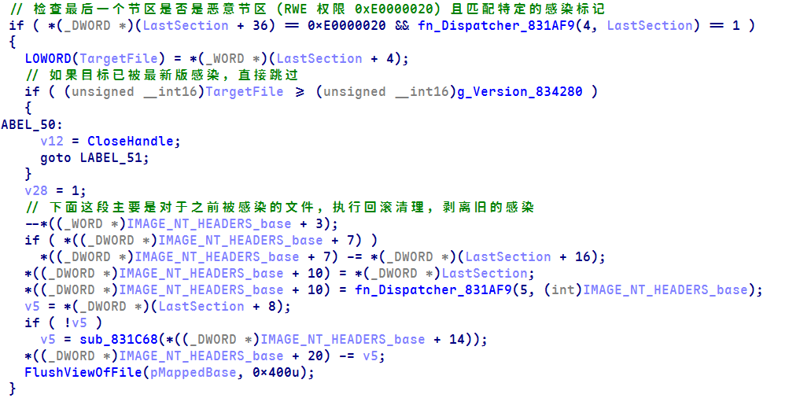

代码在寻找节表末尾的空位时，寻找40字节的空区域。只有确保空间完全干净，它才会写入新的节表项。篡改为病毒新追加节区的起始虚拟地址（RVA）。当受害者双击运行该程序时，CPU 将第一时间跳入病毒的陷阱。

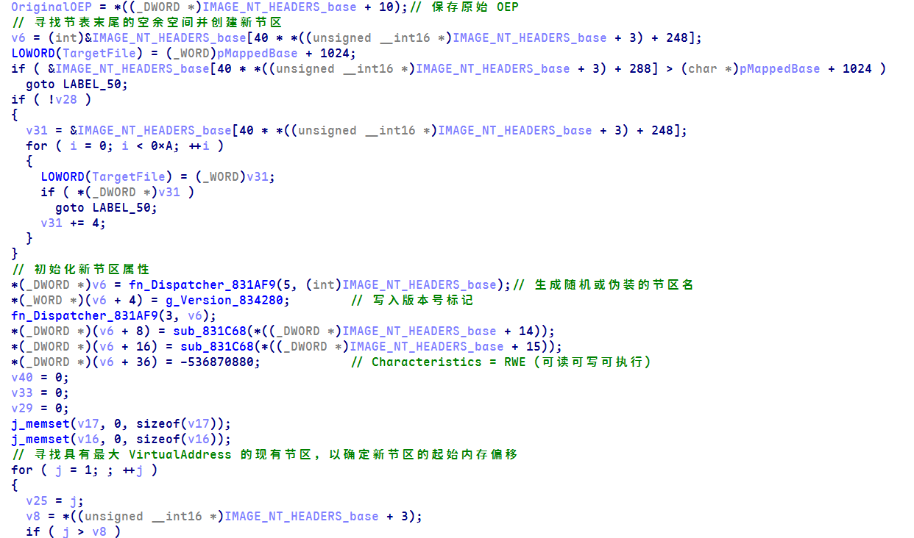

在向磁盘末尾追加物理数据之前，代码利用 `ptr_OEP_Placeholder` 直接修改了内存中引导头内部的返回地址。这样，引导头在执行完解密和内存展开后，就能顺畅地跳回正常的业务逻辑。最后，调用 `fn_Timestomping_831915` 恢复原始的文件修改时间，神不知鬼不觉地完成整个感染闭环。

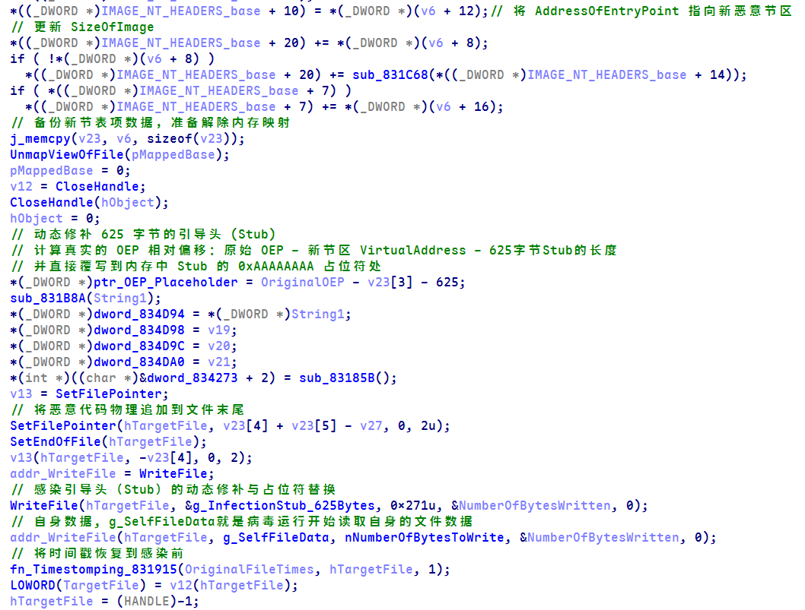

**反取证策略**

恶意软件会根据 `CurrentRunningMode` 的值在主控函数的结尾执行不同的反取证操作。`1` 对应样本作为独立进程启动，`2` 对应于样本被感染的正常进程启动。这个状态值在入口函数调用主控函数时传递。

如果恶意软件作为独立进程启动，则创建一个BAT脚本删除自己。如果该恶意软件是被感染进程启动，则在被感染进程中卸载自身。但被感染的程序仍然存在恶意代码。

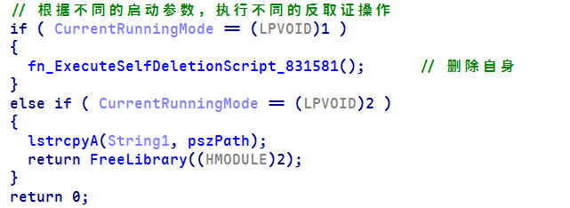

## IoCs

SHA-256: `4354970ccc7cd6bb16318f132c34f6a1b3d5c2ea7ff53e1c9271905527f2db07`

MD5: `56b2c3810dba2e939a8bb9fa36d3cf96`

SHA-1: `99ee31cd4b0d6a4b62779da36e0eeecdd80589fc`

---

- [[computer-security/reports/Malware Reports]]
