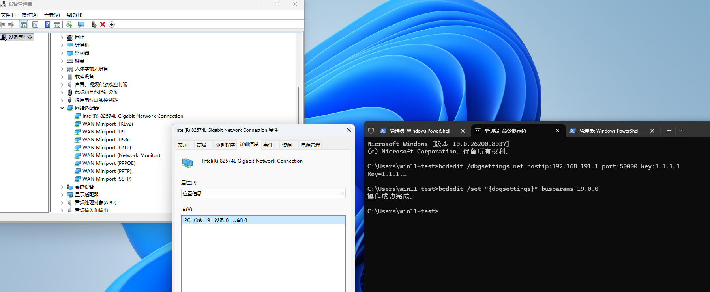
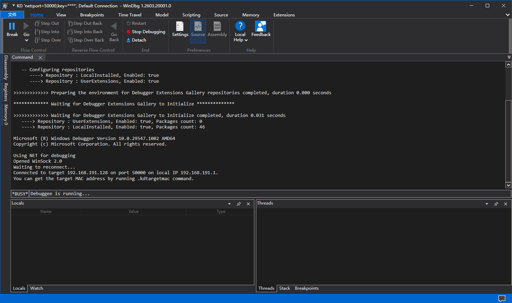

---
tags:
  - Windows内核
  - 内核调试
  - WinDbg
  - 虚拟机
date: 2026-06-14
star: false
---
# Windows 虚拟机开启内核网络调试

**VMWare虚拟机设置设置**

如果需要测试Hypervisor，建议开始完整的调试信息记录。

```
虚拟机设置 -> 选项 -> 高级 -> 收集调试信息 -> 完整
```

**Windows11客户机设置**

以管理员权限打开命令提示符，开启调试。
```
bcdedit /debug on
```

开启网络调试。在命令提示符下，输入以下命令。 将 w.x.y.z 替换为主计算机的 IP 地址，并将 n 替换为所选端口号

```
bcdedit /dbgsettings net hostip:w.x.y.z port:n key:your.key
```

例如我宿主机（HOST）的IP地址为 `192.168.191.1` (VMNet8网卡，因为客户机是VMNet8网段NAT模式，需要保证客户机与宿主机可以通信)
```
bcdedit /dbgsettings net hostip:192.168.191.1 port:50000 key:1.1.1.1
```

使用设备管理器确定要用于调试的适配器的 PCI 总线、设备和函数号。展开网络适配器，选择你想要配置的网卡，右键菜单选择属性。选择新弹出的窗口选择详细信息，属性选择位置信息。然后在管理员权限的命令提示符中，输入以下命令，其中 b、d 和 f 是适配器的总线号、设备编号和函数号：
```
bcdedit /set "{dbgsettings}" busparams b.d.f
```

例如：

```
bcdedit /set "{dbgsettings}" busparams 19.0.0
```



开启签名测试。
```
bcdedit /set testsigning on
```

打开WinDBG，选择内核网络调试，输入端口号和Key。出现以下信息就代表内核网络调试的环境搭建好了。



---

- [[computer-security/tooling/Tooling|Tooling]]
